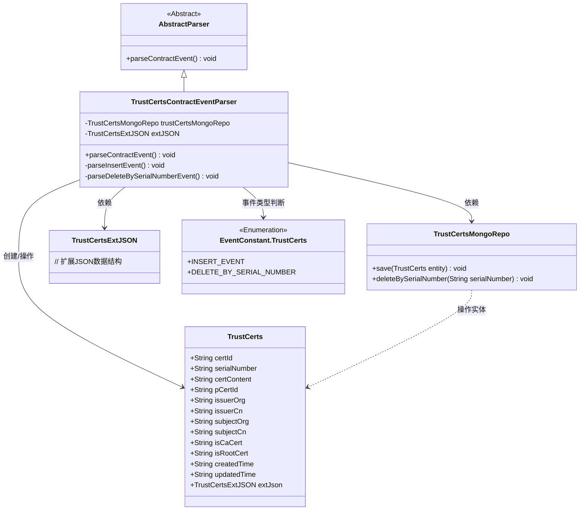
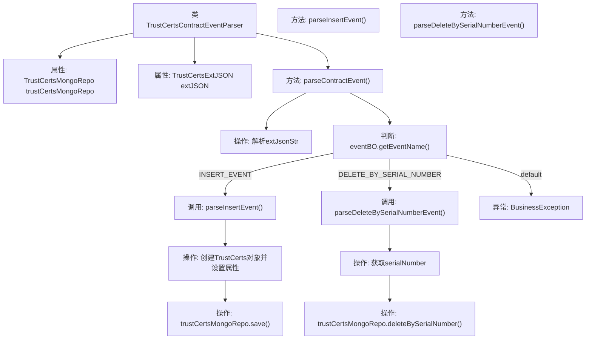

# 基础信息

|      |      |
|------|------|
| 名称 | TrustCertsContractEventParser |
| 编码语言 | .java |
| 代码路径 | WeFe/union/blockchain-data-sync/src/main/java/com/welab/wefe/parser/TrustCertsContractEventParser.java |
| 包名 | com.welab.wefe.parser |
| 依赖项 | ['com.alibaba.fastjson.JSONObject', 'com.welab.wefe.BlockchainDataSyncApp', 'com.welab.wefe.common.data.mongodb.entity.union.TrustCerts', 'com.welab.wefe.common.data.mongodb.entity.union.ext.TrustCertsExtJSON', 'com.welab.wefe.common.data.mongodb.repo.TrustCertsMongoRepo', 'com.welab.wefe.common.util.StringUtil', 'com.welab.wefe.constant.EventConstant', 'com.welab.wefe.exception.BusinessException', 'org.apache.commons.lang3.StringUtils'] |
| 概述说明 | 解析区块链信任证书事件的Java类，处理插入和删除操作，使用MongoDB存储数据。 |

# 说明

TrustCertsContractEventParser类继承AbstractParser，用于解析信任证书合约事件。它依赖TrustCertsMongoRepo进行数据库操作，包含两个主要方法：parseInsertEvent处理证书插入事件，设置证书各项属性并保存到MongoDB；parseDeleteBySerialNumberEvent根据序列号删除证书记录。主方法parseContractEvent通过事件名称路由到对应处理方法，无效事件抛出异常。

# 类列表 Class Summary

| 名称   | 类型  | 说明 |
|-------|------|-------------|
| TrustCertsContractEventParser | class | 解析区块链证书事件的Java类，处理插入和删除操作，使用MongoDB存储数据。 |

## 类 TrustCertsContractEventParser

|      |      |
|------|------|
| 访问范围 | public |
| 类型 | class |
| 名称 | TrustCertsContractEventParser |
| 说明 | 解析区块链证书事件的Java类，处理插入和删除操作，使用MongoDB存储数据。 |

### UML类图

该类图展示了TrustCertsContractEventParser继承自AbstractParser，用于解析区块链合约事件。它依赖TrustCertsMongoRepo进行数据库操作，使用TrustCertsExtJSON处理扩展数据，并根据EventConstant.TrustCerts枚举判断事件类型来执行插入或删除操作。TrustCerts类包含证书的完整字段结构，体现了从事件解析到数据存储的完整流程。

### 内部方法调用关系图

这段代码展示了一个区块链证书事件解析器，主要处理两种合约事件：INSERT_EVENT和DELETE_BY_SERIAL_NUMBER。当事件为INSERT_EVENT时，会创建TrustCerts对象并设置其属性后保存到MongoDB；当事件为DELETE_BY_SERIAL_NUMBER时，会根据序列号从MongoDB中删除对应记录。流程图中清晰展示了从事件解析到具体处理方法的完整调用链，包括属性初始化、JSON解析、事件类型判断和对应的数据库操作。

### 字段列表 Field List

| 名称  | 类型  | 说明 |
|-------|-------|------|
| trustCertsMongoRepo = BlockchainDataSyncApp.CONTEXT.getBean(TrustCertsMongoRepo.class) | TrustCertsMongoRepo | 从应用上下文中获取TrustCertsMongoRepo实例并赋值给保护变量。 |
| extJSON | TrustCertsExtJSON | 受保护的TrustCertsExtJSON扩展JSON对象。 |

### 方法列表

| 名称  | 类型  | 说明 |
|-------|-------|------|
| parseDeleteBySerialNumberEvent | void | 该方法解析删除事件，根据序列号从MongoDB仓库中删除对应证书。 |
| parseContractEvent | void | 解析合约事件方法，根据事件名称调用对应处理逻辑，无效事件抛出异常。 |
| parseInsertEvent | void | 解析插入事件，设置TrustCerts对象属性并保存到MongoDB。 |

