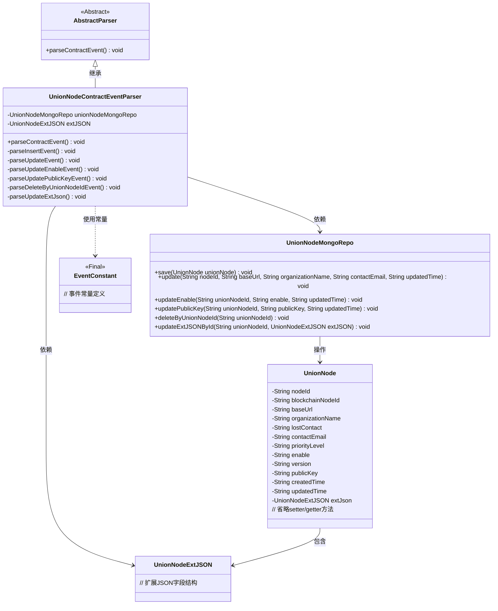
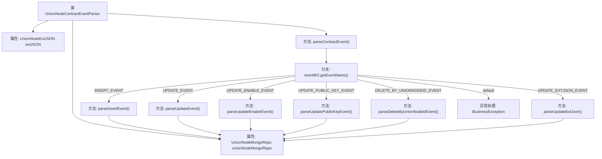

# 基础信息

|      |      |
|------|------|
| 名称 | UnionNodeContractEventParser |
| 编码语言 | .java |
| 代码路径 | WeFe/union/blockchain-data-sync/src/main/java/com/welab/wefe/parser/UnionNodeContractEventParser.java |
| 包名 | com.welab.wefe.parser |
| 依赖项 | ['com.alibaba.fastjson.JSONObject', 'com.welab.wefe.BlockchainDataSyncApp', 'com.welab.wefe.common.data.mongodb.entity.union.UnionNode', 'com.welab.wefe.common.data.mongodb.entity.union.ext.UnionNodeExtJSON', 'com.welab.wefe.common.data.mongodb.repo.UnionNodeMongoRepo', 'com.welab.wefe.common.util.StringUtil', 'com.welab.wefe.constant.EventConstant', 'com.welab.wefe.exception.BusinessException', 'org.apache.commons.lang3.StringUtils'] |
| 概述说明 | UnionNodeContractEventParser类解析区块链节点事件，处理插入、更新、启用状态、公钥、删除及扩展JSON更新操作，与MongoDB交互存储数据。 |

# 说明

UnionNodeContractEventParser类继承自AbstractParser，用于解析联盟节点相关合约事件。它通过unionNodeMongoRepo操作MongoDB数据库，处理不同类型的事件。主要功能包括解析插入事件（设置节点各项属性并保存）、更新事件（修改基础信息）、更新启用状态事件、更新公钥事件、按节点ID删除事件以及更新扩展JSON事件。每个事件处理方法都从参数中提取必要信息，并调用相应的MongoDB仓库方法进行数据操作。

# 类列表 Class Summary

| 名称   | 类型  | 说明 |
|-------|------|-------------|
| UnionNodeContractEventParser | class | UnionNodeContractEventParser类解析区块链节点事件，包括插入、更新、启用、公钥修改、删除及扩展JSON更新操作，并调用MongoDB存储库进行数据持久化。 |

## 类 UnionNodeContractEventParser

|      |      |
|------|------|
| 访问范围 | public |
| 类型 | class |
| 名称 | UnionNodeContractEventParser |
| 说明 | UnionNodeContractEventParser类解析区块链节点事件，包括插入、更新、启用、公钥修改、删除及扩展JSON更新操作，并调用MongoDB存储库进行数据持久化。 |

### UML类图

类图描述：该图展示了UnionNodeContractEventParser继承自AbstractParser，并依赖UnionNodeMongoRepo和UnionNodeExtJSON实现区块链节点事件解析功能。解析器根据不同事件类型（INSERT/UPDATE/DELETE等）调用MongoDB仓库的对应方法操作UnionNode实体，其中UnionNode包含扩展JSON字段。EventConstant提供事件类型常量，整体构成一个典型的事件驱动型数据处理架构。

### 内部方法调用关系图

流程图描述：该流程图展示了UnionNodeContractEventParser类的核心逻辑结构。该类继承自AbstractParser，包含2个属性和7个主要方法。parseContractEvent()作为入口方法，根据事件类型(eventName)调用不同的处理方法(如parseInsertEvent/parseUpdateEvent等)，所有方法最终都会操作unionNodeMongoRepo进行数据库操作。流程图中清晰体现了事件分发逻辑和异常处理路径，各方法均通过箭头指向其依赖的MongoRepo属性。

### 字段列表 Field List

| 名称  | 类型  | 说明 |
|-------|-------|------|
| extJSON | UnionNodeExtJSON | 保护类型的UnionNodeExtJSON扩展JSON对象。 |
| unionNodeMongoRepo = BlockchainDataSyncApp.CONTEXT.getBean(UnionNodeMongoRepo.class) | UnionNodeMongoRepo | 获取UnionNodeMongoRepo实例，通过BlockchainDataSyncApp的CONTEXT上下文注入。 |

### 方法列表

| 名称  | 类型  | 说明 |
|-------|-------|------|
| parseUpdatePublicKeyEvent | void | 解析更新公钥事件，获取节点ID、公钥及更新时间，调用存储库更新数据。 |
| parseUpdateEvent | void | 解析更新事件，获取节点ID、基础URL、组织名称、联系邮箱和更新时间，并更新MongoDB中的节点数据。 |
| parseUpdateExtJson | void | 解析更新扩展JSON：根据事件BO中的node_id获取节点ID，调用Mongo仓库方法更新对应节点的扩展JSON数据。 |
| parseInsertEvent | void | 解析插入事件，创建UnionNode对象并设置各属性值，最后保存到MongoDB。 |
| parseUpdateEnableEvent | void | 解析更新启用事件，获取节点ID、启用状态和更新时间，调用Mongo仓库更新。 |
| parseContractEvent | void | 解析合约事件方法，根据事件名称调用对应处理逻辑，包括增删改查及扩展JSON更新，无效事件抛出异常。 |
| parseDeleteByUnionNodeIdEvent | void | 解析删除事件，根据节点ID从MongoDB中删除对应记录。 |

