# 基础信息

|      |      |
|------|------|
| 名称 | parser |
| 编码语言 | .java |
| 代码路径 | WeFe/union/blockchain-data-sync/src/main/java/com/welab/wefe/parser |
| 包名 | docs.union.blockchain-data-sync.src.main.java.com.welab.wefe.parser |
| 概述说明 | 多个解析器类继承AbstractParser，处理区块链合约事件并操作MongoDB。包括成员、数据集、节点、证书等各类事件解析，实现增删改查及扩展JSON更新功能，确保数据同步与一致性。 |

# 说明

## 概述  
该模块是区块链数据同步系统的核心解析组件，负责将链上合约事件转换为MongoDB存储操作。采用抽象工厂模式，AbstractParser定义基础框架，各子类实现具体事件解析逻辑，类似事件总线模式。关键数据结构包括EventBO（事件业务对象）、BlockInfoBO（区块信息）及各实体类（如Member、DataSet等）。外部依赖主要为MongoDB（通过*MongoRepo操作）和区块链节点SDK（如BcosBlock）。例如MemberContractEventParser处理成员数据变更，DataSetContractEventParser管理数据集生命周期。

## 主要业务场景  
模块主要处理三类场景：实体状态变更（例如成员公钥更新）、扩展数据维护（如extJSON字段同步）和资源权限管理（数据集标签权限控制）。典型流程为：BlockInfoParser解析区块事件→子类Parser处理具体业务→MongoDB持久化。交互模式统一通过parseContractEvent路由，支持CRUD操作和扩展字段更新。例如UnionNodeContractEventParser处理节点启用状态变更，BloomFilterContractEventParser维护布隆过滤器参数。所有API遵循"事件类型识别→参数提取→仓库操作"模式，确保数据最终一致性。

### 包内部结构视图

```mermaid
graph TD
    parser --> MemberContractEventParser.java
    parser --> RealnameAuthAgreementTemplateContractEventParser.java
    parser --> DataSetContractEventParser.java
    parser --> AbstractParser.java
    parser --> TableDataSetContractEventParser.java
    parser --> BlockInfoParser.java
    parser --> MemberFileInfoContractEventParser.java
    parser --> UnionNodeContractEventParser.java
    parser --> TrustCertsContractEventParser.java
    parser --> MemberAuthTypeContractEventParser.java
    parser --> DataResourceContractEventParser.java
    parser --> BloomFilterContractEventParser.java
    parser --> DataSetMemberPermissionContractEventParser.java
    parser --> MemberServiceContractEventParser.java
    parser --> DataSetDefaultTagContractEventParser.java
    parser --> DataResourceDefaultTagContractEventParser.java
    parser --> ImageDataSetContractEventParser.java
```

该流程图展示了区块链数据同步模块中解析器(parser)目录下的所有Java文件。这些文件包括各类合约事件解析器，如成员合约、实名认证协议模板合约、数据集合约等事件的解析器，以及抽象解析器和区块信息解析器等。所有文件都直接隶属于parser目录，没有更深层级的子目录结构，形成了扁平化的文件组织结构。

# 文件列表

| 名称   | 类型  | 说明 |
|-------|------|-------------|
| [MemberContractEventParser.java](MemberContractEventParser.md) | file | MemberContractEventParser类解析成员合约事件，处理插入、更新、删除等操作，操作包括成员信息、公钥、logo等字段的更新，并将数据同步到MongoDB。 |
| [RealnameAuthAgreementTemplateContractEventParser.java](RealnameAuthAgreementTemplateContractEventParser.md) | file | RealnameAuthAgreementTemplateContractEventParser类解析实名认证协议模板事件，处理插入、更新启用状态和更新扩展JSON三种事件，操作MongoDB存储数据。 |
| [DataSetContractEventParser.java](DataSetContractEventParser.md) | file | DataSetContractEventParser类解析合约事件，处理插入、更新、删除和更新扩展JSON操作，将数据存储到MongoDB。 |
| [AbstractParser.java](AbstractParser.md) | file | 抽象类AbstractParser定义事件解析基础逻辑，含常量、日志和关键方法process处理事件数据，成功时调用parseContractEvent抽象方法，并记录耗时日志。 |
| [TableDataSetContractEventParser.java](TableDataSetContractEventParser.md) | file | TableDataSetContractEventParser类解析合约事件，处理插入、更新、删除操作，操作MongoDB存储表数据，包含数据资源ID、列名、特征等字段。 |
| [BlockInfoParser.java](BlockInfoParser.md) | file | BlockInfoParser类解析区块链区块信息，处理交易回执和事件日志，生成包含事件和交易响应的BlockInfoBO对象。 |
| [MemberFileInfoContractEventParser.java](MemberFileInfoContractEventParser.md) | file | MemberFileInfoContractEventParser类解析成员文件信息事件，处理插入、更新启用状态和扩展JSON事件，操作MongoDB存储。 |
| [UnionNodeContractEventParser.java](UnionNodeContractEventParser.md) | file | UnionNodeContractEventParser类解析区块链节点事件，处理插入、更新、启用状态、公钥、删除及扩展JSON更新操作，与MongoDB交互存储数据。 |
| [TrustCertsContractEventParser.java](TrustCertsContractEventParser.md) | file | 解析区块链信任证书事件的Java类，处理插入和删除操作，使用MongoDB存储数据。 |
| [MemberAuthTypeContractEventParser.java](MemberAuthTypeContractEventParser.md) | file | MemberAuthTypeContractEventParser类解析成员认证类型事件，处理插入、更新、删除及扩展JSON更新操作，使用MongoDB存储数据。 |
| [DataResourceContractEventParser.java](DataResourceContractEventParser.md) | file | DataResourceContractEventParser类解析数据资源事件，处理插入、更新、启用、扩展JSON更新和删除操作，通过MongoDB存储数据。 |
| [BloomFilterContractEventParser.java](BloomFilterContractEventParser.md) | file | BloomFilterContractEventParser类解析布隆过滤器相关事件，包括插入、更新哈希函数、更新扩展JSON和按ID删除操作，使用MongoDB存储数据。 |
| [DataSetMemberPermissionContractEventParser.java](DataSetMemberPermissionContractEventParser.md) | file | 解析合约事件的类，处理数据集成员权限的增删改查操作，包括插入、更新、删除及扩展JSON更新，使用MongoDB存储数据。 |
| [MemberServiceContractEventParser.java](MemberServiceContractEventParser.md) | file | MemberServiceContractEventParser类解析合约事件，处理插入、更新、删除及扩展JSON更新操作，与MongoDB交互。 |
| [DataSetDefaultTagContractEventParser.java](DataSetDefaultTagContractEventParser.md) | file | 解析数据集默认标签合约事件的Java类，包含插入、更新、删除和更新扩展JSON的方法，使用MongoDB存储数据。 |
| [DataResourceDefaultTagContractEventParser.java](DataResourceDefaultTagContractEventParser.md) | file | 解析数据资源默认标签合约事件的类，处理插入、更新、删除和更新扩展JSON事件，使用MongoDB存储数据。 |
| [ImageDataSetContractEventParser.java](ImageDataSetContractEventParser.md) | file | ImageDataSetContractEventParser类继承AbstractParser，解析图像数据集事件，包括插入、更新、删除等操作，操作MongoDB存储数据。 |

