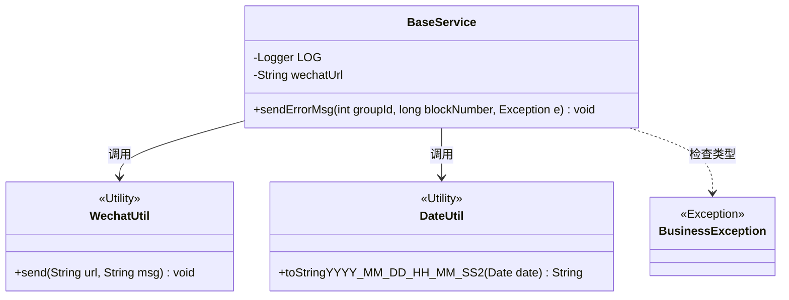
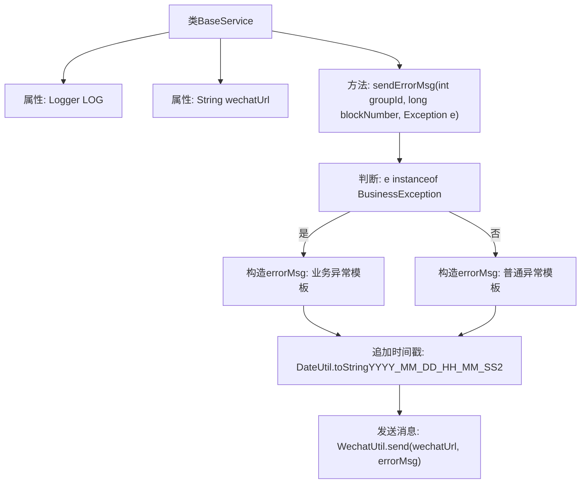

# 基础信息

|      |      |
|------|------|
| 名称 | BaseService |
| 编码语言 | .java |
| 代码路径 | WeFe/union/blockchain-data-sync/src/main/java/com/welab/wefe/service/BaseService.java |
| 包名 | com.welab.wefe.service |
| 依赖项 | ['com.welab.wefe.common.util.DateUtil', 'com.welab.wefe.exception.BusinessException', 'com.welab.wefe.util.WechatUtil', 'org.slf4j.Logger', 'org.slf4j.LoggerFactory', 'org.springframework.beans.factory.annotation.Value', 'java.util.Date'] |
| 概述说明 | BaseService类包含日志记录和微信错误消息发送功能，根据异常类型格式化错误信息并发送至指定URL。 |

# 说明

BaseService类是一个基础服务类，包含日志记录器和微信机器人URL配置。提供了sendErrorMsg方法用于发送错误警告消息。该方法接收群组ID、区块号和异常对象，根据异常类型生成不同格式的错误信息，包含同步群组ID、区块号和异常详情，并附加当前时间戳。最终通过WechatUtil工具类将错误信息发送到配置的微信机器人URL。如果是BusinessException异常，错误信息会以重复三次的警告形式强调业务异常重要性。

# 类列表 Class Summary

| 名称   | 类型  | 说明 |
|-------|------|-------------|
| BaseService | class | BaseService类包含日志记录和微信通知功能，通过sendErrorMsg方法发送错误信息，区分业务异常和普通异常，并附加时间戳。 |

## 类 BaseService

|      |      |
|------|------|
| 访问范围 | public |
| 类型 | class |
| 名称 | BaseService |
| 说明 | BaseService类包含日志记录和微信通知功能，通过sendErrorMsg方法发送错误信息，区分业务异常和普通异常，并附加时间戳。 |

### UML类图

类图描述：
BaseService类包含日志记录器和微信机器人URL配置，提供sendErrorMsg方法用于发送错误警告消息。该方法根据异常类型（BusinessException或其他）生成不同格式的错误信息，并调用WechatUtil发送消息，同时使用DateUtil获取当前时间。类图中展示了BaseService与三个工具类（WechatUtil、DateUtil）和一个异常类（BusinessException）的依赖关系。

### 内部方法调用关系图

这段代码流程图展示了BaseService类中错误消息处理的完整流程。首先初始化日志记录器和微信机器人URL，当调用sendErrorMsg方法时，会根据异常类型（业务异常或普通异常）选择不同的消息模板，追加当前时间戳后通过微信工具类发送。整个过程包含条件分支、字符串拼接和外部工具调用等关键步骤，实现了差异化的异常通知功能。

### 字段列表 Field List

| 名称  | 类型  | 说明 |
|-------|-------|------|
| wechatUrl | String | 微信机器人URL配置项，通过@Value注入到私有变量wechatUrl中。 |
| LOG = LoggerFactory.getLogger(this.getClass()) | Logger | 类中定义了一个受保护且不可变的日志记录器实例，用于当前类的日志输出。 |

### 方法列表

| 名称  | 类型  | 说明 |
|-------|-------|------|
| sendErrorMsg | void | 发送错误消息方法：根据异常类型（业务异常或普通异常）生成不同格式的错误信息，包含组ID、区块号和异常详情，最后添加时间戳并通过微信工具发送。 |

