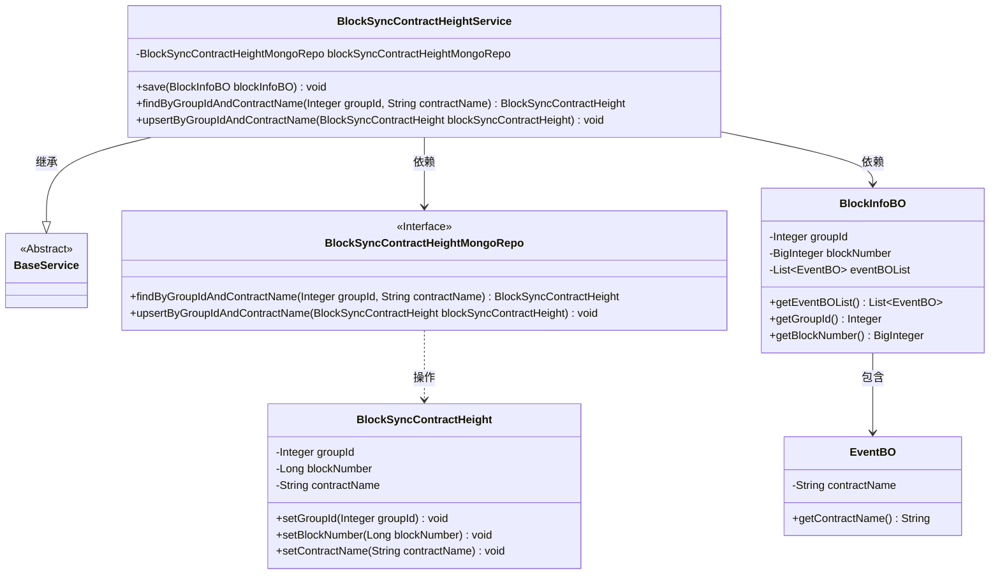
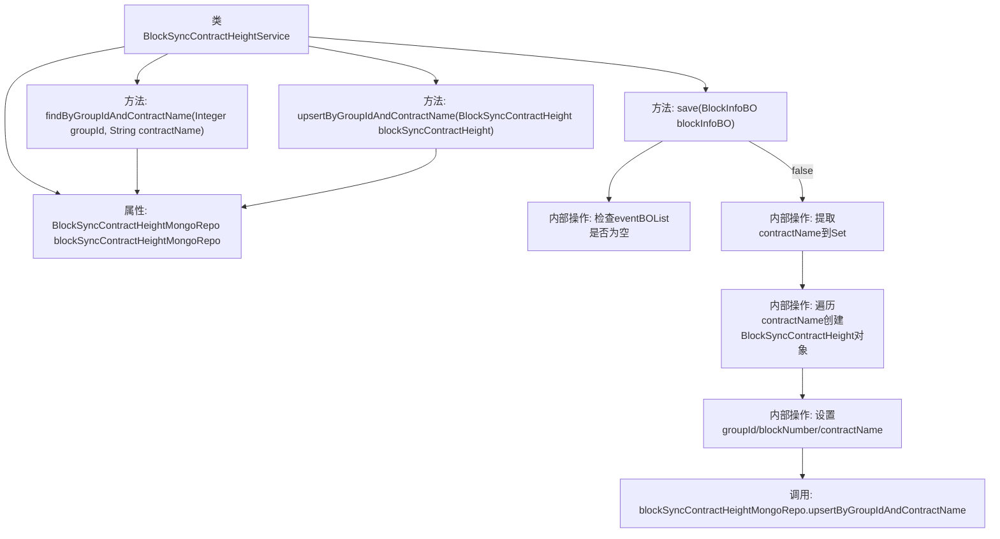

# 基础信息

|      |      |
|------|------|
| 名称 | BlockSyncContractHeightService |
| 编码语言 | .java |
| 代码路径 | WeFe/union/blockchain-data-sync/src/main/java/com/welab/wefe/service/BlockSyncContractHeightService.java |
| 包名 | com.welab.wefe.service |
| 依赖项 | ['com.welab.wefe.bo.data.BlockInfoBO', 'com.welab.wefe.bo.data.EventBO', 'com.welab.wefe.common.data.mongodb.entity.union.BlockSyncContractHeight', 'com.welab.wefe.common.data.mongodb.repo.BlockSyncContractHeightMongoRepo', 'org.apache.commons.collections4.CollectionUtils', 'org.springframework.beans.factory.annotation.Autowired', 'org.springframework.stereotype.Service', 'java.util.HashSet', 'java.util.List', 'java.util.Set'] |
| 概述说明 | BlockSyncContractHeightService用于记录已同步的区块高度和合约信息，提供保存、查询和更新功能，使用MongoDB存储数据。 |

# 说明

BlockSyncContractHeightService是一个服务类，继承自BaseService，用于记录已成功同步的区块高度合约信息。它通过blockSyncContractHeightMongoRepo与MongoDB交互。主要功能包括：保存区块信息，提取事件中的合约名称并去重，为每个合约创建BlockSyncContractHeight对象，设置组ID、区块号和合约名称，然后通过upsert方法更新或插入记录。还提供按组ID和合约名称查询记录的方法。

# 类列表 Class Summary

| 名称   | 类型  | 说明 |
|-------|------|-------------|
| BlockSyncContractHeightService | class | BlockSyncContractHeightService用于记录已同步的区块高度和合约信息，包含保存、查询和更新功能，使用MongoDB存储数据。 |

## 类 BlockSyncContractHeightService

|      |      |
|------|------|
| 访问范围 | @Service;public |
| 类型 | class |
| 名称 | BlockSyncContractHeightService |
| 说明 | BlockSyncContractHeightService用于记录已同步的区块高度和合约信息，包含保存、查询和更新功能，使用MongoDB存储数据。 |

### UML类图

这段代码描述了一个区块链同步服务系统，主要包含BlockSyncContractHeightService服务类及其相关组件。该服务继承自BaseService，通过MongoDB仓库(BlockSyncContractHeightMongoRepo)存储和查询区块同步高度信息。核心功能包括保存区块信息(save方法)、按条件查询(findByGroupIdAndContractName)和更新插入(upsertByGroupIdAndContractName)操作。系统处理的主要数据对象包括区块信息(BlockInfoBO)、事件(EventBO)和同步高度记录(BlockSyncContractHeight)。

### 内部方法调用关系图

这段代码是区块链同步合约高度的服务类，主要功能包括：1) 保存已同步的区块高度信息到MongoDB，通过遍历事件列表中的合约名称，为每个合约创建高度记录；2) 提供按组ID和合约名称查询和更新高度的方法。核心逻辑在save方法中，会先校验事件列表，然后去重处理合约名称，最后批量更新每个合约的最新区块高度。所有数据库操作都委托给blockSyncContractHeightMongoRepo实现。

### 字段列表 Field List

| 名称  | 类型  | 说明 |
|-------|-------|------|
| blockSyncContractHeightMongoRepo | BlockSyncContractHeightMongoRepo | 使用@Autowired自动注入BlockSyncContractHeightMongoRepo实例。 |

### 方法列表

| 名称  | 类型  | 说明 |
|-------|-------|------|
| save | void | 方法save接收BlockInfoBO对象，检查其事件列表非空后，提取所有合约名存入集合。遍历合约名，为每个创建BlockSyncContractHeight对象并设置组ID、块号和合约名，最后通过Mongo存储库更新或插入数据。 |
| findByGroupIdAndContractName | BlockSyncContractHeight | 该方法通过groupId和contractName查询BlockSyncContractHeight，调用MongoDB仓库接口实现。 |
| upsertByGroupIdAndContractName | void | 方法upsertByGroupIdAndContractName根据groupId和contractName更新或插入blockSyncContractHeight数据到MongoDB。 |

