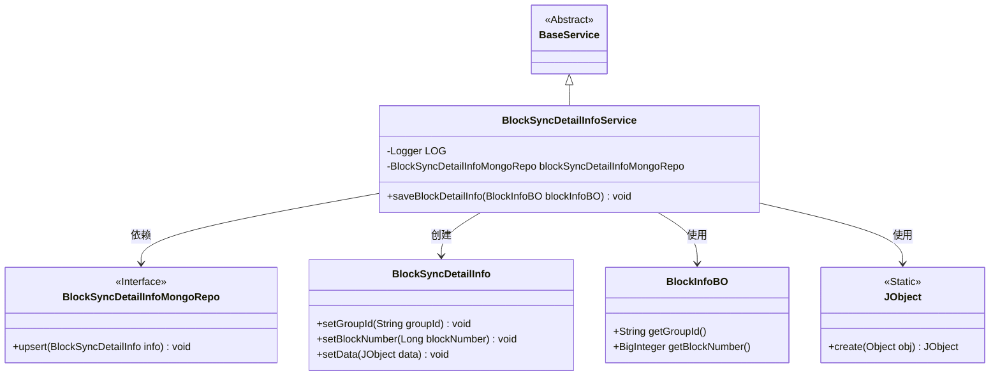
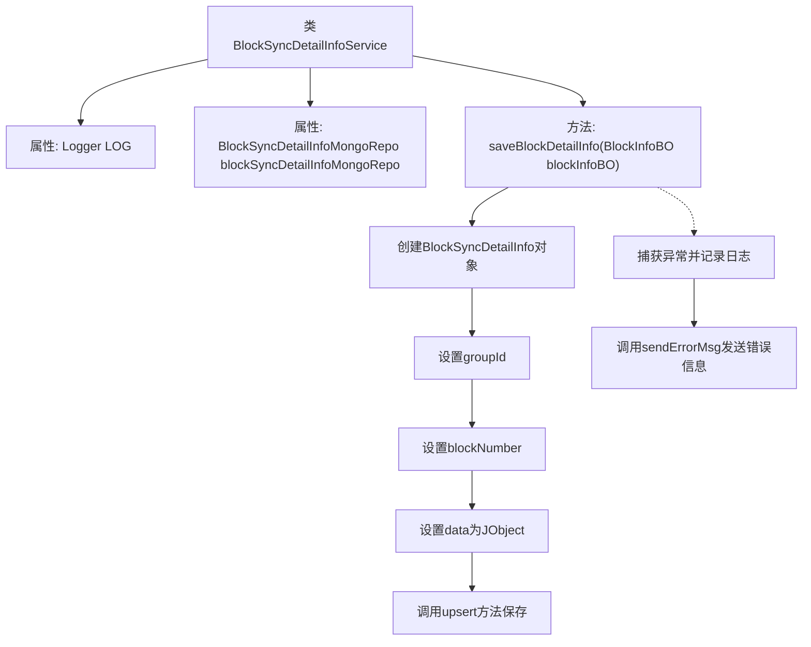

# 基础信息

|      |      |
|------|------|
| 名称 | BlockSyncDetailInfoService |
| 编码语言 | .java |
| 代码路径 | WeFe/union/blockchain-data-sync/src/main/java/com/welab/wefe/service/BlockSyncDetailInfoService.java |
| 包名 | com.welab.wefe.service |
| 依赖项 | ['com.welab.wefe.bo.data.BlockInfoBO', 'com.welab.wefe.common.data.mongodb.entity.union.BlockSyncDetailInfo', 'com.welab.wefe.common.data.mongodb.repo.BlockSyncDetailInfoMongoRepo', 'com.welab.wefe.common.util.JObject', 'org.slf4j.Logger', 'org.slf4j.LoggerFactory', 'org.springframework.beans.factory.annotation.Autowired', 'org.springframework.stereotype.Service'] |
| 概述说明 | BlockSyncDetailInfoService类用于保存区块信息到MongoDB，包含异常处理和日志记录。 |

# 说明

BlockSyncDetailInfoService是一个Spring服务类，继承自BaseService，用于保存区块同步详细信息。它通过@Autowired注入BlockSyncDetailInfoMongoRepo来操作MongoDB。saveBlockDetailInfo方法接收BlockInfoBO对象，将其转换为BlockSyncDetailInfo实体并保存到MongoDB。转换过程中会设置groupId、blockNumber和序列化后的数据。若操作失败，会记录错误日志并调用sendErrorMsg发送错误信息。

# 类列表 Class Summary

| 名称   | 类型  | 说明 |
|-------|------|-------------|
| BlockSyncDetailInfoService | class | BlockSyncDetailInfoService类用于保存区块信息到MongoDB，包含异常处理和日志记录。 |

## 类 BlockSyncDetailInfoService

|      |      |
|------|------|
| 访问范围 | @Service;public |
| 类型 | class |
| 名称 | BlockSyncDetailInfoService |
| 说明 | BlockSyncDetailInfoService类用于保存区块信息到MongoDB，包含异常处理和日志记录。 |

### UML类图

该类图展示了BlockSyncDetailInfoService继承自BaseService，并依赖BlockSyncDetailInfoMongoRepo接口进行数据持久化。服务类通过BlockInfoBO获取区块信息，创建BlockSyncDetailInfo实体并转换为JObject格式后存储。整个过程包含异常处理机制，通过日志记录和错误消息发送来保证系统可靠性。

### 内部方法调用关系图

这段代码是BlockSyncDetailInfoService类的一个服务方法，主要用于保存区块详细信息到MongoDB数据库。流程首先创建BlockSyncDetailInfo对象并设置其属性，然后通过MongoDB仓库的upsert方法进行保存。如果出现异常，会记录错误日志并发送错误消息。整个过程包含了正常的数据持久化流程和异常处理机制，确保区块信息的可靠存储和错误追踪。

### 字段列表 Field List

| 名称  | 类型  | 说明 |
|-------|-------|------|
| LOG = LoggerFactory.getLogger(BlockSyncDetailInfoService.class) | Logger | 类BlockSyncDetailInfoService中定义了一个私有不可变的日志记录器LOG，用于记录日志。 |
| blockSyncDetailInfoMongoRepo | BlockSyncDetailInfoMongoRepo | 使用@Autowired自动注入BlockSyncDetailInfoMongoRepo实例。 |

### 方法列表

| 名称  | 类型  | 说明 |
|-------|-------|------|
| saveBlockDetailInfo | void | 方法保存区块详情信息，转换并存储到MongoDB，失败时记录日志并发送错误消息。 |

