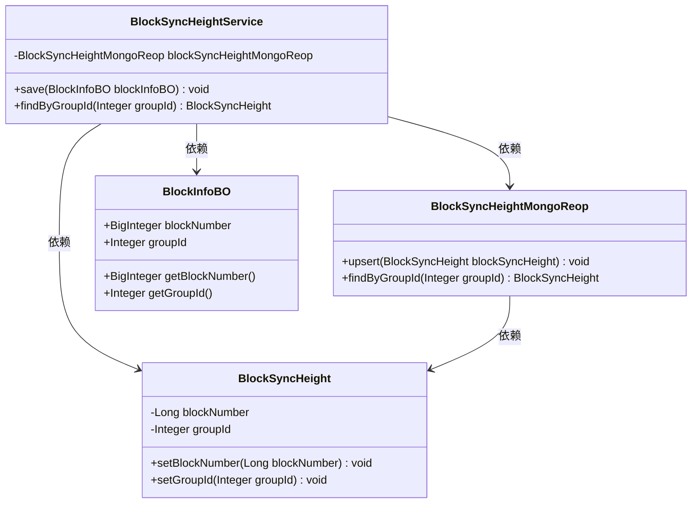
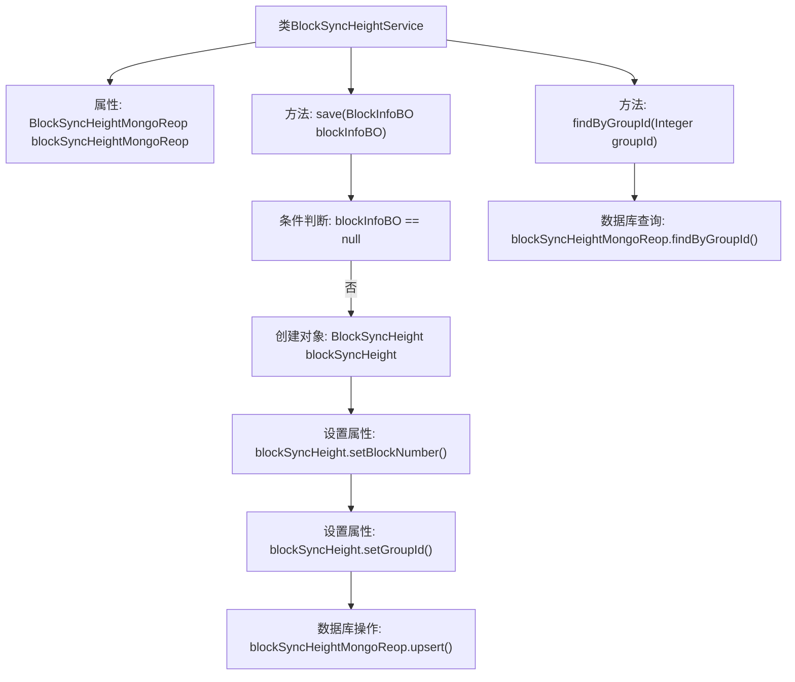

# 基础信息

|      |      |
|------|------|
| 名称 | BlockSyncHeightService |
| 编码语言 | .java |
| 代码路径 | WeFe/union/blockchain-data-sync/src/main/java/com/welab/wefe/service/BlockSyncHeightService.java |
| 包名 | com.welab.wefe.service |
| 依赖项 | ['com.welab.wefe.bo.data.BlockInfoBO', 'com.welab.wefe.common.data.mongodb.entity.union.BlockSyncHeight', 'com.welab.wefe.common.data.mongodb.repo.BlockSyncHeightMongoReop', 'org.springframework.beans.factory.annotation.Autowired', 'org.springframework.stereotype.Service'] |
| 概述说明 | BlockSyncHeightService服务类，用于记录已同步的区块高度信息。包含save方法保存区块高度和groupId到MongoDB，以及findByGroupId方法按groupId查询。 |

# 说明

BlockSyncHeightService是一个服务类，继承自BaseService，用于记录已成功同步的区块高度信息。它通过BlockSyncHeightMongoReop与MongoDB交互。主要功能包括保存区块信息到数据库（若输入为空则跳过）和根据groupId查询区块高度。保存方法会将BlockInfoBO中的blockNumber和groupId转换为BlockSyncHeight对象并执行upsert操作。查询方法通过groupId从数据库获取对应的BlockSyncHeight记录。

# 类列表 Class Summary

| 名称   | 类型  | 说明 |
|-------|------|-------------|
| BlockSyncHeightService | class | BlockSyncHeightService用于记录和查询已同步的区块高度信息，包含保存和按groupId查询功能。 |

## 类 BlockSyncHeightService

|      |      |
|------|------|
| 访问范围 | @Service;public |
| 类型 | class |
| 名称 | BlockSyncHeightService |
| 说明 | BlockSyncHeightService用于记录和查询已同步的区块高度信息，包含保存和按groupId查询功能。 |

### UML类图

这段代码描述了一个区块链同步高度服务系统，主要包含四个核心类：BlockSyncHeightService作为服务层，依赖BlockSyncHeightMongoReop进行数据库操作，处理BlockInfoBO业务对象并转换为BlockSyncHeight持久化对象。BlockSyncHeightService提供保存区块高度和按组查询功能，通过MongoDB实现数据持久化。整体结构清晰体现了分层架构思想，服务层与数据访问层解耦，符合领域驱动设计原则。

### 内部方法调用关系图

该流程图描述了BlockSyncHeightService类的结构和工作流程。类中包含两个主要方法：save()用于保存区块同步高度信息，首先检查参数有效性，然后创建并填充BlockSyncHeight对象，最后通过MongoDB存储；findByGroupId()则直接调用MongoDB查询接口按groupId检索数据。流程清晰展示了从参数校验到数据库操作的全过程，体现了服务层对数据访问层的封装逻辑。

### 字段列表 Field List

| 名称  | 类型  | 说明 |
|-------|-------|------|
| blockSyncHeightMongoReop | BlockSyncHeightMongoReop | 自动注入BlockSyncHeightMongoReop实例。 |

### 方法列表

| 名称  | 类型  | 说明 |
|-------|-------|------|
| save | void | 方法save接收BlockInfoBO对象，非空时创建BlockSyncHeight并设置区块号和组ID，最后更新到MongoDB。 |
| findByGroupId | BlockSyncHeight | 方法通过groupId查询BlockSyncHeight，调用blockSyncHeightMongoReop的findByGroupId实现。 |

