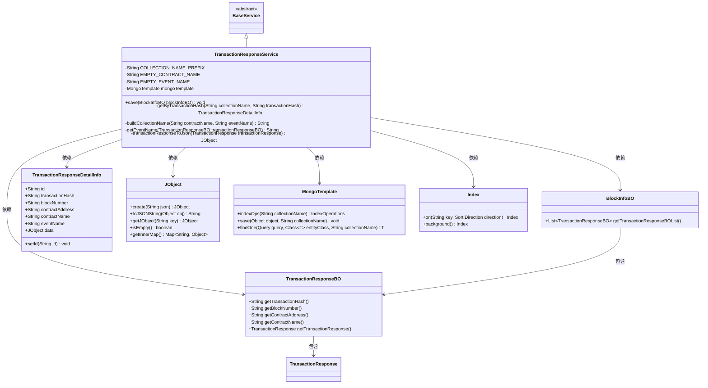
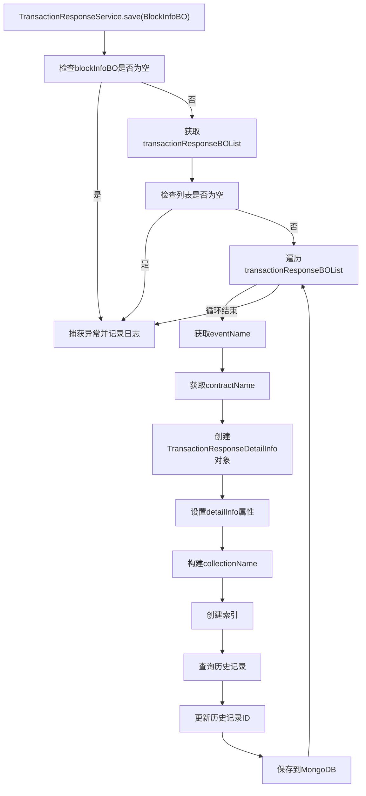
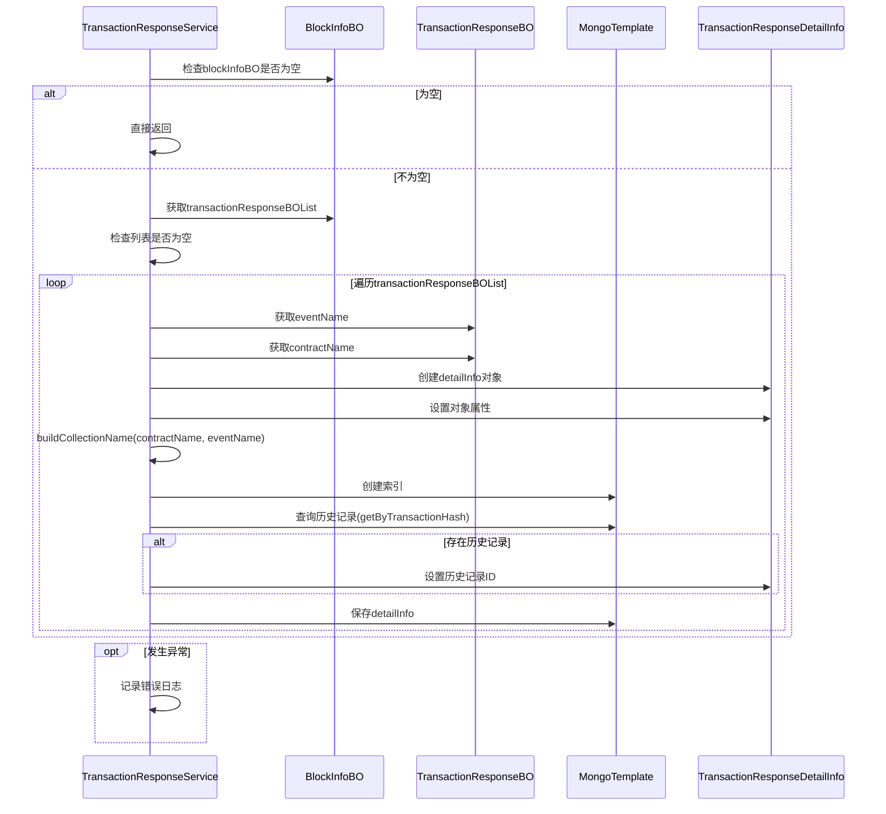

# 基础信息

|      |      |
|------|------|
| 名称 | TransactionResponseService |
| 编码语言 | .java |
| 代码路径 | WeFe/union/blockchain-data-sync/src/main/java/com/welab/wefe/service/TransactionResponseService.java |
| 包名 | com.welab.wefe.service |
| 依赖项 | ['com.welab.wefe.bo.data.BlockInfoBO', 'com.welab.wefe.bo.data.TransactionResponseBO', 'com.welab.wefe.common.data.mongodb.entity.union.TransactionResponseDetailInfo', 'com.welab.wefe.common.data.mongodb.util.QueryBuilder', 'com.welab.wefe.common.util.JObject', 'com.welab.wefe.common.util.StringUtil', 'org.apache.commons.collections4.CollectionUtils', 'org.fisco.bcos.sdk.transaction.model.dto.TransactionResponse', 'org.springframework.beans.factory.annotation.Autowired', 'org.springframework.data.domain.Sort', 'org.springframework.data.mongodb.core.MongoTemplate', 'org.springframework.data.mongodb.core.index.Index', 'org.springframework.data.mongodb.core.query.Query', 'org.springframework.stereotype.Service', 'java.util.List', 'java.util.Set'] |
| 概述说明 | TransactionResponseService类继承BaseService，使用MongoDB存储交易响应数据。主要功能包括：检查并保存交易响应信息，构建集合名称，处理事件名和合约名，创建索引，更新或插入数据。异常时记录日志。 |

# 说明

TransactionResponseService是一个基于MongoDB的服务类，用于处理并存储区块链交易响应数据。它继承自BaseService，通过MongoTemplate操作数据库。主要功能包括：保存交易响应信息到MongoDB集合，集合名称由合约名和事件名动态生成；为交易哈希字段创建索引；处理空合约名和事件名情况；支持更新已存在的记录。服务会从BlockInfoBO中提取交易数据，转换为TransactionResponseDetailInfo对象后存储。异常处理会记录错误日志，包含组ID和区块号等信息。

# 类列表 Class Summary

| 名称   | 类型  | 说明 |
|-------|------|-------------|
| TransactionResponseService | class | TransactionResponseService服务类处理交易响应数据，校验并保存到MongoDB，按合约和事件名分集合存储，自动创建索引，支持更新已有记录。异常时记录日志。 |

## 类 TransactionResponseService

|      |      |
|------|------|
| 访问范围 | @Service;public |
| 类型 | class |
| 名称 | TransactionResponseService |
| 说明 | TransactionResponseService服务类处理交易响应数据，校验并保存到MongoDB，按合约和事件名分集合存储，自动创建索引，支持更新已有记录。异常时记录日志。 |

### UML类图

该类图展示了TransactionResponseService继承BaseService，并依赖多个业务对象和工具类。主要功能是处理区块链交易响应数据，包括数据校验、事件名提取、MongoDB集合命名构建、索引创建及数据存储。通过MongoTemplate操作MongoDB，使用JObject处理JSON数据，核心方法save()实现了交易响应的批量存储逻辑。各类之间通过清晰的依赖关系协同工作，形成完整的数据处理流程。

### 内部方法调用关系图

这段代码是TransactionResponseService类的实现，主要用于处理区块链交易响应数据的存储。核心方法save()会检查输入参数有效性，遍历交易列表，提取事件名和合约名，构建MongoDB集合名称并创建索引，最后保存交易详情数据到MongoDB。流程图中详细展示了从参数检查到数据存储的完整过程，包括异常处理逻辑。时序图则更清晰地展示了各对象间的交互顺序。

### 字段列表 Field List

| 名称  | 类型  | 说明 |
|-------|-------|------|
| mongoTemplate | MongoTemplate | 使用@Autowired自动注入MongoTemplate实例，用于MongoDB操作。 |
| EMPTY_EVENT_NAME = "empty" | String | 定义静态常量EMPTY_EVENT_NAME，值为"empty"。 |
| EMPTY_CONTRACT_NAME = "empty" | String | 定义静态常量EMPTY_CONTRACT_NAME，值为"empty"，表示空合约名。 |
| COLLECTION_NAME_PREFIX = "BlockTr_" | String | 定义静态常量字符串COLLECTION_NAME_PREFIX，值为"BlockTr_"，用于表示集合名前缀。 |

### 方法列表

| 名称  | 类型  | 说明 |
|-------|-------|------|
| buildCollectionName | String | 构建集合名称方法：前缀+合约名+事件名，用下划线连接。 |
| transactionResponseToJson | JObject | 将TransactionResponse对象转为JSON，若为空则返回空对象。 |
| getByTransactionHash | TransactionResponseDetailInfo | 根据交易哈希查询交易详情，若哈希为空返回null，否则通过MongoDB查询并返回结果。 |
| save | void | 方法save处理BlockInfoBO数据，检查非空后遍历其交易列表，提取事件名、合约名等信息构建TransactionResponseDetailInfo对象，创建MongoDB索引并保存数据，异常时记录日志。 |
| getEventName | String | 该方法从交易响应对象中提取事件名称。首先将响应转为JSON，检查事件结果映射是否存在或为空。若空则返回默认空名称，否则取第一个键值作为事件名，若空仍返回默认值。 |

