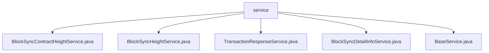

# 基础信息

|      |      |
|------|------|
| 名称 | service |
| 编码语言 | .java |
| 代码路径 | WeFe/union/blockchain-data-sync/src/main/java/com/welab/wefe/service |
| 包名 | docs.union.blockchain-data-sync.src.main.java.com.welab.wefe.service |
| 概述说明 | BlockSyncContractHeightService记录同步区块高度合约信息，与MongoDB交互，保存区块信息并处理合约名称。BlockSyncHeightService记录同步区块高度，支持保存和查询。TransactionResponseService处理交易响应数据，动态生成集合名并创建索引。BlockSyncDetailInfoService保存区块同步详情，转换并存储数据。BaseService提供基础功能，包括错误消息发送。 |

# 说明

## 概述  
该模块是区块链数据同步系统的核心服务层，负责区块高度、合约信息和交易响应的持久化操作。所有服务均继承BaseService，采用MongoDB存储数据，类似数据中台模式。关键数据结构包括BlockSyncContractHeight（合约高度）、BlockSyncHeight（区块高度）和TransactionResponseDetailInfo（交易响应）。外部依赖仅为MongoDB和微信机器人API。例如BlockSyncContractHeightService会为每个合约创建独立记录，TransactionResponseService则动态生成集合名称。

## 主要业务场景  
模块主要处理区块链事件落库全流程：从区块信息捕获（BlockSyncHeightService记录高度）、合约数据提取（BlockSyncContractHeightService去重存储）到交易响应归档（TransactionResponseService建立哈希索引）。采用UPSERT操作保证数据幂等性，类似ETL管道模式。典型场景如联盟链数据同步：先通过BlockSyncDetailInfoService保存原始区块，再分层处理不同业务维度数据。所有异常通过BaseService统一告警，例如BusinessException会触发三次重复微信通知。

### 包内部结构视图

该流程图展示了WeFe项目中区块链数据同步服务的文件结构。根节点为service文件夹，包含5个Java服务类文件：BlockSyncContractHeightService、BlockSyncHeightService、TransactionResponseService、BlockSyncDetailInfoService和BaseService。这些服务类共同构成了区块链数据同步功能的核心实现，每个文件代表不同的业务处理模块。

# 文件列表

| 名称   | 类型  | 说明 |
|-------|------|-------------|
| [BlockSyncContractHeightService.java](BlockSyncContractHeightService.md) | file | BlockSyncContractHeightService用于记录已同步的区块高度和合约信息，提供保存、查询和更新功能，使用MongoDB存储数据。 |
| [BlockSyncHeightService.java](BlockSyncHeightService.md) | file | BlockSyncHeightService服务类，用于记录已同步的区块高度信息。包含save方法保存区块高度和groupId到MongoDB，以及findByGroupId方法按groupId查询。 |
| [TransactionResponseService.java](TransactionResponseService.md) | file | TransactionResponseService类继承BaseService，使用MongoDB存储交易响应数据。主要功能包括：检查并保存交易响应信息，构建集合名称，处理事件名和合约名，创建索引，更新或插入数据。异常时记录日志。 |
| [BlockSyncDetailInfoService.java](BlockSyncDetailInfoService.md) | file | BlockSyncDetailInfoService类用于保存区块信息到MongoDB，包含异常处理和日志记录。 |
| [BaseService.java](BaseService.md) | file | BaseService类包含日志记录和微信错误消息发送功能，根据异常类型格式化错误信息并发送至指定URL。 |

