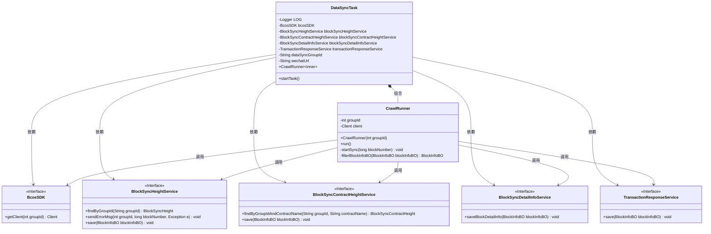
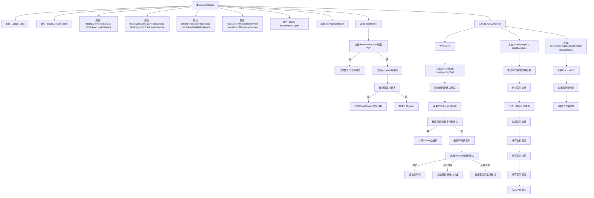

# 基础信息

|      |      |
|------|------|
| 名称 | DataSyncTask |
| 编码语言 | .java |
| 代码路径 | WeFe/union/blockchain-data-sync/src/main/java/com/welab/wefe/task/DataSyncTask.java |
| 包名 | com.welab.wefe.task |
| 依赖项 | ['com.welab.wefe.bo.data.BlockInfoBO', 'com.welab.wefe.bo.data.EventBO', 'com.welab.wefe.common.data.mongodb.entity.union.BlockSyncContractHeight', 'com.welab.wefe.common.data.mongodb.entity.union.BlockSyncHeight', 'com.welab.wefe.common.util.StringUtil', 'com.welab.wefe.common.util.ThreadUtil', 'com.welab.wefe.constant.BlockConstant', 'com.welab.wefe.constant.SyncConstant', 'com.welab.wefe.exception.BusinessException', 'com.welab.wefe.parser.BlockInfoParser', 'com.welab.wefe.service.BlockSyncContractHeightService', 'com.welab.wefe.service.BlockSyncDetailInfoService', 'com.welab.wefe.service.BlockSyncHeightService', 'com.welab.wefe.service.TransactionResponseService', 'com.welab.wefe.tool.DataProcessor', 'com.welab.wefe.tool.DataSyncContext', 'com.welab.wefe.util.BlockUtil', 'org.apache.commons.collections4.CollectionUtils', 'org.apache.commons.lang.math.NumberUtils', 'org.fisco.bcos.sdk.BcosSDK', 'org.fisco.bcos.sdk.client.Client', 'org.fisco.bcos.sdk.client.protocol.response.BcosBlock', 'org.slf4j.Logger', 'org.slf4j.LoggerFactory', 'org.springframework.beans.BeanUtils', 'org.springframework.beans.factory.annotation.Autowired', 'org.springframework.beans.factory.annotation.Value', 'org.springframework.stereotype.Component', 'java.math.BigInteger', 'java.util.ArrayList', 'java.util.List'] |
| 概述说明 | DataSyncTask类用于同步区块链数据，包含组ID配置、微信通知URL，通过多线程按组同步区块数据，处理异常并记录同步状态。 |

# 说明

DataSyncTask是一个用于数据同步的组件类，通过注入多个服务和配置参数实现区块链数据同步功能。主要包含startTask方法启动同步任务，检查配置的群组ID并异步执行CrawlRunner。CrawlRunner是一个内部类，负责持续同步指定群组的区块数据，包括查询已同步区块、处理新区块、过滤已同步合约事件等。同步过程中会记录日志、处理异常，并通过相关服务保存同步结果和错误信息。整体实现了高效、稳定的区块链数据同步机制。

# 类列表 Class Summary

| 名称   | 类型  | 说明 |
|-------|------|-------------|
| DataSyncTask | class | DataSyncTask类是一个数据同步任务组件，通过多线程同步区块链数据，包含错误处理和过滤已同步事件功能。 |

## 类 DataSyncTask

|      |      |
|------|------|
| 访问范围 | @Component;public |
| 类型 | class |
| 名称 | DataSyncTask |
| 说明 | DataSyncTask类是一个数据同步任务组件，通过多线程同步区块链数据，包含错误处理和过滤已同步事件功能。 |

### UML类图

这段代码展示了一个区块链数据同步任务的实现，主要包含DataSyncTask主类和其内部类CrawlRunner。DataSyncTask通过依赖注入获取多个服务接口实例，包括BcosSDK客户端和各类区块同步服务。CrawlRunner实现了Runnable接口，负责具体的区块同步逻辑，包括区块数据获取、过滤、处理和持久化。整个设计采用分层架构，主任务类负责调度，内部类处理具体业务逻辑，通过服务接口实现模块解耦。同步过程包含错误处理、重试机制和进度跟踪等功能，确保数据同步的可靠性和完整性。

### 内部方法调用关系图

这段代码实现了一个区块链数据同步任务，主要包含DataSyncTask类及其内部类CrawlRunner。流程图展示了从任务启动到区块同步的完整流程：首先校验配置参数，然后对每个分组创建异步线程；在同步过程中会检查区块高度差异，通过重试机制获取区块数据，过滤已处理事件后保存各类信息。整个流程包含完善的异常处理和日志记录机制，通过多服务协作完成区块链数据的增量同步。

### 字段列表 Field List

| 名称  | 类型  | 说明 |
|-------|-------|------|
| blockSyncContractHeightService | BlockSyncContractHeightService | 自动注入区块同步合约高度服务实例。 |
| LOG = LoggerFactory.getLogger(DataSyncTask.class) | Logger | 定义DataSyncTask类的私有静态日志对象LOG。 |
| transactionResponseService | TransactionResponseService | 代码片段使用@Autowired注解自动注入TransactionResponseService实例。 |
| blockSyncHeightService | BlockSyncHeightService | 自动注入区块同步高度服务实例。 |
| blockSyncDetailInfoService | BlockSyncDetailInfoService | 代码片段使用@Autowired注解自动注入BlockSyncDetailInfoService服务实例。 |
| dataSyncGroupId | String | 代码片段定义了一个私有字符串变量dataSyncGroupId，其值通过@Value注解从配置项contract.data-sync-group-id注入。 |
| wechatUrl | String | 微信机器人URL配置项，通过@Value注入到私有变量wechatUrl中。 |
| bcosSDK | BcosSDK | 使用@Autowired自动注入BcosSDK实例。 |

### 方法列表

| 名称  | 类型  | 说明 |
|-------|-------|------|
| startTask | void | 方法检查数据同步组ID配置，若为空则警告并返回。否则分割组ID为数组，遍历每个ID，跳过非数字项，对有效ID启动异步爬取任务。 |

