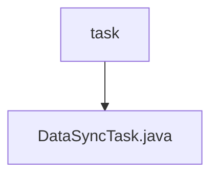

# 基础信息

|      |      |
|------|------|
| 名称 | task |
| 编码语言 | .java |
| 代码路径 | WeFe/union/blockchain-data-sync/src/main/java/com/welab/wefe/task |
| 包名 | docs.union.blockchain-data-sync.src.main.java.com.welab.wefe.task |
| 概述说明 | DataSyncTask类用于同步区块链数据，包含组ID配置、微信通知URL，通过多线程按组同步区块数据，处理异常并记录同步状态。 |

# 说明

DataSyncTask是一个用于数据同步的组件类，通过注入多个服务和配置参数实现区块链数据同步功能。主要包含startTask方法启动同步任务，检查配置的群组ID并异步执行CrawlRunner。CrawlRunner是一个内部类，负责持续同步指定群组的区块数据，包括查询已同步区块、处理新区块、过滤已同步合约事件等。同步过程中会记录日志、处理异常，并通过相关服务保存同步结果和错误信息。整体实现了高效、稳定的区块链数据同步机制。

### 包内部结构视图

该流程图展示了WeFe项目中区块链数据同步模块的简单结构。根节点"task"表示任务目录，其下包含一个具体的任务实现文件"DataSyncTask.java"。这种结构体现了典型的Java项目单文件任务实现模式，其中目录作为功能模块划分，文件承载具体业务逻辑实现。

# 文件列表

| 名称   | 类型  | 说明 |
|-------|------|-------------|
| [DataSyncTask.java](DataSyncTask.md) | file | DataSyncTask类用于同步区块链数据，包含组ID配置、微信通知URL，通过多线程按组同步区块数据，处理异常并记录同步状态。 |

