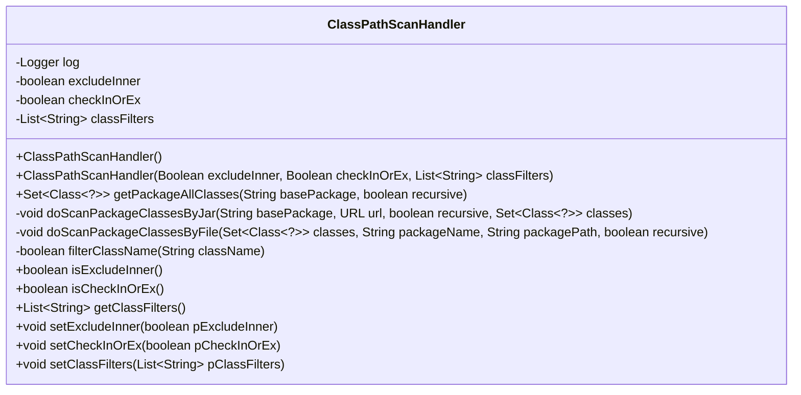
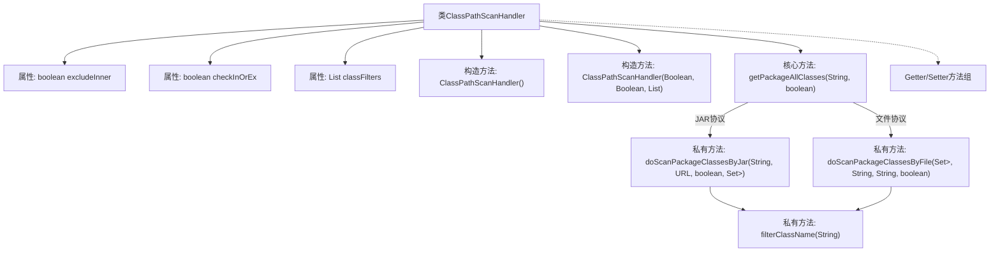

# 基础信息

|      |      |
|------|------|
| 名称 | ClassPathScanHandler |
| 编码语言 | .java |
| 代码路径 | WeFe/union/blockchain-data-sync/src/main/java/com/welab/wefe/tool/ClassPathScanHandler.java |
| 包名 | com.welab.wefe.tool |
| 依赖项 | ['org.slf4j.Logger', 'org.slf4j.LoggerFactory', 'java.io.File', 'java.io.IOException', 'java.net.JarURLConnection', 'java.net.URL', 'java.net.URLDecoder', 'java.util.Enumeration', 'java.util.LinkedHashSet', 'java.util.List', 'java.util.Set', 'java.util.jar.JarEntry', 'java.util.jar.JarFile', 'java.util.regex.Pattern'] |
| 概述说明 | ClassPathScanHandler类用于扫描类路径下的类，支持排除内部类、自定义过滤规则，可递归扫描文件或JAR包中的类。 |

# 说明

ClassPathScanHandler是一个用于扫描类路径下所有类的工具类。它支持通过文件系统和JAR文件两种方式扫描指定包路径下的类，并提供了多种过滤选项。主要功能包括：设置是否排除内部类（excludeInner）、定义过滤规则（checkInOrEx）和过滤列表（classFilters）。核心方法getPackageAllClasses递归扫描指定包路径，根据文件类型调用doScanPackageClassesByFile或doScanPackageClassesByJar处理。扫描过程中会应用过滤规则，并记录日志信息。该类还提供了相关属性的getter和setter方法。

# 类列表 Class Summary

| 名称   | 类型  | 说明 |
|-------|------|-------------|
| ClassPathScanHandler | class | ClassPathScanHandler类用于扫描类路径下的类，支持排除内部类、自定义过滤规则，可处理文件和JAR包中的类。 |

## 类 ClassPathScanHandler

|      |      |
|------|------|
| 访问范围 | public |
| 类型 | class |
| 名称 | ClassPathScanHandler |
| 说明 | ClassPathScanHandler类用于扫描类路径下的类，支持排除内部类、自定义过滤规则，可处理文件和JAR包中的类。 |

### UML类图

类图描述：ClassPathScanHandler类是一个用于扫描类路径下所有类的工具类，包含三个主要私有属性：excludeInner（是否排除内部类）、checkInOrEx（过滤规则应用方式）和classFilters（过滤规则列表）。提供构造方法和getPackageAllClasses方法用于扫描指定包下的所有类，支持文件和JAR两种扫描方式，并通过filterClassName方法实现类名过滤功能。

### 内部方法调用关系图

流程图描述：该流程图展示了ClassPathScanHandler类的完整结构，包含三个核心属性（excludeInner、checkInOrEx、classFilters）、两个构造方法、核心扫描方法getPackageAllClasses及其分支逻辑。通过文件/JAR两种协议路径扫描类文件，最终通过filterClassName方法进行类名过滤，并包含完整的Getter/Setter方法组。扫描过程会递归处理子目录，并根据配置排除内部类。

### 字段列表 Field List

| 名称  | 类型  | 说明 |
|-------|-------|------|
| checkInOrEx = true | boolean | 变量checkInOrEx为布尔类型，初始值为true。 |
| classFilters = null | List<String> | 类过滤器列表初始化为空 |
| log = LoggerFactory.getLogger(ClassPathScanHandler.class) | Logger | 定义静态常量log，使用LoggerFactory获取ClassPathScanHandler类的日志记录器实例。 |
| excludeInner = true | boolean | 排除内部元素标志，默认开启。 |

### 方法列表

| 名称  | 类型  | 说明 |
|-------|-------|------|
| doScanPackageClassesByJar | void | 该方法扫描JAR包中指定包路径下的类文件，根据递归和排除内部类等条件筛选，加载符合条件的类到集合中。处理异常并记录日志。 |
| getClassFilters | List<String> | 获取类过滤器列表的方法，返回classFilters变量。 |
| isExcludeInner | boolean | 方法isExcludeInner返回布尔值excludeInner的状态。 |
| doScanPackageClassesByFile | void | 扫描指定包路径下的类文件，递归处理子目录，排除内部类，加载符合条件的类到集合中。 |
| setExcludeInner | void | 设置是否排除内部元素的布尔值方法。 |
| filterClassName | boolean | 该方法用于过滤类名：若非.class后缀返回false；若无过滤规则返回true；否则检查类名（去除.class后缀）是否匹配过滤规则（支持*通配符），根据checkInOrEx标志返回匹配结果。 |
| isCheckInOrEx | boolean | 方法isCheckInOrEx返回布尔值checkInOrEx。 |
| setClassFilters | void | 设置类过滤器列表，将输入参数pClassFilters赋值给成员变量classFilters。 |
| getPackageAllClasses | Set<Class<?>> | 获取指定包路径下所有类，支持递归扫描文件或JAR包中的类，处理异常并返回类集合。 |
| setCheckInOrEx | void | 设置布尔值参数pCheckInOrEx到变量checkInOrEx。 |

