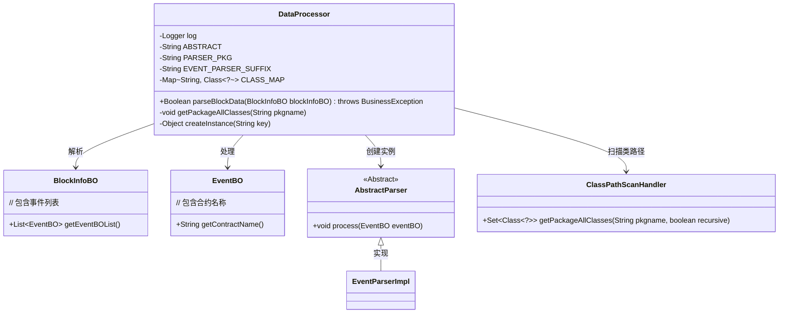
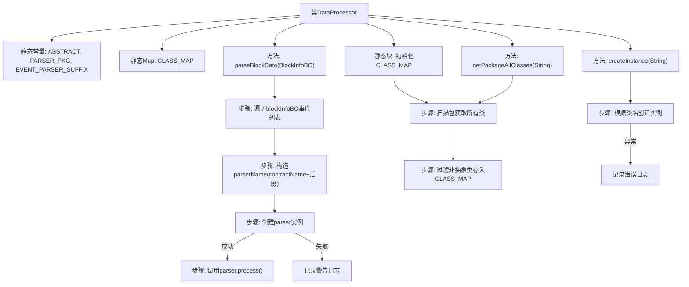

# 基础信息

|      |      |
|------|------|
| 名称 | DataProcessor |
| 编码语言 | .java |
| 代码路径 | WeFe/union/blockchain-data-sync/src/main/java/com/welab/wefe/tool/DataProcessor.java |
| 包名 | com.welab.wefe.tool |
| 依赖项 | ['com.welab.wefe.bo.data.BlockInfoBO', 'com.welab.wefe.bo.data.EventBO', 'com.welab.wefe.exception.BusinessException', 'com.welab.wefe.parser.AbstractParser', 'org.slf4j.Logger', 'org.slf4j.LoggerFactory', 'java.util.HashMap', 'java.util.Map', 'java.util.Set'] |
| 概述说明 | DataProcessor类通过反射动态加载指定包下的解析器类，处理区块事件数据。静态块初始化类映射，parseBlockData方法创建解析器实例并处理事件。 |

# 说明

DataProcessor类是一个用于处理区块数据的工具类。它通过静态初始化块扫描指定包路径下的所有类，并缓存非抽象类到CLASS_MAP中。主要功能parseBlockData方法遍历区块事件列表，根据合约名动态创建对应的解析器实例（命名规则为合约名+EventParser后缀），并调用其process方法处理事件数据。若解析器创建失败会记录警告日志并返回false。类中还包含辅助方法getPackageAllClasses用于获取包下所有类，以及createInstance用于根据类名创建实例。整个过程都配有完善的日志记录。

# 类列表 Class Summary

| 名称   | 类型  | 说明 |
|-------|------|-------------|
| DataProcessor | class | DataProcessor类处理区块数据，通过反射动态加载解析器类并处理事件。静态初始化扫描指定包下非抽象类，运行时根据合约名创建对应解析器实例执行处理。 |

## 类 DataProcessor

|      |      |
|------|------|
| 访问范围 | public |
| 类型 | class |
| 名称 | DataProcessor |
| 说明 | DataProcessor类处理区块数据，通过反射动态加载解析器类并处理事件。静态初始化扫描指定包下非抽象类，运行时根据合约名创建对应解析器实例执行处理。 |

### UML类图

该代码实现了一个基于反射的事件处理器框架，DataProcessor通过扫描指定包下的非抽象类，动态创建对应合约的事件解析器(XXXEventParser)，并处理区块链事件数据。核心流程包括：1)静态初始化阶段扫描类路径；2)运行时根据合约名动态实例化解析器；3)调用解析器处理事件。类图展示了主要组件及其关系，包括数据对象(BlockInfoBO/EventBO)、处理器(AbstractParser)和类扫描器(ClassPathScanHandler)的协作方式。

### 内部方法调用关系图

这段代码实现了一个区块链数据处理器，主要功能是通过反射机制动态加载并执行特定格式的事件解析器。静态初始化阶段会扫描指定包下的所有非抽象类并缓存，parseBlockData方法会为每个事件动态创建对应的解析器实例并处理事件。流程图清晰展示了类结构、初始化过程以及事件处理的主流程，包括异常处理路径。该设计实现了插件式架构，通过命名约定自动发现和加载处理器。

### 字段列表 Field List

| 名称  | 类型  | 说明 |
|-------|-------|------|
| EVENT_PARSER_SUFFIX = "EventParser" | String | 常量EVENT_PARSER_SUFFIX定义为字符串"EventParser"。 |
| log = LoggerFactory.getLogger(DataProcessor.class) | Logger | 定义DataProcessor类的私有静态日志对象log。 |
| PARSER_PKG = "com.welab.wefe.parser" | String | 定义私有静态常量字符串PARSER_PKG，值为"com.welab.wefe.parser"。 |
| CLASS_MAP = new HashMap<>() | Map<String, Class<?>> | 定义了一个私有静态常量CLASS_MAP，类型为Map，键为String，值为Class对象。 |
| ABSTRACT = "Abstract" | String | 静态常量字符串ABSTRACT值为"Abstract"。 |

### 方法列表

| 名称  | 类型  | 说明 |
|-------|-------|------|
| parseBlockData | Boolean | 静态方法parseBlockData解析区块信息，遍历事件列表，根据合约名动态创建解析器实例，若失败返回false，成功则处理事件并返回true。 |
| getPackageAllClasses | void | 该方法扫描指定包下的所有类，过滤掉抽象类，将类名和类对象存入映射表并打印类全名。 |
| createInstance | Object | 静态方法根据键从映射获取类并创建实例，失败返回null。 |

