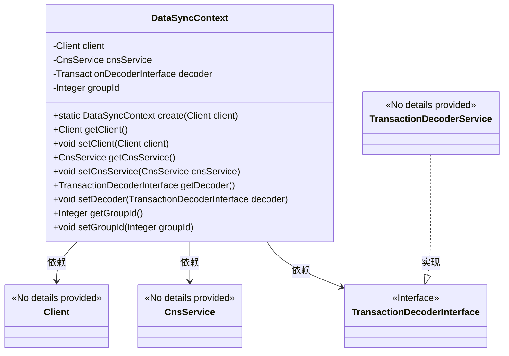

# 基础信息

|      |      |
|------|------|
| 名称 | DataSyncContext |
| 编码语言 | .java |
| 代码路径 | WeFe/union/blockchain-data-sync/src/main/java/com/welab/wefe/tool/DataSyncContext.java |
| 包名 | com.welab.wefe.tool |
| 依赖项 | ['org.fisco.bcos.sdk.client.Client', 'org.fisco.bcos.sdk.contract.precompiled.cns.CnsService', 'org.fisco.bcos.sdk.transaction.codec.decode.TransactionDecoderInterface', 'org.fisco.bcos.sdk.transaction.codec.decode.TransactionDecoderService'] |
| 概述说明 | DataSyncContext类封装区块链客户端、CNS服务、交易解码器和组ID，提供创建和访问方法。 |

# 说明

DataSyncContext类封装了区块链数据同步的核心功能，包含区块链客户端、CNS服务、交易解码器和群组ID四个关键组件。通过静态工厂方法create初始化对象，自动配置解码器和服务实例，并提供全套getter/setter方法实现灵活访问和修改。该类主要用于管理区块链交互的基础环境配置。

# 类列表 Class Summary

| 名称   | 类型  | 说明 |
|-------|------|-------------|
| DataSyncContext | class | DataSyncContext类封装区块链客户端、CNS服务、交易解码器和组ID，提供创建和访问方法。 |

## 类 DataSyncContext

|      |      |
|------|------|
| 访问范围 | public |
| 类型 | class |
| 名称 | DataSyncContext |
| 说明 | DataSyncContext类封装区块链客户端、CNS服务、交易解码器和组ID，提供创建和访问方法。 |

### UML类图

类图描述：DataSyncContext类封装了区块链客户端(Client)、CNS服务(CnsService)、交易解码器接口(TransactionDecoderInterface)和群组ID(groupId)等核心组件，通过工厂方法create()初始化这些依赖项。TransactionDecoderService实现了TransactionDecoderInterface接口。该类提供了完整的getter/setter方法用于属性访问和修改，实现了区块链数据同步的上下文管理功能。

### 内部方法调用关系图

这段代码定义了一个DataSyncContext类，用于管理区块链数据同步的上下文信息。核心是通过静态工厂方法create()初始化对象，该方法会设置客户端实例、交易解码器、组ID和CNS服务。类中包含四个主要属性及其getter/setter方法，其中client和decoder在创建时初始化且不可为空。流程图展示了类结构和create()方法的详细初始化流程，突出了对象创建时的依赖关系。

### 字段列表 Field List

| 名称  | 类型  | 说明 |
|-------|-------|------|
| groupId | Integer | 定义私有整型变量groupId。 |
| decoder | TransactionDecoderInterface | 私有成员变量decoder，类型为TransactionDecoderInterface接口。 |
| cnsService | CnsService | 私有CnsService实例变量。 |
| client | Client | 私有客户端实例变量。 |

### 方法列表

| 名称  | 类型  | 说明 |
|-------|-------|------|
| getCnsService | CnsService | 获取CnsService实例的方法。 |
| setClient | void | 设置客户端对象的方法，将传入的client参数赋值给当前对象的client属性。 |
| create | DataSyncContext | 创建DataSyncContext实例，初始化client、decoder、groupId和cnsService，返回配置好的对象。 |
| setCnsService | void | 这是一个Java方法，用于设置类的CnsService成员变量。方法接受一个CnsService参数，并将其赋值给当前对象的cnsService属性。 |
| getClient | Client | 获取客户端实例的方法，直接返回私有成员变量client。 |
| getDecoder | TransactionDecoderInterface | 获取交易解码器接口实例的方法。 |
| setDecoder | void | 设置交易解码器接口实例。 |
| getGroupId | Integer | 获取分组ID的方法，返回整数类型的groupId。 |
| setGroupId | void | 这是一个Java方法，用于设置类的groupId属性，接受一个Integer类型参数。 |

