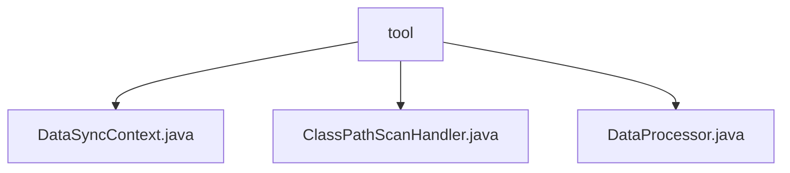

# 基础信息

|      |      |
|------|------|
| 名称 | tool |
| 编码语言 | .java |
| 代码路径 | WeFe/union/blockchain-data-sync/src/main/java/com/welab/wefe/tool |
| 包名 | docs.union.blockchain-data-sync.src.main.java.com.welab.wefe.tool |
| 概述说明 | DataSyncContext管理区块链交互配置，含客户端、CNS、解码器和群组ID。ClassPathScanHandler扫描类路径，支持文件和JAR扫描及过滤。DataProcessor处理区块数据，动态创建解析器并处理事件。 |

# 说明

## 概述  
该模块实现区块链数据同步与处理的核心功能，包含环境配置管理、类路径扫描和事件解析三大组件。DataSyncContext负责管理区块链客户端、CNS服务等基础配置；ClassPathScanHandler提供类路径扫描能力，支持文件系统和JAR包两种方式；DataProcessor动态加载合约解析器处理区块事件。  

接口规范包括：DataSyncContext通过工厂模式创建，ClassPathScanHandler支持过滤规则配置，DataProcessor要求解析器遵循"合约名+EventParser"命名规范。关键数据结构涉及CLASS_MAP缓存、classFilters过滤列表和群组ID等配置项。  

外部依赖包括区块链客户端SDK、日志组件和JAR文件操作库。例如DataSyncContext依赖CNS服务，ClassPathScanHandler需要处理JAR清单文件。实现案例包含合约事件解析器动态加载、内部类排除过滤等场景。

## 主要业务场景  
模块工作流分为三阶段：1) DataSyncContext初始化区块链环境；2) ClassPathScanHandler扫描类路径获取解析器；3) DataProcessor匹配合约事件并调用对应解析器。类似事件总线模式，通过动态绑定实现扩展性。  

典型应用包括跨链数据同步、智能合约事件分析等场景。例如DataProcessor可解析不同合约的区块事件，ClassPathScanHandler支持按需过滤特定包路径。交互模式以配置驱动为主，如设置excludeInner排除内部类，通过群组ID隔离不同链环境。  

API类型涵盖工厂方法（create）、扫描接口（getPackageAllClasses）和数据处理（parseBlockData）。集成案例展示如何通过约定优于配置原则，实现合约解析器的自动发现与加载。

### 包内部结构视图

该流程图展示了WeFe项目中区块链数据同步工具的代码结构。根节点"tool"下包含三个Java文件：DataSyncContext.java处理数据同步上下文，ClassPathScanHandler.java负责类路径扫描，DataProcessor.java进行数据处理。这三个文件直接位于tool目录下，没有更深层级的子目录结构，属于平级关系。

# 文件列表

| 名称   | 类型  | 说明 |
|-------|------|-------------|
| [DataSyncContext.java](DataSyncContext.md) | file | DataSyncContext类封装区块链客户端、CNS服务、交易解码器和组ID，提供创建和访问方法。 |
| [ClassPathScanHandler.java](ClassPathScanHandler.md) | file | ClassPathScanHandler类用于扫描类路径下的类，支持排除内部类、自定义过滤规则，可递归扫描文件或JAR包中的类。 |
| [DataProcessor.java](DataProcessor.md) | file | DataProcessor类通过反射动态加载指定包下的解析器类，处理区块事件数据。静态块初始化类映射，parseBlockData方法创建解析器实例并处理事件。 |

