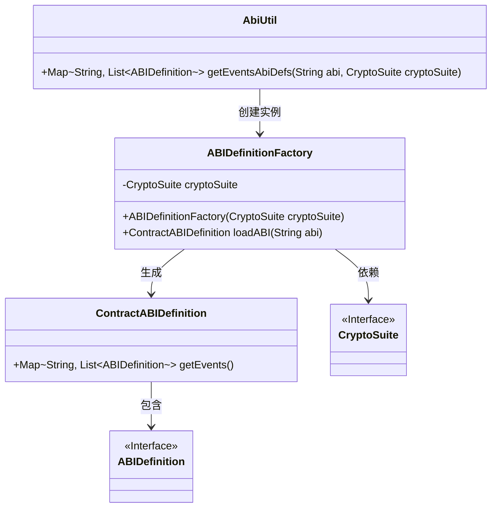
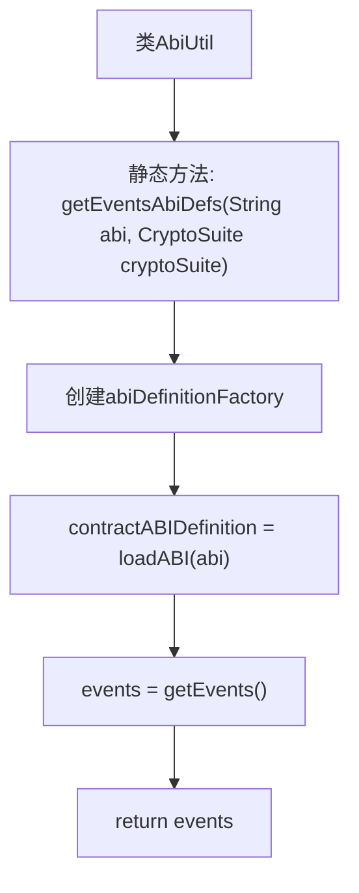

# 基础信息

|      |      |
|------|------|
| 名称 | AbiUtil |
| 编码语言 | .java |
| 代码路径 | WeFe/union/blockchain-data-sync/src/main/java/com/welab/wefe/util/AbiUtil.java |
| 包名 | com.welab.wefe.util |
| 依赖项 | ['org.fisco.bcos.sdk.abi.wrapper.ABIDefinition', 'org.fisco.bcos.sdk.abi.wrapper.ABIDefinitionFactory', 'org.fisco.bcos.sdk.abi.wrapper.ContractABIDefinition', 'org.fisco.bcos.sdk.crypto.CryptoSuite', 'java.util.List', 'java.util.Map'] |
| 概述说明 | AbiUtil类包含静态方法getEventsAbiDefs，通过ABIDefinitionFactory解析ABI字符串并返回事件定义列表。 |

# 说明

AbiUtil类包含一个静态方法getEventsAbiDefs，该方法接收ABI字符串和CryptoSuite对象作为参数。方法内部通过ABIDefinitionFactory创建实例，并使用loadABI方法加载ABI字符串生成ContractABIDefinition对象。最后返回该对象中存储的事件定义映射，其中键为字符串类型，值为ABIDefinition对象的列表。

# 类列表 Class Summary

| 名称   | 类型  | 说明 |
|-------|------|-------------|
| AbiUtil | class | AbiUtil类提供静态方法getEventsAbiDefs，通过输入ABI字符串和CryptoSuite对象，返回包含事件定义的映射。方法使用ABIDefinitionFactory解析ABI并提取事件列表。 |

## 类 AbiUtil

|      |      |
|------|------|
| 访问范围 | public |
| 类型 | class |
| 名称 | AbiUtil |
| 说明 | AbiUtil类提供静态方法getEventsAbiDefs，通过输入ABI字符串和CryptoSuite对象，返回包含事件定义的映射。方法使用ABIDefinitionFactory解析ABI并提取事件列表。 |

### UML类图

这段代码描述了一个ABI工具类AbiUtil，它通过ABIDefinitionFactory加载合约ABI并提取事件定义。核心流程是：AbiUtil调用ABIDefinitionFactory创建实例，工厂加载ABI字符串生成ContractABIDefinition对象，最终返回事件映射表。其中CryptoSuite作为加密工具接口被依赖，ABIDefinition是事件定义的接口规范。整个结构展示了从ABI字符串到事件定义的转换过程，涉及工厂模式和数据封装。

### 内部方法调用关系图

这段代码流程图展示了AbiUtil类中getEventsAbiDefs方法的完整执行流程。该方法首先通过ABIDefinitionFactory解析传入的ABI字符串，生成合约定义对象后提取事件列表，最终返回事件名称与定义的映射关系。整个过程体现了ABI解析的核心逻辑，涉及工厂模式创建、数据加载和结果提取三个关键步骤。

### 字段列表 Field List

| 名称  | 类型  | 说明 |
|-------|-------|------|

### 方法列表

| 名称  | 类型  | 说明 |
|-------|-------|------|
| getEventsAbiDefs | Map<String, List<ABIDefinition>> | 静态方法getEventsAbiDefs接收ABI字符串和加密套件，通过工厂解析ABI并返回事件定义映射。 |

