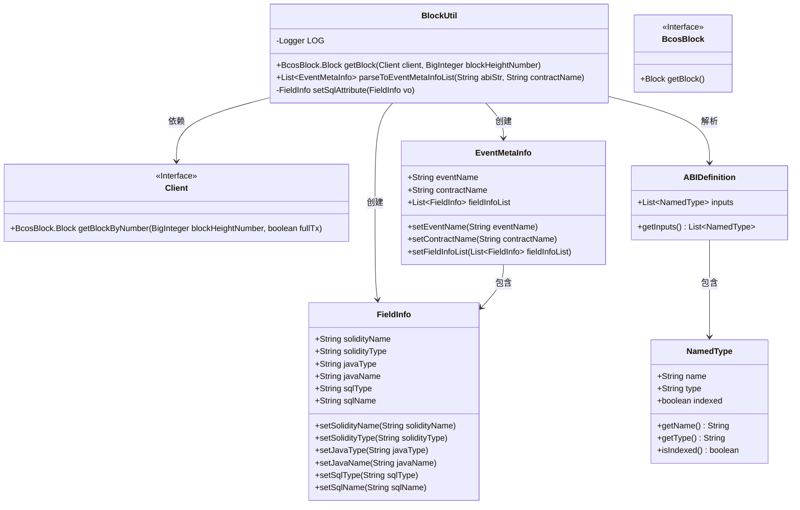
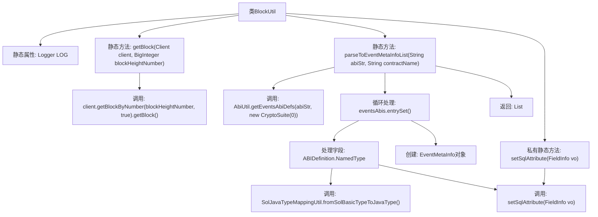

# 基础信息

|      |      |
|------|------|
| 名称 | BlockUtil |
| 编码语言 | .java |
| 代码路径 | WeFe/union/blockchain-data-sync/src/main/java/com/welab/wefe/util/BlockUtil.java |
| 包名 | com.welab.wefe.util |
| 依赖项 | ['cn.hutool.core.collection.CollectionUtil', 'cn.hutool.core.util.StrUtil', 'com.welab.wefe.bo.contract.EventMetaInfo', 'com.welab.wefe.bo.contract.FieldInfo', 'com.welab.wefe.common.util.JObject', 'com.welab.wefe.enums.JavaTypeEnum', 'org.apache.commons.lang3.StringUtils', 'org.fisco.bcos.sdk.abi.wrapper.ABIDefinition', 'org.fisco.bcos.sdk.client.Client', 'org.fisco.bcos.sdk.client.protocol.response.BcosBlock', 'org.fisco.bcos.sdk.crypto.CryptoSuite', 'org.slf4j.Logger', 'org.slf4j.LoggerFactory', 'java.math.BigInteger', 'java.util.ArrayList', 'java.util.List', 'java.util.Map'] |
| 概述说明 | BlockUtil类提供两个功能：1.通过区块高度获取区块信息；2.解析合约ABI生成事件元数据列表，包含事件名、合约名及字段类型映射。 |

# 说明

BlockUtil类包含两个核心方法：getBlock通过客户端和区块高度获取区块数据；parseToEventMetaInfoList解析合约ABI字符串和名称，生成事件元信息列表。该方法处理事件ABI定义，过滤非索引字段，映射Solidity类型到Java类型，并设置SQL属性。过程中会校验事件ABI有效性，记录异常情况。最终返回包含事件名、合约名及字段信息的EventMetaInfo对象列表。辅助方法setSqlAttribute负责设置字段的SQL类型和名称。

# 类列表 Class Summary

| 名称   | 类型  | 说明 |
|-------|------|-------------|
| BlockUtil | class | BlockUtil类提供获取区块和解析事件元数据的方法。getBlock通过区块高度获取区块信息。parseToEventMetaInfoList根据合约ABI和名称解析事件元数据，处理事件名、合约名及字段映射，并设置SQL属性。 |

## 类 BlockUtil

|      |      |
|------|------|
| 访问范围 | public |
| 类型 | class |
| 名称 | BlockUtil |
| 说明 | BlockUtil类提供获取区块和解析事件元数据的方法。getBlock通过区块高度获取区块信息。parseToEventMetaInfoList根据合约ABI和名称解析事件元数据，处理事件名、合约名及字段映射，并设置SQL属性。 |

### UML类图

这段代码主要实现了一个区块链工具类BlockUtil，包含两个核心功能：1) 通过客户端获取指定高度的区块数据；2) 解析智能合约ABI生成事件元信息列表。类图展示了BlockUtil与多个辅助类的交互关系，包括Client接口获取区块数据、EventMetaInfo存储事件元数据、FieldInfo存储字段信息，以及ABIDefinition和NamedType用于解析ABI结构。整个设计采用分层结构，BlockUtil作为入口类协调各组件完成区块链数据解析工作，体现了清晰的职责划分和模块化设计思想。

### 内部方法调用关系图

该流程图展示了BlockUtil类的结构和方法调用关系。类包含获取区块信息的getBlock方法和解析事件元数据的parseToEventMetaInfoList方法，后者通过AbiUtil工具解析ABI字符串，遍历事件定义并处理字段类型映射，最终返回事件元信息列表。私有方法setSqlAttribute用于设置字段的SQL属性。整个过程涉及多个工具类和类型转换操作，体现了区块链事件解析的复杂性。

### 字段列表 Field List

| 名称  | 类型  | 说明 |
|-------|-------|------|
| LOG = LoggerFactory.getLogger(BlockUtil.class) | Logger | 定义BlockUtil类的静态日志对象LOG，用于记录日志信息。 |

### 方法列表

| 名称  | 类型  | 说明 |
|-------|-------|------|
| getBlock | BcosBlock.Block | 获取指定高度的区块链块信息，返回包含完整交易详情的块对象。 |
| parseToEventMetaInfoList | List<EventMetaInfo> | 解析ABI字符串生成事件元信息列表，包括事件名、合约名和字段信息，过滤索引字段并映射Java类型，处理异常情况后返回列表。 |
| setSqlAttribute | FieldInfo | 方法setSqlAttribute接收FieldInfo对象，根据其javaType设置sqlType，将javaName转为下划线格式作为sqlName，最后返回更新后的对象。 |

