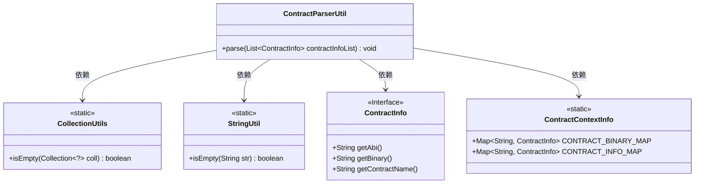
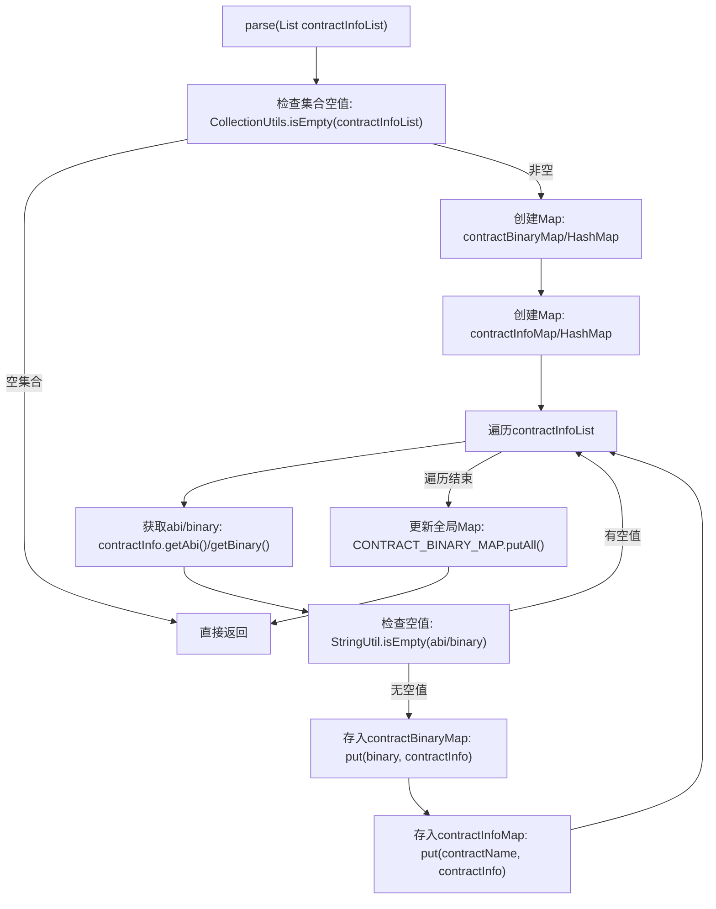

# 基础信息

|      |      |
|------|------|
| 名称 | ContractParserUtil |
| 编码语言 | .java |
| 代码路径 | WeFe/union/blockchain-data-sync/src/main/java/com/welab/wefe/util/ContractParserUtil.java |
| 包名 | com.welab.wefe.util |
| 依赖项 | ['com.welab.wefe.bo.contract.ContractContextInfo', 'com.welab.wefe.bo.contract.ContractInfo', 'com.welab.wefe.common.util.StringUtil', 'org.apache.commons.collections4.CollectionUtils', 'java.util.HashMap', 'java.util.List', 'java.util.Map'] |
| 概述说明 | ContractParserUtil类解析合约信息列表，过滤无效数据后，将二进制和合约名分别映射到ContractInfo对象，并存入全局上下文。 |

# 说明

ContractParserUtil类包含一个静态方法parse，用于处理ContractInfo对象列表。方法首先检查列表是否为空，为空则直接返回。然后创建两个HashMap分别以二进制代码和合约名称为键存储ContractInfo对象。遍历列表时跳过abi或binary为空的条目，将有效数据存入对应Map。最后将两个临时Map的内容分别合并到ContractContextInfo类的静态Map中。整个过程实现了合约信息的分类存储。

# 类列表 Class Summary

| 名称   | 类型  | 说明 |
|-------|------|-------------|
| ContractParserUtil | class | ContractParserUtil类提供静态方法parse，处理合同信息列表，过滤无效数据后，将合同二进制和名称分别映射到合同信息，并存入全局上下文。 |

## 类 ContractParserUtil

|      |      |
|------|------|
| 访问范围 | public |
| 类型 | class |
| 名称 | ContractParserUtil |
| 说明 | ContractParserUtil类提供静态方法parse，处理合同信息列表，过滤无效数据后，将合同二进制和名称分别映射到合同信息，并存入全局上下文。 |

### UML类图

这段代码展示了一个合约解析工具类`ContractParserUtil`，它通过静态方法`parse`处理合约信息列表。主要功能是过滤无效合约数据，并将有效数据存入两个静态映射表中。类图中清晰地显示了工具类与工具类库(`CollectionUtils`/`StringUtil`)、合约信息接口(`ContractInfo`)及上下文存储类(`ContractContextInfo`)之间的依赖关系，体现了数据校验、过滤和存储的完整流程。

### 内部方法调用关系图

该流程图描述了`ContractParserUtil.parse()`方法的完整逻辑流程。方法首先检查输入集合是否为空，若为空则直接返回；否则创建两个临时HashMap用于存储合约数据。遍历过程中会过滤掉ABI或Binary为空的合约，将有效数据存入对应的Map。最后将临时Map的内容合并到全局的`ContractContextInfo`静态Map中。流程包含空值检查、数据过滤和两级Map合并等关键步骤。

### 字段列表 Field List

| 名称  | 类型  | 说明 |
|-------|-------|------|

### 方法列表

| 名称  | 类型  | 说明 |
|-------|-------|------|
| parse | void | 解析合约信息列表，过滤无效数据后，将二进制和合约名分别映射到合约信息，并存入全局上下文。 |

