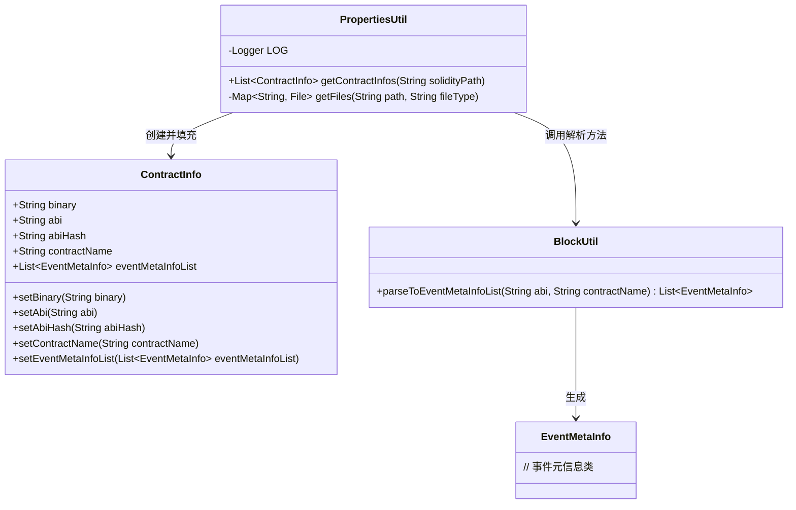
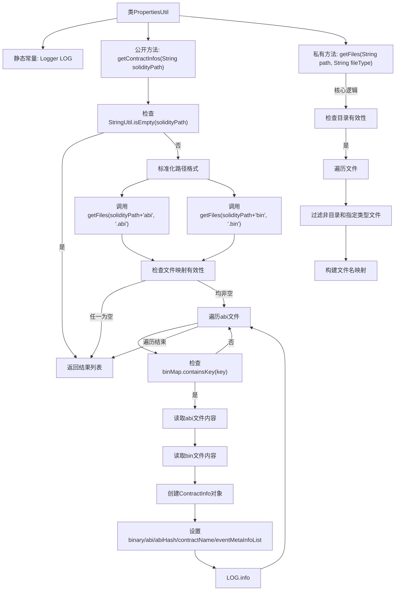

# 基础信息

|      |      |
|------|------|
| 名称 | PropertiesUtil |
| 编码语言 | .java |
| 代码路径 | WeFe/union/blockchain-data-sync/src/main/java/com/welab/wefe/util/PropertiesUtil.java |
| 包名 | com.welab.wefe.util |
| 依赖项 | ['cn.hutool.core.collection.CollectionUtil', 'com.welab.wefe.bo.contract.ContractInfo', 'com.welab.wefe.common.util.StringUtil', 'org.apache.commons.codec.digest.DigestUtils', 'org.slf4j.Logger', 'org.slf4j.LoggerFactory', 'java.io.File', 'java.io.IOException', 'java.nio.charset.StandardCharsets', 'java.nio.file.Files', 'java.nio.file.Paths', 'java.util.ArrayList', 'java.util.HashMap', 'java.util.List', 'java.util.Map'] |
| 概述说明 | PropertiesUtil类提供静态方法getContractInfos，从指定路径读取abi和bin文件，解析为ContractInfo列表，包含合约名、ABI、二进制代码及事件元信息。 |

# 说明

PropertiesUtil类是一个工具类，用于从指定路径读取智能合约的ABI和BIN文件，并生成ContractInfo对象列表。主要功能包括检查路径有效性，处理路径格式，获取ABI和BIN文件，读取文件内容，计算ABI的MD5哈希值，解析事件元信息，并将结果封装为ContractInfo对象。若路径无效或文件缺失，返回空列表。过程中会记录错误日志和成功加载的合约信息。

# 类列表 Class Summary

| 名称   | 类型  | 说明 |
|-------|------|-------------|
| PropertiesUtil | class | PropertiesUtil类从指定路径读取abi和bin文件，解析为ContractInfo列表，包含合约名、abi、二进制码、abi哈希及事件元信息。 |

## 类 PropertiesUtil

|      |      |
|------|------|
| 访问范围 | public |
| 类型 | class |
| 名称 | PropertiesUtil |
| 说明 | PropertiesUtil类从指定路径读取abi和bin文件，解析为ContractInfo列表，包含合约名、abi、二进制码、abi哈希及事件元信息。 |

### UML类图

类图描述：
PropertiesUtil是一个工具类，主要功能是从指定路径读取智能合约的ABI和BIN文件，并将其转换为ContractInfo对象列表。它依赖ContractInfo类存储合约信息，并通过BlockUtil类解析ABI生成事件元信息列表。ContractInfo包含合约二进制代码、ABI、哈希值、合约名称和事件元信息列表等属性。整个流程涉及文件读取、数据转换和事件解析等操作，用于智能合约的配置管理。

### 内部方法调用关系图

该流程图展示了PropertiesUtil类的主要执行逻辑，从输入路径处理开始，经过文件获取、内容读取、对象构建到最后结果返回的全过程。重点突出了路径有效性检查、文件映射获取、ABI/BIN文件匹配读取等关键步骤，同时体现了异常处理和数据转换的流程。私有方法getFiles的内部处理逻辑也通过子流程方式清晰呈现，完整展现了整个工具类的功能实现路径。

### 字段列表 Field List

| 名称  | 类型  | 说明 |
|-------|-------|------|
| LOG = LoggerFactory.getLogger(PropertiesUtil.class) | Logger | 定义静态常量LOG，用于PropertiesUtil类的日志记录。 |

### 方法列表

| 名称  | 类型  | 说明 |
|-------|-------|------|
| getContractInfos | List<ContractInfo> | 该方法从指定路径读取Solidity合约的ABI和BIN文件，解析为ContractInfo对象列表。若路径无效或文件缺失返回空列表。处理时校验文件匹配，读取内容并计算ABI哈希，最后生成包含合约信息的列表。 |
| getFiles | Map<String, File> | 获取指定路径下特定类型文件，返回文件名（不含后缀）与文件的映射。忽略子目录，空目录返回空映射。 |

