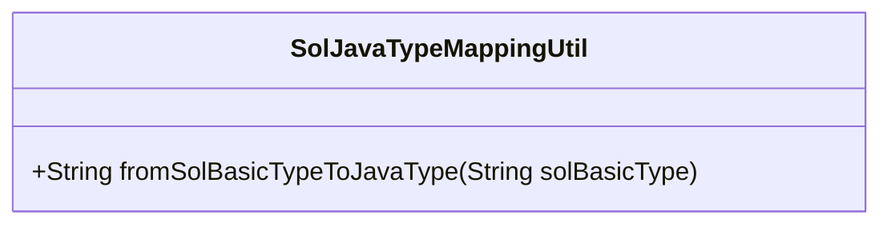
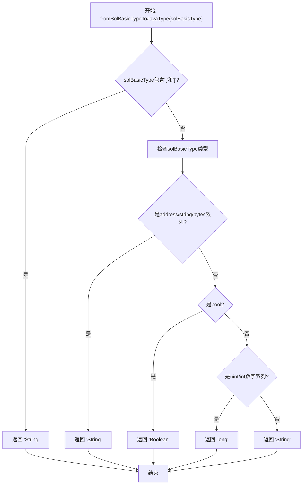
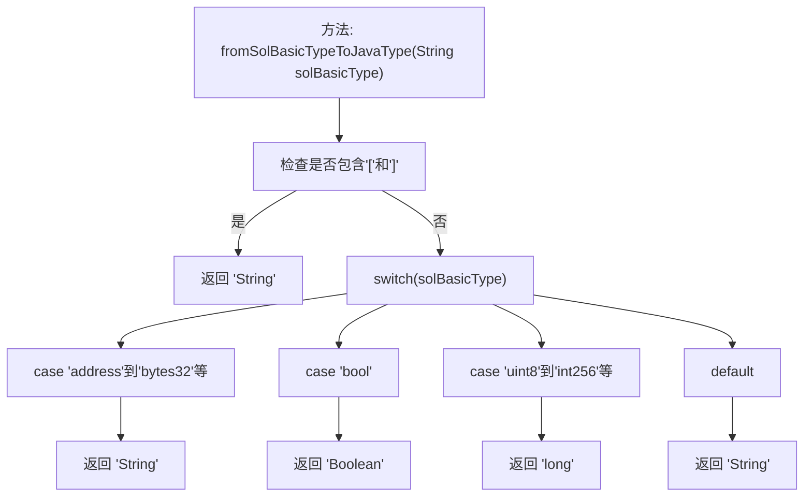

# 基础信息

|      |      |
|------|------|
| 名称 | SolJavaTypeMappingUtil |
| 编码语言 | .java |
| 代码路径 | WeFe/union/blockchain-data-sync/src/main/java/com/welab/wefe/util/SolJavaTypeMappingUtil.java |
| 包名 | com.welab.wefe.util |
| 依赖项 | ['org.apache.commons.lang3.StringUtils'] |
| 概述说明 | SolJavaTypeMappingUtil类将Solidity基础类型映射为Java类型：数组类型返回String；address、string、bytes系列返回String；bool返回Boolean；整数类型返回long；其他默认返回String。 |

# 说明

SolJavaTypeMappingUtil类包含一个静态方法fromSolBasicTypeToJavaType，用于将Solidity基础类型映射为Java类型。若输入类型包含方括号则返回String。address、string及bytes系列类型映射为String，bool映射为Boolean，所有uint和int系列数值类型映射为long，其他情况默认返回String。该方法实现了Solidity到Java的基础类型转换逻辑。

# 类列表 Class Summary

| 名称   | 类型  | 说明 |
|-------|------|-------------|
| SolJavaTypeMappingUtil | class | SolJavaTypeMappingUtil类将Solidity基础类型映射为Java类型：数组类型、地址、字符串和字节类型映射为String；布尔类型映射为Boolean；整数类型映射为long；其他默认返回String。 |

## 类 SolJavaTypeMappingUtil

|      |      |
|------|------|
| 访问范围 | public |
| 类型 | class |
| 名称 | SolJavaTypeMappingUtil |
| 说明 | SolJavaTypeMappingUtil类将Solidity基础类型映射为Java类型：数组类型、地址、字符串和字节类型映射为String；布尔类型映射为Boolean；整数类型映射为long；其他默认返回String。 |

### UML类图

该代码实现了一个Solidity基础类型到Java类型的映射工具类。类图显示这是一个仅包含静态方法的工具类，流程图清晰展示了其三层判断逻辑：首先检查数组类型，然后处理特定字符串类型，最后处理数值类型。该方法将Solidity的address、string、bytes系列映射为Java的String，bool映射为Boolean，所有整数类型映射为long，默认情况也返回String。这种类型转换在区块链智能合约与Java应用交互时非常有用。

### 内部方法调用关系图

这段代码流程图描述了`SolJavaTypeMappingUtil`类中`fromSolBasicTypeToJavaType`方法的执行逻辑。方法首先检查输入字符串是否包含数组符号，如果是则直接返回"String"。否则通过switch-case结构匹配Solidity基础类型到Java类型：地址/字节类型返回"String"，布尔类型返回"Boolean"，各种整型返回"long"，默认情况返回"String"。流程图清晰展示了类型转换的分支决策过程。

### 字段列表 Field List

| 名称  | 类型  | 说明 |
|-------|-------|------|

### 方法列表

| 名称  | 类型  | 说明 |
|-------|-------|------|
| fromSolBasicTypeToJavaType | String | 该方法将Solidity基础类型转换为Java类型：数组类型返回String；address、string、bytes系列返回String；bool返回Boolean；整数类型返回long；其他默认返回String。 |

