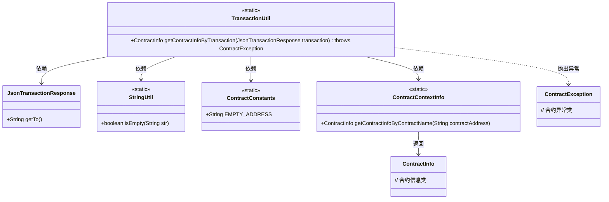
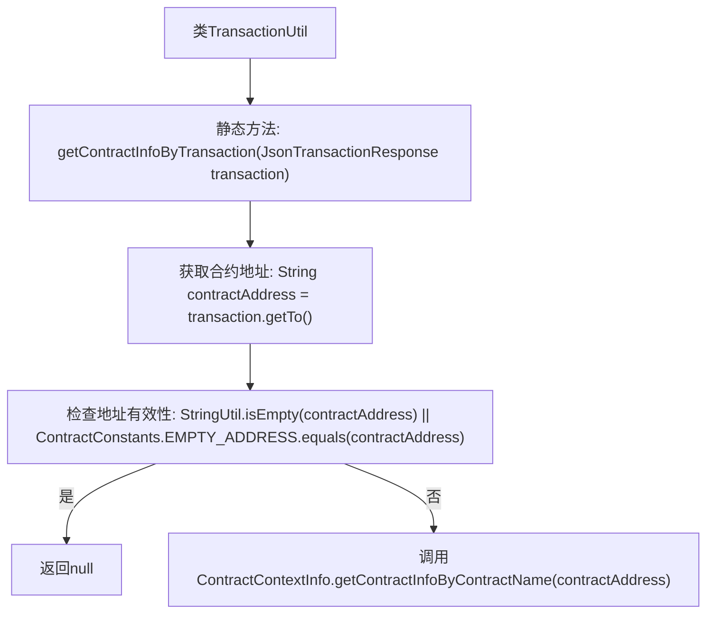

# 基础信息

|      |      |
|------|------|
| 名称 | TransactionUtil |
| 编码语言 | .java |
| 代码路径 | WeFe/union/blockchain-data-sync/src/main/java/com/welab/wefe/util/TransactionUtil.java |
| 包名 | com.welab.wefe.util |
| 依赖项 | ['com.welab.wefe.bo.contract.ContractContextInfo', 'com.welab.wefe.bo.contract.ContractInfo', 'com.welab.wefe.common.util.StringUtil', 'com.welab.wefe.constant.ContractConstants', 'org.fisco.bcos.sdk.client.protocol.model.JsonTransactionResponse', 'org.fisco.bcos.sdk.transaction.model.exception.ContractException'] |
| 概述说明 | TransactionUtil类提供静态方法，通过交易信息获取合约信息。若合约地址为空或无效则返回null，否则调用ContractContextInfo查询。 |

# 说明

该代码描述了一个名为TransactionUtil的工具类，其中包含一个静态方法getContractInfoByTransaction。该方法接收一个JsonTransactionResponse对象作为参数，尝试从中提取合约地址。若地址为空或等于预定义的EMPTY_ADDRESS常量，则返回null；否则通过ContractContextInfo类根据合约地址查询并返回对应的ContractInfo对象。过程中可能抛出ContractException异常。

# 类列表 Class Summary

| 名称   | 类型  | 说明 |
|-------|------|-------------|
| TransactionUtil | class | TransactionUtil类提供静态方法，通过交易信息获取合约信息。若合约地址为空或无效则返回null，否则根据地址查询合约信息。 |

## 类 TransactionUtil

|      |      |
|------|------|
| 访问范围 | public |
| 类型 | class |
| 名称 | TransactionUtil |
| 说明 | TransactionUtil类提供静态方法，通过交易信息获取合约信息。若合约地址为空或无效则返回null，否则根据地址查询合约信息。 |

### UML类图

这段代码展示了一个交易工具类TransactionUtil，它通过静态方法getContractInfoByTransaction从交易响应中提取合约地址并获取合约信息。流程包括：检查交易接收地址有效性，若为空或默认地址则返回null，否则通过ContractContextInfo查询合约信息。涉及6个辅助类，包括数据处理工具、常量定义和异常处理等组件，共同完成合约信息查询功能。

### 内部方法调用关系图

这段代码流程图展示了TransactionUtil类中获取合约信息的方法逻辑。流程从检查交易对象中的合约地址开始，首先验证地址是否为空或为预设的空地址，若无效则返回null；若有效则通过ContractContextInfo查询并返回对应的合约信息。整个过程体现了对输入参数的严格校验和清晰的异常处理路径。

### 字段列表 Field List

| 名称  | 类型  | 说明 |
|-------|-------|------|

### 方法列表

| 名称  | 类型  | 说明 |
|-------|-------|------|
| getContractInfoByTransaction | ContractInfo | 方法通过交易获取合约信息，检查地址有效性后返回对应合约数据，无效则返回空。 |

