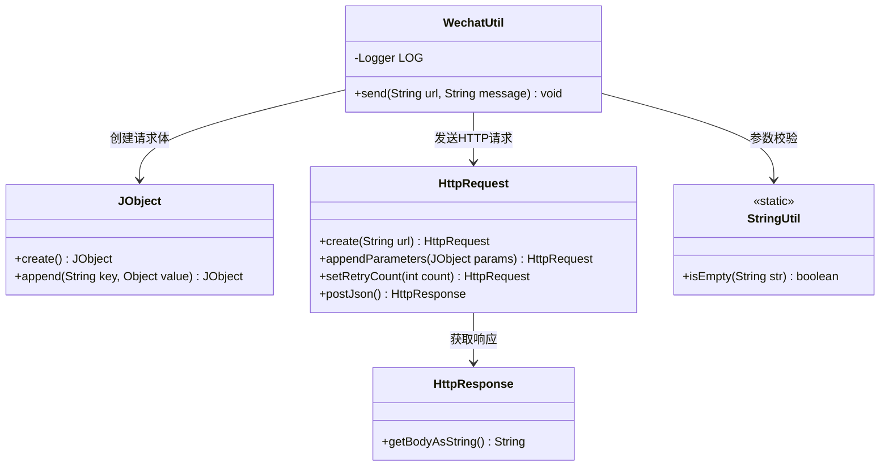
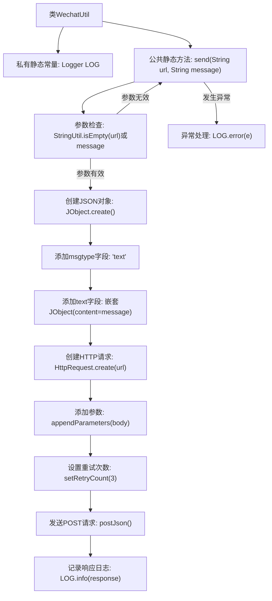

# 基础信息

|      |      |
|------|------|
| 名称 | WechatUtil |
| 编码语言 | .java |
| 代码路径 | WeFe/union/blockchain-data-sync/src/main/java/com/welab/wefe/util/WechatUtil.java |
| 包名 | com.welab.wefe.util |
| 依赖项 | ['com.welab.wefe.common.http.HttpRequest', 'com.welab.wefe.common.http.HttpResponse', 'com.welab.wefe.common.util.JObject', 'com.welab.wefe.common.util.StringUtil', 'org.slf4j.Logger', 'org.slf4j.LoggerFactory'] |
| 概述说明 | WechatUtil类提供静态方法send，通过HTTP POST发送文本消息到微信企业号，支持重试和异常处理。 |

# 说明

WechatUtil类包含一个静态方法send，用于向微信发送消息。方法接收url和message参数，若任一为空则直接返回。使用JObject构建JSON请求体，包含msgtype和text字段。通过HttpRequest发起POST请求，设置重试次数为3，并记录响应或异常信息。

# 类列表 Class Summary

| 名称   | 类型  | 说明 |
|-------|------|-------------|
| WechatUtil | class | WechatUtil类提供静态方法send，通过HTTP请求向微信发送消息，支持重试和异常处理。 |

## 类 WechatUtil

|      |      |
|------|------|
| 访问范围 | public |
| 类型 | class |
| 名称 | WechatUtil |
| 说明 | WechatUtil类提供静态方法send，通过HTTP请求向微信发送消息，支持重试和异常处理。 |

### UML类图

这段代码展示了一个微信工具类`WechatUtil`，主要功能是通过HTTP请求向企业微信发送消息。类图中包含5个关键类：`WechatUtil`作为主类，依赖`JObject`构建请求体，使用`HttpRequest`发送POST请求，通过`StringUtil`进行空值校验，最后从`HttpResponse`获取响应结果。整个流程包含参数校验、请求体构建、HTTP请求发送和异常处理，体现了企业微信消息发送的完整处理链。

### 内部方法调用关系图

该流程图展示了WechatUtil类的消息发送流程：首先进行空参数检查，有效时构建JSON请求体并配置HTTP请求，包括设置重试机制和发送POST请求，最后记录响应或异常。整个过程包含参数校验、请求构建、网络通信和错误处理四个主要阶段，体现了健壮的消息发送逻辑。

### 字段列表 Field List

| 名称  | 类型  | 说明 |
|-------|-------|------|
| LOG = LoggerFactory.getLogger(WechatUtil.class) | Logger | 定义WechatUtil类的私有静态日志对象LOG，使用LoggerFactory获取日志实例。 |

### 方法列表

| 名称  | 类型  | 说明 |
|-------|-------|------|
| send | void | 静态方法send接收URL和消息参数，检查非空后构造JSON请求体，通过HTTP POST发送到企业微信接口，支持重试3次并记录响应或异常。 |

