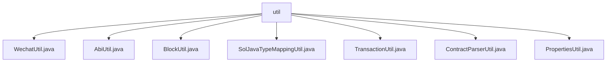

# 基础信息

|      |      |
|------|------|
| 名称 | util |
| 编码语言 | .java |
| 代码路径 | WeFe/union/blockchain-data-sync/src/main/java/com/welab/wefe/util |
| 包名 | docs.union.blockchain-data-sync.src.main.java.com.welab.wefe.util |
| 概述说明 | WechatUtil发送微信消息；AbiUtil获取ABI事件定义；BlockUtil处理区块数据和事件元信息；SolJavaTypeMappingUtil转换类型；TransactionUtil获取合约信息；ContractParserUtil解析合约；PropertiesUtil读取合约文件。 |

# 说明

## 概述  
该模块核心职责是提供区块链数据同步过程中的工具集，包括微信通知、ABI解析、区块数据处理、类型转换等辅助功能。接口规范涉及静态方法调用，输入参数多为字符串或对象，输出包含对象列表、映射或空值。关键数据结构包括ContractABIDefinition（存储ABI定义）、EventMetaInfo（事件元信息）、ContractInfo（合约信息）等。外部依赖包括HttpRequest（网络请求）、JObject（JSON处理）、CryptoSuite（加密套件）等。例如WechatUtil处理微信通知，AbiUtil解析ABI定义。

## 主要业务场景  
模块主要支持区块链事件解析与同步流程，类似ETL管道模式。典型场景包括：通过BlockUtil获取区块数据并解析事件元信息；使用AbiUtil加载ABI定义；借助SolJavaTypeMappingUtil完成类型转换；最终通过TransactionUtil和ContractParserUtil处理合约信息。例如PropertiesUtil读取合约文件生成ContractInfo列表，供后续流程使用。所有工具类通过静态方法提供无状态服务，支持重试机制和异常处理。

### 包内部结构视图

该流程图展示了WeFe项目中区块链数据同步模块的工具类结构。根节点"util"包含7个工具类文件，包括微信工具、ABI工具、区块工具等，这些工具类直接隶属于util目录，没有更深层级的子目录结构。所有工具类均用于处理区块链数据同步相关的功能实现。

# 文件列表

| 名称   | 类型  | 说明 |
|-------|------|-------------|
| [WechatUtil.java](WechatUtil.md) | file | WechatUtil类提供静态方法send，通过HTTP POST发送文本消息到微信企业号，支持重试和异常处理。 |
| [AbiUtil.java](AbiUtil.md) | file | AbiUtil类包含静态方法getEventsAbiDefs，通过ABIDefinitionFactory解析ABI字符串并返回事件定义列表。 |
| [BlockUtil.java](BlockUtil.md) | file | BlockUtil类提供两个功能：1.通过区块高度获取区块信息；2.解析合约ABI生成事件元数据列表，包含事件名、合约名及字段类型映射。 |
| [SolJavaTypeMappingUtil.java](SolJavaTypeMappingUtil.md) | file | SolJavaTypeMappingUtil类将Solidity基础类型映射为Java类型：数组类型返回String；address、string、bytes系列返回String；bool返回Boolean；整数类型返回long；其他默认返回String。 |
| [TransactionUtil.java](TransactionUtil.md) | file | TransactionUtil类提供静态方法，通过交易信息获取合约信息。若合约地址为空或无效则返回null，否则调用ContractContextInfo查询。 |
| [ContractParserUtil.java](ContractParserUtil.md) | file | ContractParserUtil类解析合约信息列表，过滤无效数据后，将二进制和合约名分别映射到ContractInfo对象，并存入全局上下文。 |
| [PropertiesUtil.java](PropertiesUtil.md) | file | PropertiesUtil类提供静态方法getContractInfos，从指定路径读取abi和bin文件，解析为ContractInfo列表，包含合约名、ABI、二进制代码及事件元信息。 |

