# 基础信息

|      |      |
|------|------|
| 名称 | com |
| 编码语言 | .java |
| 代码路径 | WeFe/union/union-service/src/main/java/com |
| 包名 | docs.union.union-service.src.main.java.com |
| 概述说明 | 联盟服务模块群提供多维度管理能力，包括会员生命周期、数据资源操作、公共服务及监控。采用RESTful接口，统一继承AbstractApi基类，关键结构含MemberOutput等。支持四大场景：会员管理、数据CRUD、公共服务及健康检测。依赖MemberService等组件，集成智能合约与区块链技术，实现联邦学习数据协同与权限控制。 |

# 说明

## 概述  
该模块群核心职责为提供联盟链环境下的多维度管理能力，涵盖成员生命周期管理、数据资源操作、智能合约封装及系统监控，类似企业级RBAC与数据中台的结合体。接口规范采用分层设计，包含AbstractApi基类继承、@Api注解定义和标准化DTO封装（如BaseInput/MemberOutput），支持RESTful交互与Getter/Setter模式。关键数据结构包括成员信息（MemberQueryOutput）、数据资源（DataResourcePutInput）、智能合约返回值（Tuple）及枚举状态（CertStatusEnums）。外部依赖涉及FISCO BCOS SDK、国密算法库、MongoDB驱动及Spring框架。例如MemberContract管理成员全生命周期，FileUploadApi处理文件凭证，UnionNodeConfigCache维护SM2密钥。

## 主要业务场景  
模块支持四大典型流程：1)成员全周期管理（注册→认证→状态更新），通过MemberService和智能合约联动，类似CRM与区块链融合；2)数据资源CRUD与权限控制，采用"本地校验+链上操作"双阶段模式，如DataSetService控制分级公开；3)智能合约封装场景（如MemberContract），支持ECDSA/SM2双算法及事件订阅；4)系统监控与日志，类似探针机制通过UnionAvailableApi检测服务状态。交互模式涵盖RESTful API（member/realname/auth）、静态工具类（FileCheckerUtil）和事件驱动（合约事件总线）。典型应用包括联合建模时特征集查询（QueryApi）、文件同步（UploadFileSyncToUnionTask）及证书状态流转（CertStatusEnums）。功能完整性体现在细粒度权限、健康检查链和异构数据转换（如MapperUtil处理时间格式）。

### 包内部结构视图

```mermaid
graph TD
    union --> service
    union --> dto
    union --> operation
    union --> task
    union --> contract
    union --> constant
    union --> util
    union --> common
    union --> entity
    union --> scheduler
    union --> cache
    union --> listener
    union --> config
    union --> UnionService.java
    
    service --> api
    service --> contract
    service --> ImageDataSetService.java
    service --> DefaultTagService.java
    service --> available
    service --> MemberServiceService.java
    service --> AbstractDataResourceService.java
    service --> BloomFilterService.java
    service --> MemberService.java
    service --> DataSetService.java
    service --> DataResourceService.java
    service --> TableDataSetService.java
    service --> CommonService.java
    
    api --> cert
    api --> member
    api --> dataresource
    api --> common
    api --> service
    api --> defaulttag
    api --> server
    
    cert --> QueryTrustCertApi.java
    member --> authtype
    member --> QueryApi.java
    member --> UpdateServingBaseUrlApi.java
    member --> UpdateLastActivityTimeApi.java
    member --> FileUploadApi.java
    member --> UpdateApi.java
    member --> RealnameAuthApi.java
    member --> AddApi.java
    member --> RealnameAuthInfoQueryApi.java
    member --> UpdateExcludeLogoApi.java
    member --> UpdatePublicKeyApi.java
    member --> QueryMemberNameApi.java
    member --> UpdateLogoByIdApi.java
    member --> QueryAllApi.java
    authtype --> QueryAllApi.java
    
    dataresource --> bloomfilter
    dataresource --> dataset
    dataresource --> LazyUpdateApi.java
    dataresource --> QueryApi.java
    dataresource --> DeleteApi.java
    dataresource --> DefaultTagQueryApi.java
    dataresource --> DetailApi.java
    dataresource --> DataSetTagsApi.java
    dataresource --> HiddenApi.java
    bloomfilter --> PutApi.java
    dataset --> image
    dataset --> table
    dataset --> nomal
    image --> PutApi.java
    table --> PutApi.java
    nomal --> PutApi.java
    nomal --> QueryApi.java
    nomal --> DeleteApi.java
    nomal --> DetailApi.java
    
    common --> DownloadFileApi.java
    common --> QueryRealnameAuthAgreementTemplateApi.java
    common --> RealnameAuthAgreementTemplateSyncApi.java
    common --> MemberFileUploadSyncApi.java
    
    service --> PutApi.java
    service --> QueryApi.java
    
    defaulttag --> QueryAllApi.java
    
    server --> UnionAliveApi.java
    server --> UnionAvailableApi.java
    
    dto --> cert
    dto --> dataresource
    dto --> common
    dto --> member
    dto --> base
    
    cert --> TrustCertsQueryOutput.java
    dataresource --> bloomfilter
    dataresource --> dataset
    dataresource --> ApiDataResourceQueryOutput.java
    dataresource --> ApiTagsQueryOutput.java
    dataresource --> TagsDTO.java
    dataresource --> ApiDataResourceDetailInput.java
    dataresource --> DataResourcePutInput.java
    dataresource --> ApiDataResourceQueryInput.java
    bloomfilter --> ApiBloomFilterQueryOutput.java
    dataset --> image
    dataset --> table
    dataset --> ApiDataResourceQueryOutput.java
    image --> ApiImageDataSetQueryOutput.java
    table --> ApiTableDataSetQueryOutput.java
    table --> ApiDataSetQueryOutput.java
    table --> DataSetDetailOutput.java
    table --> DataSetOutput.java
    table --> ApiDataSetDefaultTagOutput.java
    
    common --> RealnameAuthAgreementTemplateOutput.java
    common --> SM2SignedApiInput.java
    
    member --> MemberOutput.java
    member --> RealNameAuthFileUploadOutput.java
    member --> ApiMemberServiceQueryOutput.java
    member --> MemberQueryOutput.java
    
    base --> BaseInput.java
    base --> PageInput.java
    
    operation --> UnionApiLogger.java
    
    task --> UploadFileSyncToUnionTask.java
    
    contract --> MemberAuthTypeContract.java
    contract --> DataSetContract.java
    contract --> BloomFilterContract.java
    contract --> MemberContract.java
    contract --> TableDataSetContract.java
    contract --> DataResourceContract.java
    contract --> UnionNodeContract.java
    contract --> DataSetMemberPermissionContract.java
    contract --> ImageDataSetContract.java
    contract --> MemberServiceContract.java
    contract --> MemberFileInfoContract.java
    
    constant --> UnionNodeConfigType.java
    constant --> CertStatusEnums.java
    
    util --> FileCheckerUtil.java
    util --> ModelMapper.java
    util --> MapperUtil.java
    
    common --> BlockChainContext.java
    
    service --> contract
    contract --> MemberFileInfoContractService.java
    contract --> BloomFilterContractService.java
    contract --> DataResourceContractService.java
    contract --> DataSetContractService.java
    contract --> AbstractContractService.java
    contract --> ImageDataSetContractService.java
    contract --> MemberServiceContractService.java
    contract --> DataSetMemberPermissionContractService.java
    contract --> TableDataSetContractService.java
    contract --> UnionNodeContractService.java
    contract --> MemberContractService.java
    
    available --> checkpoint
    checkpoint --> MongoCheckpoint.java
    checkpoint --> BlockChainCheckpoint.java
    
    entity --> DataSet.java
    entity --> DataSetMemberPermission.java
    entity --> QueryDataSet.java
    entity --> Member.java
    entity --> DataSetDefaultTag.java
    
    scheduler --> DataResourceLazyUpdateTask.java
    
    cache --> UnionNodeConfigCache.java
    cache --> MemberActivityCache.java
    
    listener --> RegisterNodeInfoListener.java
    
    config --> BlockChainConfig.java
    config --> ConfigProperties.java
```

该流程图展示了WeFe/union/union-service项目的完整目录结构，从顶层union节点开始，逐级展开service、api、dto等主要模块。其中api模块包含cert、member、dataresource等子模块，每个子模块下又有具体的API实现类；service模块包含各种服务类和合约服务实现；dto模块包含各类数据传输对象。整个结构层次清晰，完整呈现了项目的模块划分和文件组织方式。

# 文件列表

| 名称   | 类型  | 说明 |
|-------|------|-------------|
| [welab](welab/_module.md) | package | 联盟服务模块群提供多维度管理能力，包括会员生命周期、数据资源操作、公共服务及监控。采用RESTful接口，统一继承AbstractApi基类，关键结构含MemberOutput等。支持四大场景：会员管理、数据CRUD、公共服务及健康检测。依赖MemberService等组件，集成智能合约与区块链技术，实现联邦学习数据协同与权限控制。 |

