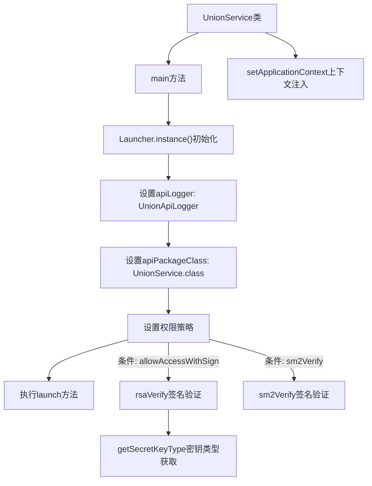
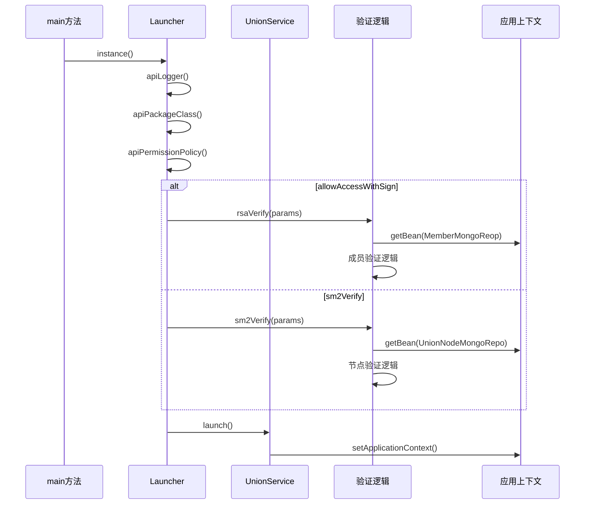

# 基础信息

|      |      |
|------|------|
| 名称 | UnionService |
| 编码语言 | .java |
| 代码路径 | WeFe/union/union-service/src/main/java/com/welab/wefe/union/service/UnionService.java |
| 包名 | com.welab.wefe.union.service |
| 依赖项 | ['com.alibaba.druid.spring.boot.autoconfigure.DruidDataSourceAutoConfigure', 'com.alibaba.fastjson.JSONObject', 'com.welab.wefe.common.StatusCode', 'com.welab.wefe.common.constant.SecretKeyType', 'com.welab.wefe.common.data.mongodb.entity.union.Member', 'com.welab.wefe.common.data.mongodb.entity.union.UnionNode', 'com.welab.wefe.common.data.mongodb.entity.union.ext.MemberExtJSON', 'com.welab.wefe.common.data.mongodb.repo.MemberMongoReop', 'com.welab.wefe.common.data.mongodb.repo.UnionNodeMongoRepo', 'com.welab.wefe.common.exception.StatusCodeWithException', 'com.welab.wefe.common.util.DateUtil', 'com.welab.wefe.common.util.SM2Util', 'com.welab.wefe.common.util.SignUtil', 'com.welab.wefe.common.web.Launcher', 'com.welab.wefe.common.web.config.ApiBeanNameGenerator', 'com.welab.wefe.common.web.dto.SignedApiInput', 'com.welab.wefe.common.wefe.checkpoint.CheckpointManager', 'com.welab.wefe.union.service.cache.MemberActivityCache', 'com.welab.wefe.union.service.dto.common.SM2SignedApiInput', 'com.welab.wefe.union.service.operation.UnionApiLogger', 'com.welab.wefe.union.service.service.contract.MemberContractService', 'org.springframework.beans.BeansException', 'org.springframework.boot.autoconfigure.SpringBootApplication', 'org.springframework.boot.autoconfigure.data.mongo.MongoDataAutoConfiguration', 'org.springframework.boot.autoconfigure.jdbc.DataSourceAutoConfiguration', 'org.springframework.boot.autoconfigure.mongo.MongoAutoConfiguration', 'org.springframework.boot.autoconfigure.transaction.TransactionAutoConfiguration', 'org.springframework.context.ApplicationContext', 'org.springframework.context.ApplicationContextAware', 'org.springframework.context.annotation.ComponentScan', 'org.springframework.scheduling.annotation.EnableScheduling', 'java.nio.charset.StandardCharsets'] |
| 概述说明 | UnionService类是一个Spring Boot应用，排除了多个自动配置类，启用了定时任务和组件扫描。主方法启动应用并设置API权限验证，包括RSA和SM2签名验证。类实现了ApplicationContextAware，保存应用上下文。提供了RSA和SM2签名验证方法，检查成员状态和节点有效性，更新成员活跃时间。 |

# 说明

该代码定义了一个名为UnionService的Spring Boot应用主类，通过注解排除了数据源、MongoDB等自动配置，启用了定时任务和组件扫描。类实现了ApplicationContextAware接口以获取应用上下文。main方法使用Launcher启动应用，配置了API日志、权限验证逻辑（包括RSA和SM2签名验证）。提供了rsaVerify和sm2Verify方法分别处理不同签名验证流程，涉及成员状态检查、公钥验证及数据更新操作。类还包含辅助方法获取密钥类型。整体实现了联盟服务的核心验证机制和上下文管理功能。

# 类列表 Class Summary

| 名称   | 类型  | 说明 |
|-------|------|-------------|
| UnionService | class | SpringBoot应用排除数据源配置，启用定时任务，扫描指定包。主类实现应用上下文设置，提供RSA和SM2签名验证功能，验证成员和节点状态，更新活跃时间。 |


## 类 UnionService

|      |      |
|------|------|
| 访问范围 | @SpringBootApplication(exclude = {;        DataSourceAutoConfiguration.class,;        DruidDataSourceAutoConfigure.class,;        MongoAutoConfiguration.class,;        MongoDataAutoConfiguration.class,;        TransactionAutoConfiguration.class;});@EnableScheduling;@ComponentScan(;        basePackages = {"com.welab.wefe.common.data.mongodb"},;        nameGenerator = ApiBeanNameGenerator.class,;        basePackageClasses = {;                Launcher.class,;                UnionService.class,;                CheckpointManager.class;        };);public |
| 类型 | class |
| 名称 | UnionService |
| 说明 | SpringBoot应用排除数据源配置，启用定时任务，扫描指定包。主类实现应用上下文设置，提供RSA和SM2签名验证功能，验证成员和节点状态，更新活跃时间。 |


### UML类图

```mermaid
classDiagram
    class UnionService {
        +ApplicationContext CONTEXT
        +main(String[] args) void
        +setApplicationContext(ApplicationContext applicationContext) void
        -rsaVerify(JSONObject params) void
        -sm2Verify(JSONObject params) void
        -getSecretKeyType(Member member) SecretKeyType
    }

    class SignedApiInput {
        +String memberId
        +String sign
        +String data
        +setSign(String sign) void
        +getMemberId() String
        +getSign() String
        +getData() String
    }

    class SM2SignedApiInput {
        +String currentBlockchainNodeId
        +String sign
        +String data
        +getCurrentBlockchainNodeId() String
        +getSign() String
        +getData() String
    }

    class Member {
        +String memberId
        +String freezed
        +String lastActivityTime
        +String publicKey
        +MemberExtJSON extJson
        +getMemberId() String
        +getFreezed() String
        +getLastActivityTime() String
        +setLastActivityTime(String time) void
        +getPublicKey() String
        +getExtJson() MemberExtJSON
    }

    class MemberExtJSON {
        +SecretKeyType secretKeyType
        +getSecretKeyType() SecretKeyType
    }

    class UnionNode {
        +String nodeId
        +String enable
        +String publicKey
        +String blockchainNodeId
        +getNodeId() String
        +getEnable() String
        +getPublicKey() String
        +getBlockchainNodeId() String
    }

    class MemberMongoReop {
        +findMemberId(String memberId) Member
    }

    class UnionNodeMongoRepo {
        +findByBlockchainNodeId(String id) UnionNode
    }

    class MemberActivityCache {
        +getInstance() MemberActivityCache
        +isActivePeriod(Member member) boolean
        +add(Member member) void
    }

    class MemberContractService {
        +updateLastActivityTimeById(String memberId, String time) void
    }

    class SignUtil {
        +verify(byte[] data, String publicKey, String sign, SecretKeyType type) boolean
    }

    class SM2Util {
        +verify(byte[] data, PublicKey publicKey, String sign) boolean
        +getPublicKey(String key) PublicKey
    }

    enum SecretKeyType {
        rsa
        sm2
    }

    UnionService --> SignedApiInput : 依赖
    UnionService --> SM2SignedApiInput : 依赖
    UnionService --> MemberMongoReop : 依赖
    UnionService --> UnionNodeMongoRepo : 依赖
    UnionService --> MemberActivityCache : 依赖
    UnionService --> MemberContractService : 依赖
    UnionService --> SignUtil : 依赖
    UnionService --> SM2Util : 依赖
    Member --> MemberExtJSON : 包含
    MemberExtJSON --> SecretKeyType : 使用
```

这段代码实现了一个基于Spring Boot的联盟服务(UnionService)，主要功能包括应用启动配置、API签名验证(RSA/SM2)和成员状态管理。类图展示了核心类及其关系：UnionService作为主类，通过CONTEXT管理应用上下文，依赖多个工具类(如SignUtil)和数据访问类(如MemberMongoReop)完成签名验证流程。系统采用分层设计，包含实体类(Member/UnionNode)、数据访问层、工具类和服务层，通过枚举SecretKeyType统一管理密钥类型。签名验证过程涉及多步骤校验，包括成员状态检查、密钥类型判断和签名算法验证。


### 内部方法调用关系图





该流程图展示了UnionService的核心执行流程，主要包括应用启动时的Launcher配置、两种签名验证路径（RSA和SM2）以及上下文注入过程。时序图详细描述了main方法通过Launcher构建器模式初始化服务，并根据注解条件选择不同的验证路径，最终完成服务启动的全过程。验证逻辑均涉及数据库查询和密码学操作，体现了该服务的安全性和完整性验证机制。

### 字段列表 Field List

| 名称  | 类型  | 说明 |
|-------|-------|------|
| CONTEXT = null | ApplicationContext | 静态公共应用上下文变量，初始值为空。 |

### 方法列表

| 名称  | 类型  | 说明 |
|-------|-------|------|
| main | void | Java主方法启动UnionService，配置日志、API包及权限策略，支持RSA和SM2签名验证。 |
| rsaVerify | void | 方法rsaVerify验证成员签名：检查成员存在性、冻结状态，更新活跃时间，验证签名有效性，处理参数。失败时抛出异常。 |
| sm2Verify | void | 验证SM2签名，检查节点是否注册和启用，验证签名后更新参数。 |
| setApplicationContext | void | 该方法重写setApplicationContext，将传入的ApplicationContext赋值给静态变量CONTEXT。 |
| getSecretKeyType | SecretKeyType | 该方法根据成员对象的扩展JSON数据获取密钥类型，若未设置则默认返回rsa类型。 |


