# 基础信息

|      |      |
|------|------|
| 名称 | service |
| 编码语言 | .java |
| 代码路径 | WeFe/union/union-service/src/main/java/com/welab/wefe/union/service |
| 包名 | docs.union.union-service.src.main.java.com.welab.wefe.union.service |
| 概述说明 | 联盟服务模块群提供多维度管理能力，包括会员生命周期、数据资源操作、公共服务及监控。采用RESTful接口，统一继承AbstractApi基类，关键结构含MemberOutput等。支持四大场景：会员管理、数据CRUD、公共服务及健康检测。依赖MemberService等组件，集成智能合约与区块链技术，实现联邦学习数据协同与权限控制。 |

# 说明

## 概述  
该模块群核心职责为提供联盟链环境下的多维度管理能力，涵盖成员生命周期管理、数据资源操作、智能合约封装及系统监控，类似企业级RBAC与数据中台的结合体。接口规范采用分层设计，包含AbstractApi基类继承、@Api注解定义和标准化DTO封装（如BaseInput/MemberOutput），支持RESTful交互与Getter/Setter模式。关键数据结构包括成员信息（MemberQueryOutput）、数据资源（DataResourcePutInput）、智能合约返回值（Tuple）及枚举状态（CertStatusEnums）。外部依赖涉及FISCO BCOS SDK、国密算法库、MongoDB驱动及Spring框架。例如MemberContract管理成员全生命周期，FileUploadApi处理文件凭证，UnionNodeConfigCache维护SM2密钥。

## 主要业务场景  
模块支持四大典型流程：1)成员全周期管理（注册→认证→状态更新），通过MemberService和智能合约联动，类似CRM与区块链融合；2)数据资源CRUD与权限控制，采用"本地校验+链上操作"双阶段模式，如DataSetService控制分级公开；3)智能合约封装场景（如MemberContract），支持ECDSA/SM2双算法及事件订阅；4)系统监控与日志，类似探针机制通过UnionAvailableApi检测服务状态。交互模式涵盖RESTful API（member/realname/auth）、静态工具类（FileCheckerUtil）和事件驱动（合约事件总线）。典型应用包括联合建模时特征集查询（QueryApi）、文件同步（UploadFileSyncToUnionTask）及证书状态流转（CertStatusEnums）。功能完整性体现在细粒度权限、健康检查链和异构数据转换（如MapperUtil处理时间格式）。

### 包内部结构视图

```mermaid
graph TD
    service --> api
    service --> dto
    service --> operation
    service --> task
    service --> contract
    service --> constant
    service --> util
    service --> common
    service --> entity
    service --> scheduler
    service --> cache
    service --> listener
    service --> config
    service --> UnionService.java
    
    api --> cert
    api --> member
    api --> dataresource
    api --> common
    api --> service
    api --> defaulttag
    api --> server
    
    cert --> QueryTrustCertApi.java
    
    member --> authtype
    member --> QueryApi.java
    member --> UpdateServingBaseUrlApi.java
    member --> UpdateLastActivityTimeApi.java
    member --> FileUploadApi.java
    member --> UpdateApi.java
    member --> RealnameAuthApi.java
    member --> AddApi.java
    member --> RealnameAuthInfoQueryApi.java
    member --> UpdateExcludeLogoApi.java
    member --> UpdatePublicKeyApi.java
    member --> QueryMemberNameApi.java
    member --> UpdateLogoByIdApi.java
    member --> QueryAllApi.java
    
    authtype --> QueryAllApi.java
    
    dataresource --> bloomfilter
    dataresource --> dataset
    dataresource --> LazyUpdateApi.java
    dataresource --> QueryApi.java
    dataresource --> DeleteApi.java
    dataresource --> DefaultTagQueryApi.java
    dataresource --> DetailApi.java
    dataresource --> DataSetTagsApi.java
    dataresource --> HiddenApi.java
    
    bloomfilter --> PutApi.java
    
    dataset --> image
    dataset --> table
    dataset --> nomal
    
    image --> PutApi.java
    
    table --> PutApi.java
    
    nomal --> PutApi.java
    nomal --> QueryApi.java
    nomal --> DeleteApi.java
    nomal --> DetailApi.java
    
    common --> DownloadFileApi.java
    common --> QueryRealnameAuthAgreementTemplateApi.java
    common --> RealnameAuthAgreementTemplateSyncApi.java
    common --> MemberFileUploadSyncApi.java
    
    service --> PutApi.java
    service --> QueryApi.java
    
    defaulttag --> QueryAllApi.java
    
    server --> UnionAliveApi.java
    server --> UnionAvailableApi.java
    
    dto --> cert
    dto --> dataresource
    dto --> common
    dto --> member
    dto --> base
    
    cert --> TrustCertsQueryOutput.java
    
    dataresource --> bloomfilter
    dataresource --> dataset
    dataresource --> ApiDataResourceQueryOutput.java
    dataresource --> ApiTagsQueryOutput.java
    dataresource --> TagsDTO.java
    dataresource --> ApiDataResourceDetailInput.java
    dataresource --> DataResourcePutInput.java
    dataresource --> ApiDataResourceQueryInput.java
    
    bloomfilter --> ApiBloomFilterQueryOutput.java
    
    dataset --> image
    dataset --> table
    dataset --> ApiDataSetQueryOutput.java
    
    image --> ApiImageDataSetQueryOutput.java
    
    table --> ApiTableDataSetQueryOutput.java
    table --> ApiDataSetQueryOutput.java
    table --> DataSetDetailOutput.java
    table --> DataSetOutput.java
    table --> ApiDataSetDefaultTagOutput.java
    
    common --> RealnameAuthAgreementTemplateOutput.java
    common --> SM2SignedApiInput.java
    
    member --> MemberOutput.java
    member --> RealNameAuthFileUploadOutput.java
    member --> ApiMemberServiceQueryOutput.java
    member --> MemberQueryOutput.java
    
    base --> BaseInput.java
    base --> PageInput.java
    
    operation --> UnionApiLogger.java
    
    task --> UploadFileSyncToUnionTask.java
    
    contract --> MemberAuthTypeContract.java
    contract --> DataSetContract.java
    contract --> BloomFilterContract.java
    contract --> MemberContract.java
    contract --> TableDataSetContract.java
    contract --> DataResourceContract.java
    contract --> UnionNodeContract.java
    contract --> DataSetMemberPermissionContract.java
    contract --> ImageDataSetContract.java
    contract --> MemberServiceContract.java
    contract --> MemberFileInfoContract.java
    
    constant --> UnionNodeConfigType.java
    constant --> CertStatusEnums.java
    
    util --> FileCheckerUtil.java
    util --> ModelMapper.java
    util --> MapperUtil.java
    
    common --> BlockChainContext.java
    
    entity --> DataSet.java
    entity --> DataSetMemberPermission.java
    entity --> QueryDataSet.java
    entity --> Member.java
    entity --> DataSetDefaultTag.java
    
    scheduler --> DataResourceLazyUpdateTask.java
    
    cache --> UnionNodeConfigCache.java
    cache --> MemberActivityCache.java
    
    listener --> RegisterNodeInfoListener.java
    
    config --> BlockChainConfig.java
    config --> ConfigProperties.java
```

该流程图展示了WeFe/union/union-service项目的完整目录结构，从service根目录开始，详细呈现了api、dto、contract等主要模块及其子模块的层级关系。图中包含100多个节点，完整反映了项目的模块划分和文件组织方式，特别是展示了api模块下复杂的接口分类和dataresource模块的多层嵌套结构。所有节点均使用最后一级路径名称，保持了图表的简洁性。

# 文件列表

| 名称   | 类型  | 说明 |
|-------|------|-------------|
| [operation](operation/_module.md) | package | UnionApiLogger类继承AbstractApiLogger，实现日志记录功能。忽略特定API日志，处理请求参数如压缩公钥和logo，添加调用者ID，保存日志到MongoDB。 |
| [common](common/_module.md) | package | 输入内容为空，无法生成概要描述。 |
| [UnionService.java](UnionService.md) | file | UnionService类是一个Spring Boot应用，排除了多个自动配置类，启用了定时任务和组件扫描。主方法启动应用并设置API权限验证，包括RSA和SM2签名验证。类实现了ApplicationContextAware，保存应用上下文。提供了RSA和SM2签名验证方法，检查成员状态和节点有效性，更新成员活跃时间。 |
| [cache](cache/_module.md) | package | UnionNodeConfigCache类缓存节点配置，提供SM2密钥的获取和设置方法。MemberActivityCache类单例管理会员活动信息，支持添加和有效期检查功能。 |
| [config](config/_module.md) | package | BlockChainConfig类初始化FISCO BCOS区块链SDK，配置证书、群组ID等属性，创建SDK实例和智能合约服务。ConfigProperties是空的Spring组件类，用于后续配置管理。 |
| [listener](listener/_module.md) | package | 组件类RegisterNodeInfoListener监听应用启动事件，自动注册节点信息至区块链。检查配置后生成或更新SM2密钥对，保存至MongoDB并通过合约服务同步公钥，失败则退出系统。 |
| [scheduler](scheduler/_module.md) | package | 这是一个定时任务类，用于延迟更新数据资源和图像数据集信息。它从MongoDB读取待更新记录，更新数据资源的使用统计和图像数据集的标注信息，最后删除已处理的记录。任务每30秒执行一次。 |
| [service](service/_module.md) | package | 区块链数据管理服务模块，通过智能合约实现数据增删改查及权限管理，支持联邦学习多方协同。包含数据资源、布隆过滤器等关键结构，依赖加密组件和MongoDB。提供健康检查、成员管理、数据集操作等功能，覆盖全生命周期和细粒度控制。 |
| [entity](entity/_module.md) | package | DataSet类包含数据集属性和访问方法。DataSetMemberPermission类管理数据集成员权限。QueryDataSet类扩展数据集查询功能。Member类存储成员信息和状态。DataSetDefaultTag类处理数据集标签。 |
| [util](util/_module.md) | package | FileCheckerUtil检查文件类型和安全性，失败删除文件。ModelMapper提供线程安全对象映射，支持单对象和批量转换。MapperUtil处理数据转换，包括API输出、时间格式和对象映射。 |
| [constant](constant/_module.md) | package | UnionNodeConfigType枚举含SM2值，表示配置类型。CertStatusEnums枚举定义三种认证状态：无效(0)、认证中(1)、有效(2)，含状态码查找方法。 |
| [contract](contract/_module.md) | package | MemberAuthTypeContract：管理成员认证类型，支持增删改查、扩展JSON更新和事件监听，使用ECDSA/SM加密。  DataSetContract：数据集管理合约，提供增删改查功能，支持ECDSA/SM2加密和事件通知。  BloomFilterContract：布隆过滤器合约，支持数据增删改查和哈希函数更新，提供事件订阅。  MemberContract：成员管理合约，支持CRUD操作、分页查询和事件监听，使用ECDSA/SM加密。  TableDataSetContract：数据表管理合约，提供增删改查和事件订阅，支持国密/非国密算法。  DataResourceContract：数据资源管理合约，支持状态更新、查询和事件监听，使用泛型处理类型。  UnionNodeContract：联盟节点管理合约，支持节点CRUD操作和状态更新，提供6种事件监听。  DataSetMemberPermissionContract：数据权限管理合约，支持权限查询和操作，使用ECDSA/SM2加密。  ImageDataSetContract：图像数据集管理合约，提供增删改查和扩展JSON更新，支持事件订阅。  MemberServiceContract：成员服务管理合约，支持服务CRUD操作和事件通知，含ABI和二进制代码。  MemberFileInfoContract：成员文件管理合约，支持文件信息更新和查询，提供4种事件监听。 |
| [task](task/_module.md) | package | UploadFileSyncToUnionTask是线程类，用于上传文件到联盟节点。包含重试机制，每次请求间隔递增。使用SM2签名，支持多部分表单数据上传，验证响应状态码和JSON结果。失败时记录错误并重试。 |
| [dto](dto/_module.md) | package | TrustCertsQueryOutput类表示证书查询结果，含证书ID、内容等字段。模块管理数据资源元信息，支持CRUD操作。实名认证模块处理协议模板和SM2签名数据。成员管理模块封装成员信息响应。基础输入模块处理分页和成员ID参数。 |
| [api](api/_module.md) | package | QueryTrustCertApi类查询信任证书信息，路径trust/certs/query，返回JSON格式结果。会员管理模块提供CRUD、实名认证等功能，遵循RESTful设计。数据资源模块支持CRUD、标签管理，依赖BloomFilterService等。公共服务模块处理文件下载、实名认证协议等。会员服务模块实现服务注册和查询。QueryAllApi类查询默认标签列表。基础服务检测模块提供存活和可用性检查API。 |

