# 基础信息

|      |      |
|------|------|
| 名称 | api |
| 编码语言 | .java |
| 代码路径 | WeFe/union/union-service/src/main/java/com/welab/wefe/union/service/api |
| 包名 | docs.union.union-service.src.main.java.com.welab.wefe.union.service.api |
| 概述说明 | QueryTrustCertApi类查询信任证书信息，路径trust/certs/query，返回JSON格式结果。会员管理模块提供CRUD、实名认证等功能，遵循RESTful设计。数据资源模块支持CRUD、标签管理，依赖BloomFilterService等。公共服务模块处理文件下载、实名认证协议等。会员服务模块实现服务注册和查询。QueryAllApi类查询默认标签列表。基础服务检测模块提供存活和可用性检查API。 |

# 说明

## 概述  
该模块群核心职责为提供联盟服务中的多维度管理能力，涵盖会员生命周期、数据资源操作、公共服务及系统状态监控等。接口规范统一继承AbstractApi基类，采用@Api注解定义路径和访问权限，输入输出使用标准化DTO封装（如BaseInput/JObject）。关键数据结构包括MemberOutput（会员信息）、DataResourcePutInput（数据资源）、ServiceAvailableCheckOutput（服务状态）等。外部依赖涉及MemberService、DataResourceService、CommonService等组件，通过Autowired注入实现业务逻辑。例如UpdatePublicKeyApi更新公钥，LazyUpdateApi处理标签统计。

## 主要业务场景  
模块支持四大典型场景：1)会员全流程管理（注册-认证-状态更新），类似CRM系统；2)数据资源CRUD与标签管理，类似元数据仓库；3)文件下载/协议模板查询等公共服务；4)服务健康检测（类似K8s探针）。交互模式遵循RESTful风格，如member/realname/auth提交认证，data_resource/delete删除资源。典型应用包括联合建模时查询特征数据集（调用QueryApi），或通过UnionAvailableApi验证服务可用性。API类型覆盖CRUD、状态变更和文件操作，例如FileUploadApi处理文件IO，HiddenApi控制资源可见性。

### 包内部结构视图

```mermaid
graph TD
    service --> cert
    service --> member
    service --> dataresource
    service --> common
    service --> defaulttag
    service --> server
    cert --> QueryTrustCertApi.java
    member --> authtype
    member --> QueryApi.java
    member --> UpdateServingBaseUrlApi.java
    member --> UpdateLastActivityTimeApi.java
    member --> FileUploadApi.java
    member --> UpdateApi.java
    member --> RealnameAuthApi.java
    member --> AddApi.java
    member --> RealnameAuthInfoQueryApi.java
    member --> UpdateExcludeLogoApi.java
    member --> UpdatePublicKeyApi.java
    member --> QueryMemberNameApi.java
    member --> UpdateLogoByIdApi.java
    member --> QueryAllApi.java
    authtype --> QueryAllApi.java
    dataresource --> bloomfilter
    dataresource --> dataset
    dataresource --> LazyUpdateApi.java
    dataresource --> QueryApi.java
    dataresource --> DeleteApi.java
    dataresource --> DefaultTagQueryApi.java
    dataresource --> DetailApi.java
    dataresource --> DataSetTagsApi.java
    dataresource --> HiddenApi.java
    bloomfilter --> PutApi.java
    dataset --> image
    dataset --> table
    dataset --> nomal
    image --> PutApi.java
    table --> PutApi.java
    nomal --> PutApi.java
    nomal --> QueryApi.java
    nomal --> DeleteApi.java
    nomal --> DetailApi.java
    common --> DownloadFileApi.java
    common --> QueryRealnameAuthAgreementTemplateApi.java
    common --> RealnameAuthAgreementTemplateSyncApi.java
    common --> MemberFileUploadSyncApi.java
    defaulttag --> QueryAllApi.java
    server --> UnionAliveApi.java
    server --> UnionAvailableApi.java
```

该流程图展示了union-service模块的API层级结构，包含7个主要分类（cert、member、dataresource等），每个分类下又细分为多个子模块和具体API接口文件。member分类最为复杂，包含15个API文件，dataresource分类则分为bloomfilter、dataset等子模块。整体结构清晰展现了服务接口的组织方式。

# 文件列表

| 名称   | 类型  | 说明 |
|-------|------|-------------|
| [server](server/_module.md) | package | UnionAliveApi类处理存活检测，路径"service/alive"，无需输入直接返回成功。UnionAvailableApi类检查服务可用性，路径"service/available"，执行检查后返回结果。两者均继承AbstractApi。 |
| [defaulttag](defaulttag/_module.md) | package | Java类QueryAllApi定义了一个API接口，路径为default_tag/query，允许签名访问，调用DefaultTagService的queryAll方法查询数据并返回JSON格式结果。 |
| [service](service/_module.md) | package | PutApi是处理会员服务添加的API，路径member/service/put，继承AbstractApi，必填字段serviceId等，调用MemberServiceService.add。QueryApi是查询会员服务的API，路径member/service/query，继承AbstractApi，输入含serviceId等，分页查询默认10条，调用memberServiceService.query。 |
| [common](common/_module.md) | package | DownloadFileApi处理文件下载，路径download/file。QueryRealnameAuthAgreementTemplateApi查询实名模板，路径realname/auth/agreement/template/query。RealnameAuthAgreementTemplateSyncApi同步实名模板，SM2加密。MemberFileUploadSyncApi处理会员文件上传，路径member/file/upload/sync，需SM2加密。均继承AbstractApi，通过CommonService处理业务。 |
| [dataresource](dataresource/_module.md) | package | PutApi用于向布隆过滤器添加数据。LazyUpdateApi懒更新标签统计。QueryApi查询数据资源。DeleteApi删除数据资源。DefaultTagQueryApi查询默认标签。DetailApi查询数据详情。DataSetTagsApi查询标签。HiddenApi隐藏数据资源。 |
| [member](member/_module.md) | package | QueryAllApi查询会员认证类型，路径member/authtype/query。QueryApi查询会员信息，路径member/query。UpdateServingBaseUrlApi更新服务URL，路径member/update_serving_base_url。UpdateLastActivityTimeApi更新最后活动时间，路径member/update_last_activity_time。FileUploadApi处理文件上传，路径member/file/upload。UpdateApi更新成员信息，路径member/update。RealnameAuthApi处理实名认证，路径member/realname/auth。AddApi添加成员，路径member/add。RealnameAuthInfoQueryApi查询实名信息，路径member/realname/authInfo/query。UpdateExcludeLogoApi更新成员信息，路径member/update_exclude_logo。UpdatePublicKeyApi更新公钥，路径member/update_public_key。QueryMemberNameApi查询成员名称，路径member/map。UpdateLogoByIdApi更新头像，路径member/update_logo。QueryAllApi查询所有成员，路径member/query_all。 |
| [cert](cert/_module.md) | package | 这是一个查询信任证书的API类，路径为trust/certs/query，通过MongoDB获取所有证书数据并转换为输出格式，返回包含证书列表的JSON结果。 |

