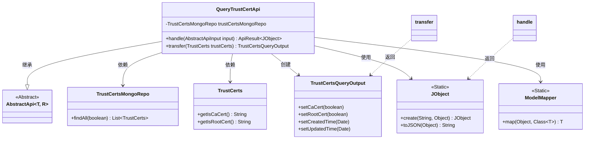
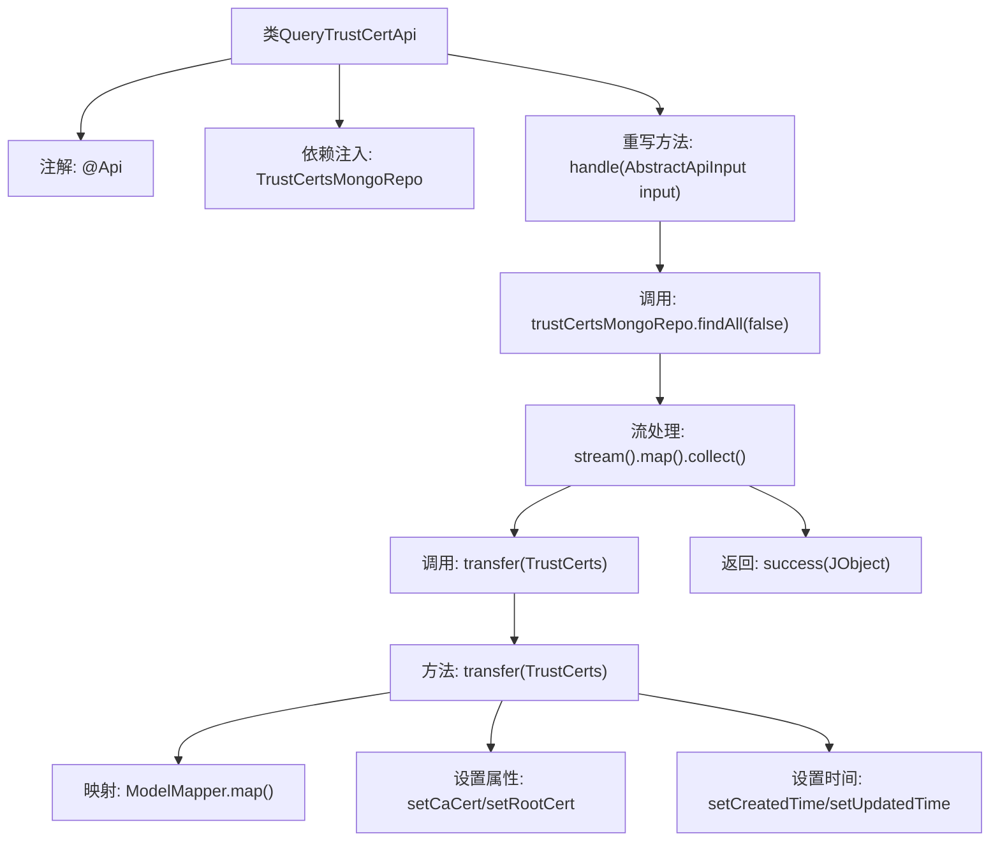

# 基础信息

|      |      |
|------|------|
| 名称 | QueryTrustCertApi |
| 编码语言 | .java |
| 代码路径 | WeFe/union/union-service/src/main/java/com/welab/wefe/union/service/api/cert/QueryTrustCertApi.java |
| 包名 | com.welab.wefe.union.service.api.cert |
| 依赖项 | ['com.welab.wefe.common.data.mongodb.entity.union.TrustCerts', 'com.welab.wefe.common.data.mongodb.repo.TrustCertsMongoRepo', 'com.welab.wefe.common.util.JObject', 'com.welab.wefe.common.web.api.base.AbstractApi', 'com.welab.wefe.common.web.api.base.Api', 'com.welab.wefe.common.web.dto.AbstractApiInput', 'com.welab.wefe.common.web.dto.ApiResult', 'com.welab.wefe.union.service.dto.cert.TrustCertsQueryOutput', 'com.welab.wefe.union.service.util.ModelMapper', 'org.springframework.beans.factory.annotation.Autowired', 'java.util.Date', 'java.util.List', 'java.util.stream.Collectors'] |
| 概述说明 | 这是一个查询信任证书的API类，路径为trust/certs/query，通过MongoDB获取所有证书数据并转换为输出格式，返回包含证书列表的JSON结果。 |

# 说明

该代码定义了一个名为QueryTrustCertApi的API类，用于查询信任证书信息。API路径为trust/certs/query，允许带签名访问。类继承自AbstractApi，使用TrustCertsMongoRepo从MongoDB获取所有证书数据。handle方法处理请求，将查询结果转换为TrustCertsQueryOutput对象列表，并封装为JSON返回。transfer方法负责数据转换，设置证书类型标识（CA证书和根证书）以及创建和更新时间。整个过程不包含敏感操作，仅提供查询功能。

# 类列表 Class Summary

| 名称   | 类型  | 说明 |
|-------|------|-------------|
| QueryTrustCertApi | class | 这是一个查询信任证书的API类，路径为trust/certs/query，通过MongoDB获取所有证书数据并转换为输出格式，包含CA和根证书标识及时间戳。 |

## 类 QueryTrustCertApi

|      |      |
|------|------|
| 访问范围 | @Api(path = "trust/certs/query", name = "trust_cert_query", allowAccessWithSign = true);public |
| 类型 | class |
| 名称 | QueryTrustCertApi |
| 说明 | 这是一个查询信任证书的API类，路径为trust/certs/query，通过MongoDB获取所有证书数据并转换为输出格式，包含CA和根证书标识及时间戳。 |

### UML类图

这段代码展示了一个处理信任证书查询的API类QueryTrustCertApi，它继承自泛型抽象类AbstractApi。该类通过TrustCertsMongoRepo从数据库获取证书数据，使用ModelMapper进行对象转换，并通过JObject构建JSON响应。核心功能包括查询所有非CA/根证书，并将其转换为包含创建/更新时间等增强属性的输出对象。类图中清晰地展现了继承关系、依赖注入以及工具类的静态方法调用等关键设计。

### 内部方法调用关系图

这段代码展示了一个处理信任证书查询的API类，通过MongoDB仓库获取数据后，使用流处理和模型映射转换数据格式，最终返回JSON格式的结果。流程图清晰呈现了从数据查询到结果返回的完整处理链条，包括依赖注入、流式操作和对象转换等关键步骤，体现了Spring Boot应用中典型的API处理模式。

### 字段列表 Field List

| 名称  | 类型  | 说明 |
|-------|-------|------|
| trustCertsMongoRepo | TrustCertsMongoRepo | 使用@Autowired自动注入TrustCertsMongoRepo实例。 |

### 方法列表

| 名称  | 类型  | 说明 |
|-------|-------|------|
| transfer | TrustCertsQueryOutput | 将TrustCerts对象转换为TrustCertsQueryOutput对象，设置是否为CA证书和根证书标志，并更新创建和修改时间为当前时间。 |
| handle | ApiResult<JObject> | Java方法重写，查询MongoDB获取TrustCerts数据并转换为JSON格式返回。 |

