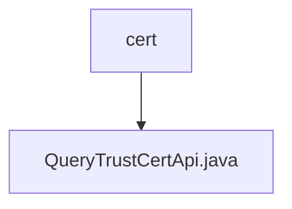

# 基础信息

|      |      |
|------|------|
| 名称 | cert |
| 编码语言 | .java |
| 代码路径 | WeFe/union/union-service/src/main/java/com/welab/wefe/union/service/api/cert |
| 包名 | docs.union.union-service.src.main.java.com.welab.wefe.union.service.api.cert |
| 概述说明 | 这是一个查询信任证书的API类，路径为trust/certs/query，通过MongoDB获取所有证书数据并转换为输出格式，返回包含证书列表的JSON结果。 |

# 说明

该代码定义了一个名为QueryTrustCertApi的API类，用于查询信任证书信息。API路径为trust/certs/query，允许带签名访问。类继承自AbstractApi，使用TrustCertsMongoRepo从MongoDB获取所有证书数据。handle方法处理请求，将查询结果转换为TrustCertsQueryOutput对象列表，并封装为JSON返回。transfer方法负责数据转换，设置证书类型标识（CA证书和根证书）以及创建和更新时间。整个过程不包含敏感操作，仅提供查询功能。

### 包内部结构视图

该流程图展示了WeFe项目中union-service模块下的证书查询接口结构。cert目录作为父节点，包含一个具体的API实现文件QueryTrustCertApi.java。这种简洁的层级关系体现了微服务架构中接口文件的典型组织方式，其中业务功能模块通过清晰的目录结构进行隔离和管理。

# 文件列表

| 名称   | 类型  | 说明 |
|-------|------|-------------|
| [QueryTrustCertApi.java](QueryTrustCertApi.md) | file | 这是一个查询信任证书的API类，路径为trust/certs/query，通过MongoDB获取所有证书数据并转换为输出格式，返回包含证书列表的JSON结果。 |

