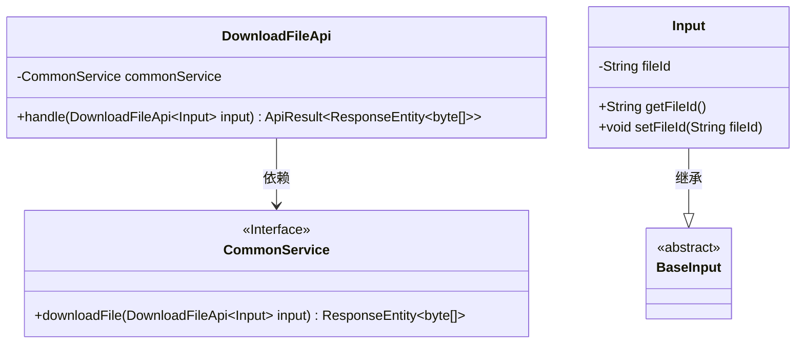
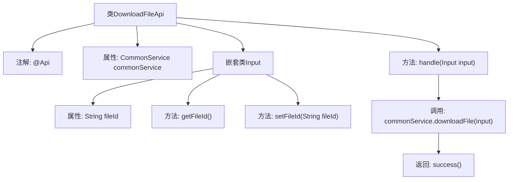

# 基础信息

|      |      |
|------|------|
| 名称 | DownloadFileApi |
| 编码语言 | .java |
| 代码路径 | WeFe/union/union-service/src/main/java/com/welab/wefe/union/service/api/common/DownloadFileApi.java |
| 包名 | com.welab.wefe.union.service.api.common |
| 依赖项 | ['com.welab.wefe.common.exception.StatusCodeWithException', 'com.welab.wefe.common.fieldvalidate.annotation.Check', 'com.welab.wefe.common.web.api.base.AbstractApi', 'com.welab.wefe.common.web.api.base.Api', 'com.welab.wefe.common.web.dto.ApiResult', 'com.welab.wefe.union.service.dto.base.BaseInput', 'com.welab.wefe.union.service.service.CommonService', 'org.springframework.beans.factory.annotation.Autowired', 'org.springframework.http.ResponseEntity', 'java.io.IOException'] |
| 概述说明 | DownloadFileApi是一个支持签名的文件下载接口，接收fileId参数并返回文件字节流。 |

# 说明

该代码定义了一个名为DownloadFileApi的API类，用于处理文件下载请求。API路径为"download/file"，允许带签名访问。类继承自AbstractApi，输入类型为内部类Input，输出为ResponseEntity<byte[]>。Input类包含必须的fileId字段，并通过getter和setter方法访问。处理逻辑调用commonService的downloadFile方法完成文件下载，并返回封装的结果。整个API通过注解和继承结构实现了标准的输入输出处理和业务逻辑调用。

# 类列表 Class Summary

| 名称   | 类型  | 说明 |
|-------|------|-------------|
| DownloadFileApi | class | 下载文件API类，需签名访问，接收文件ID参数，调用CommonService下载文件并返回字节数组响应。 |

## 类 DownloadFileApi

|      |      |
|------|------|
| 访问范围 | @Api(path = "download/file", name = "download_file", allowAccessWithSign = true);public |
| 类型 | class |
| 名称 | DownloadFileApi |
| 说明 | 下载文件API类，需签名访问，接收文件ID参数，调用CommonService下载文件并返回字节数组响应。 |

### UML类图

类图描述：该图展示了DownloadFileApi类结构及其关联关系。DownloadFileApi继承自AbstractApi，使用泛型参数Input和ResponseEntity<byte[]>，包含一个CommonService依赖。Input作为内部类继承BaseInput，具有fileId属性和getter/setter方法。CommonService是一个接口，提供downloadFile方法。整体结构体现了文件下载API的核心组件及其交互关系。

### 内部方法调用关系图

这段代码展示了一个文件下载API的实现，使用Spring框架和自定义注解。DownloadFileApi类继承自AbstractApi，通过handle方法处理输入参数并调用CommonService的downloadFile方法获取文件数据。Input嵌套类定义了必需的fileId字段及其getter/setter方法。流程图清晰地呈现了类结构、方法调用关系和数据处理流程。

### 字段列表 Field List

| 名称  | 类型  | 说明 |
|-------|-------|------|
| commonService | CommonService | 使用@Autowired自动注入CommonService实例。 |

### 方法列表

| 名称  | 类型  | 说明 |
|-------|-------|------|
| handle | ApiResult<ResponseEntity<byte[]>> | Java方法重写，处理文件下载请求，返回字节数组响应，可能抛出IO异常或状态码异常。 |

