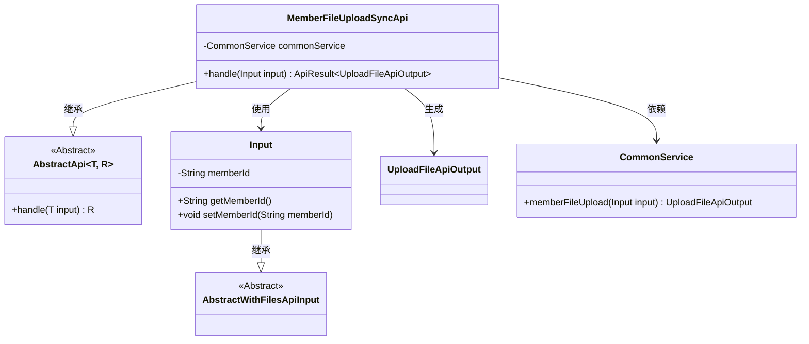

# 基础信息

|      |      |
|------|------|
| 名称 | MemberFileUploadSyncApi |
| 编码语言 | .java |
| 代码路径 | WeFe/union/union-service/src/main/java/com/welab/wefe/union/service/api/common/MemberFileUploadSyncApi.java |
| 包名 | com.welab.wefe.union.service.api.common |
| 依赖项 | ['com.welab.wefe.common.exception.StatusCodeWithException', 'com.welab.wefe.common.fieldvalidate.annotation.Check', 'com.welab.wefe.common.web.api.base.AbstractApi', 'com.welab.wefe.common.web.api.base.Api', 'com.welab.wefe.common.web.dto.AbstractWithFilesApiInput', 'com.welab.wefe.common.web.dto.ApiResult', 'com.welab.wefe.common.web.dto.UploadFileApiOutput', 'com.welab.wefe.union.service.service.CommonService', 'org.springframework.beans.factory.annotation.Autowired', 'java.io.IOException'] |
| 概述说明 | 成员文件同步上传API，需SM2验证，处理成员ID和文件上传，调用通用服务完成操作。 |

# 说明

该代码定义了一个名为MemberFileUploadSyncApi的API类，用于处理会员文件同步上传。API路径为member/file/upload/sync，需进行SM2加密验证。继承自AbstractApi类，输入类型为内部类Input，输出类型为UploadFileApiOutput。通过CommonService处理文件上传业务逻辑，要求输入参数memberId必填。核心功能是将文件上传请求转发至commonService.memberFileUpload方法处理。

# 类列表 Class Summary

| 名称   | 类型  | 说明 |
|-------|------|-------------|
| MemberFileUploadSyncApi | class | 成员文件同步上传API，需SM2验证，接收成员ID和文件，调用通用服务处理上传，返回结果。 |

## 类 MemberFileUploadSyncApi

|      |      |
|------|------|
| 访问范围 | @Api(path = "member/file/upload/sync", name = "member file upload sync", sm2Verify = true);public |
| 类型 | class |
| 名称 | MemberFileUploadSyncApi |
| 说明 | 成员文件同步上传API，需SM2验证，接收成员ID和文件，调用通用服务处理上传，返回结果。 |

### UML类图

这段代码展示了一个成员文件上传同步API的实现结构。MemberFileUploadSyncApi继承自泛型抽象类AbstractApi，处理Input类型参数并返回UploadFileApiOutput结果。Input类继承自AbstractWithFilesApiInput，包含memberId字段及getter/setter方法。MemberFileUploadSyncApi通过依赖注入的CommonService完成核心业务逻辑，体现了清晰的层级关系和职责划分。

### 内部方法调用关系图

```mermaid
graph TD
    A["类MemberFileUploadSyncApi"]
    B["注解: @Api"]
    C["继承: AbstractApi<Input, UploadFileApiOutput>"]
    D["依赖注入: @Autowired CommonService"]
    E["重写方法: handle(Input input)"]
    F["内部类: Input"]
    G["属性: String memberId"]
    H["方法: getMemberId()"]
    I["方法: setMemberId(String)"]
    J["调用: commonService.memberFileUpload(input)"]
    K["返回: success()"]

    A --> B
    A --> C
    A --> D
    A --> E
    E --> J
    J --> K
    A --> F
    F --> G
    F --> H
    F --> I
```

这段代码展示了一个名为MemberFileUploadSyncApi的API类，它继承自AbstractApi并处理文件上传同步请求。类中包含一个内部类Input用于封装请求参数，通过@Autowired注入CommonService来处理业务逻辑。主要流程是handle方法调用commonService.memberFileUpload处理上传请求，并返回封装后的结果。代码结构清晰，包含了必要的参数校验和日志记录功能。

### 字段列表 Field List

| 名称  | 类型  | 说明 |
|-------|-------|------|
| commonService | CommonService | 使用@Autowired自动注入CommonService实例。 |

### 方法列表

| 名称  | 类型  | 说明 |
|-------|-------|------|
| handle | ApiResult<UploadFileApiOutput> | 处理成员文件上传同步请求，调用通用服务上传文件并返回结果。 |

