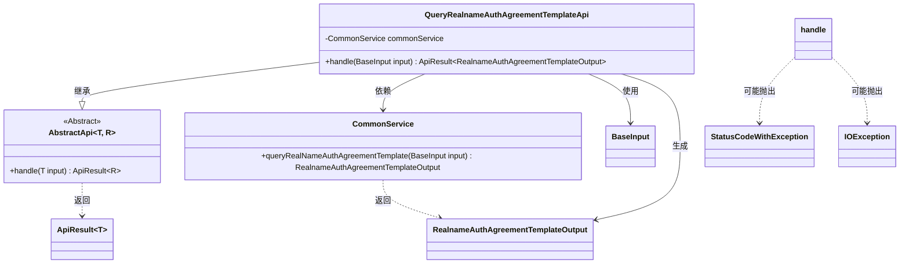
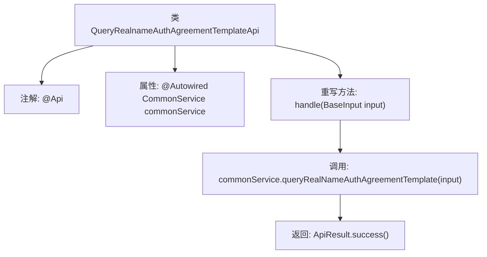

# 基础信息

|      |      |
|------|------|
| 名称 | QueryRealnameAuthAgreementTemplateApi |
| 编码语言 | .java |
| 代码路径 | WeFe/union/union-service/src/main/java/com/welab/wefe/union/service/api/common/QueryRealnameAuthAgreementTemplateApi.java |
| 包名 | com.welab.wefe.union.service.api.common |
| 依赖项 | ['com.welab.wefe.common.exception.StatusCodeWithException', 'com.welab.wefe.common.web.api.base.AbstractApi', 'com.welab.wefe.common.web.api.base.Api', 'com.welab.wefe.common.web.dto.ApiResult', 'com.welab.wefe.union.service.dto.base.BaseInput', 'com.welab.wefe.union.service.dto.common.RealnameAuthAgreementTemplateOutput', 'com.welab.wefe.union.service.service.CommonService', 'org.springframework.beans.factory.annotation.Autowired', 'java.io.IOException'] |
| 概述说明 | 这是一个查询实名认证协议模板的API类，路径为"realname/auth/agreement/template/query"，允许签名访问，通过CommonService获取协议模板数据并返回结果。 |

# 说明

这是一个名为QueryRealnameAuthAgreementTemplateApi的Java类，用于查询实名认证协议模板。该类继承自AbstractApi，接收BaseInput输入并返回RealnameAuthAgreementTemplateOutput输出。通过@Api注解定义了API路径为realname/auth/agreement/template/query，名称为available，并允许带签名访问。类中注入了CommonService依赖，其handle方法调用commonService的queryRealNameAuthAgreementTemplate方法处理请求，成功时返回封装的结果。

# 类列表 Class Summary

| 名称   | 类型  | 说明 |
|-------|------|-------------|
| QueryRealnameAuthAgreementTemplateApi | class | 这是一个查询实名认证协议模板的API类，路径为"realname/auth/agreement/template/query"，允许签名访问，通过CommonService获取协议模板数据并返回结果。 |

## 类 QueryRealnameAuthAgreementTemplateApi

|      |      |
|------|------|
| 访问范围 | @Api(path = "realname/auth/agreement/template/query", name = "available", allowAccessWithSign = true);public |
| 类型 | class |
| 名称 | QueryRealnameAuthAgreementTemplateApi |
| 说明 | 这是一个查询实名认证协议模板的API类，路径为"realname/auth/agreement/template/query"，允许签名访问，通过CommonService获取协议模板数据并返回结果。 |

### UML类图

这段代码展示了一个查询实名认证协议模板的API实现类QueryRealnameAuthAgreementTemplateApi，它继承自泛型抽象类AbstractApi，并依赖CommonService来执行业务逻辑。该类接收BaseInput作为输入，返回包含RealnameAuthAgreementTemplateOutput的ApiResult结果，处理过程中可能抛出StatusCodeWithException和IOException异常。注解@Api定义了接口路径和访问权限，@Autowired实现了依赖注入。

### 内部方法调用关系图

这段代码展示了一个继承自AbstractApi的类QueryRealnameAuthAgreementTemplateApi，主要用于查询实名认证协议模板。类通过@Api注解定义了API路径和权限配置，并注入CommonService来执行业务逻辑。核心方法是handle()，它调用commonService的查询方法并返回封装后的结果。流程图清晰呈现了从类结构到方法调用的完整链路，突出了依赖注入和业务处理的关键节点。

### 字段列表 Field List

| 名称  | 类型  | 说明 |
|-------|-------|------|
| commonService | CommonService | 代码片段使用@Autowired注解自动注入CommonService实例。 |

### 方法列表

| 名称  | 类型  | 说明 |
|-------|-------|------|
| handle | ApiResult<RealnameAuthAgreementTemplateOutput> | 该方法重写父类逻辑，调用公共服务查询实名认证协议模板，返回封装结果或异常。 |

