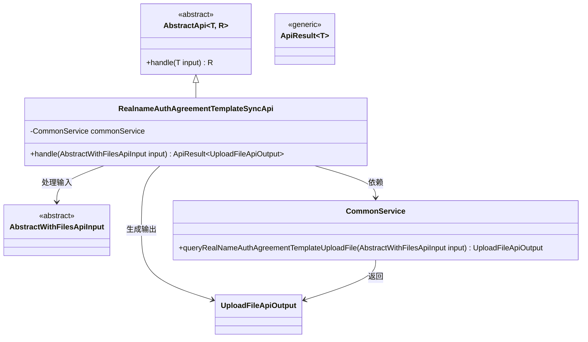
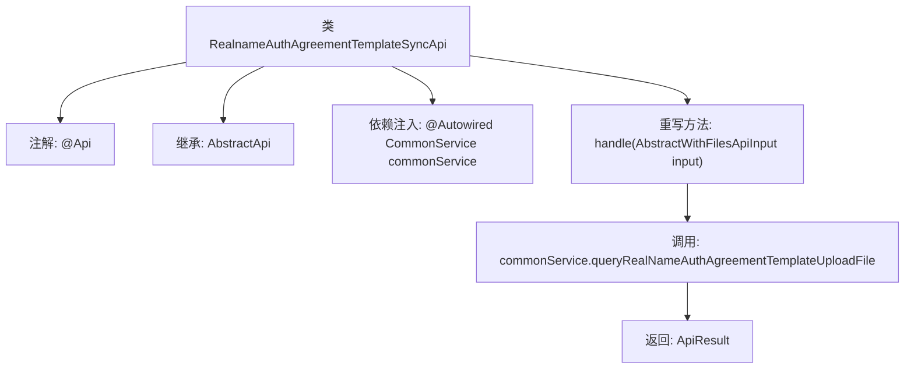

# 基础信息

|      |      |
|------|------|
| 名称 | RealnameAuthAgreementTemplateSyncApi |
| 编码语言 | .java |
| 代码路径 | WeFe/union/union-service/src/main/java/com/welab/wefe/union/service/api/common/RealnameAuthAgreementTemplateSyncApi.java |
| 包名 | com.welab.wefe.union.service.api.common |
| 依赖项 | ['com.welab.wefe.common.exception.StatusCodeWithException', 'com.welab.wefe.common.web.api.base.AbstractApi', 'com.welab.wefe.common.web.api.base.Api', 'com.welab.wefe.common.web.dto.AbstractWithFilesApiInput', 'com.welab.wefe.common.web.dto.ApiResult', 'com.welab.wefe.common.web.dto.UploadFileApiOutput', 'com.welab.wefe.union.service.service.CommonService', 'org.springframework.beans.factory.annotation.Autowired', 'java.io.IOException'] |
| 概述说明 | 这是一个实名认证协议模板同步API类，路径为"realname/auth/agreement/template/sync"，使用SM2验证，继承自AbstractApi，处理文件上传输入并返回文件输出，调用commonService查询实名认证协议模板上传文件。 |

# 说明

该代码定义了一个名为RealnameAuthAgreementTemplateSyncApi的API类，用于处理实名认证协议模板同步请求。该类继承自AbstractApi，使用SM2加密验证，接收AbstractWithFilesApiInput类型输入并返回UploadFileApiOutput类型输出。通过注入的CommonService调用queryRealNameAuthAgreementTemplateUploadFile方法处理请求，最终返回封装为ApiResult的成功结果。

# 类列表 Class Summary

| 名称   | 类型  | 说明 |
|-------|------|-------------|
| RealnameAuthAgreementTemplateSyncApi | class | 实名认证协议模板同步API，使用SM2验证，处理文件上传请求并返回结果。 |

## 类 RealnameAuthAgreementTemplateSyncApi

|      |      |
|------|------|
| 访问范围 | @Api(path = "realname/auth/agreement/template/sync", name = "realname auth agreement template sync", sm2Verify = true);public |
| 类型 | class |
| 名称 | RealnameAuthAgreementTemplateSyncApi |
| 说明 | 实名认证协议模板同步API，使用SM2验证，处理文件上传请求并返回结果。 |

### UML类图

这段代码展示了一个实名认证协议模板同步API的实现类结构。RealnameAuthAgreementTemplateSyncApi继承自泛型抽象类AbstractApi，处理AbstractWithFilesApiInput类型的输入并返回ApiResult<UploadFileApiOutput>结果。通过依赖CommonService完成核心业务逻辑，将文件上传操作委托给该服务处理。类图清晰地展现了继承关系、依赖关系和输入输出类型，体现了模板方法设计模式的应用。

### 内部方法调用关系图

该流程图展示了实名认证协议模板同步API的类结构和工作流程。类通过@Api注解定义接口路径，继承抽象模板类处理文件上传输入输出。核心方法handle调用公共服务查询协议模板文件，最终返回封装结果。流程清晰体现了Spring依赖注入和模板方法模式的应用，以及异常处理机制。

### 字段列表 Field List

| 名称  | 类型  | 说明 |
|-------|-------|------|
| commonService | CommonService | 使用@Autowired自动注入CommonService实例。 |

### 方法列表

| 名称  | 类型  | 说明 |
|-------|-------|------|
| handle | ApiResult<UploadFileApiOutput> | 重写方法处理文件上传，调用服务查询实名认证协议模板文件，返回成功结果。 |

