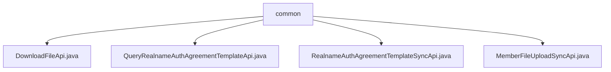

# 基础信息

|      |      |
|------|------|
| 名称 | common |
| 编码语言 | .java |
| 代码路径 | WeFe/union/union-service/src/main/java/com/welab/wefe/union/service/api/common |
| 包名 | docs.union.union-service.src.main.java.com.welab.wefe.union.service.api.common |
| 概述说明 | DownloadFileApi处理文件下载，路径download/file。QueryRealnameAuthAgreementTemplateApi查询实名模板，路径realname/auth/agreement/template/query。RealnameAuthAgreementTemplateSyncApi同步实名模板，SM2加密。MemberFileUploadSyncApi处理会员文件上传，路径member/file/upload/sync，需SM2加密。均继承AbstractApi，通过CommonService处理业务。 |

# 说明

## 概述  
该模块核心职责是提供文件下载、实名认证协议模板查询及会员文件同步上传等公共服务API。所有API均继承AbstractApi基类，遵循统一接口规范：路径通过@Api注解定义，支持签名/SM2加密验证，输入输出使用特定DTO封装。关键数据结构包括Input内部类、UploadFileApiOutput和RealnameAuthAgreementTemplateOutput等。外部依赖主要为CommonService，例如处理文件下载和模板查询。  

## 主要业务场景  
模块支持三类典型场景：文件下载（例如通过fileId获取文件字节流）、实名认证协议管理（例如查询模板或同步更新）、会员文件同步（例如加密上传成员文件）。交互模式类似RESTful风格，输入验证后委托CommonService执行业务逻辑。例如DownloadFileApi返回ResponseEntity<byte[]>，而MemberFileUploadSyncApi需校验memberId后调用上传服务。所有API均返回标准化封装结果，确保调用方处理一致性。

### 包内部结构视图

该流程图展示了WeFe项目中union-service模块下common目录的API文件结构。根节点为common文件夹，包含4个Java接口文件：DownloadFileApi、QueryRealnameAuthAgreementTemplateApi、RealnameAuthAgreementTemplateSyncApi和MemberFileUploadSyncApi，这些文件均属于公共服务接口层，用于处理文件下载、实名认证协议模板查询等通用功能。

# 文件列表

| 名称   | 类型  | 说明 |
|-------|------|-------------|
| [DownloadFileApi.java](DownloadFileApi.md) | file | DownloadFileApi是一个支持签名的文件下载接口，接收fileId参数并返回文件字节流。 |
| [QueryRealnameAuthAgreementTemplateApi.java](QueryRealnameAuthAgreementTemplateApi.md) | file | 这是一个查询实名认证协议模板的API类，路径为"realname/auth/agreement/template/query"，允许签名访问，通过CommonService获取协议模板数据并返回结果。 |
| [RealnameAuthAgreementTemplateSyncApi.java](RealnameAuthAgreementTemplateSyncApi.md) | file | 这是一个实名认证协议模板同步API类，路径为"realname/auth/agreement/template/sync"，使用SM2验证，继承自AbstractApi，处理文件上传输入并返回文件输出，调用commonService查询实名认证协议模板上传文件。 |
| [MemberFileUploadSyncApi.java](MemberFileUploadSyncApi.md) | file | 成员文件同步上传API，需SM2验证，处理成员ID和文件上传，调用通用服务完成操作。 |

