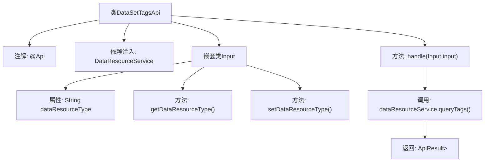

# 基础信息

|      |      |
|------|------|
| 名称 | DataSetTagsApi |
| 编码语言 | .java |
| 代码路径 | WeFe/union/union-service/src/main/java/com/welab/wefe/union/service/api/dataresource/DataSetTagsApi.java |
| 包名 | com.welab.wefe.union.service.api.dataresource |
| 依赖项 | ['com.welab.wefe.common.exception.StatusCodeWithException', 'com.welab.wefe.common.web.api.base.AbstractApi', 'com.welab.wefe.common.web.api.base.Api', 'com.welab.wefe.common.web.dto.ApiResult', 'com.welab.wefe.union.service.dto.base.BaseInput', 'com.welab.wefe.union.service.dto.dataresource.TagsDTO', 'com.welab.wefe.union.service.service.DataResourceService', 'org.springframework.beans.factory.annotation.Autowired', 'java.io.IOException', 'java.util.List'] |
| 概述说明 | 这是一个查询数据资源标签的API类，路径为"data_resource/tags/query"，需要签名访问。它接收数据类型参数，调用DataResourceService查询并返回标签列表。 |

# 说明

这是一个名为DataSetTagsApi的Java类，用于查询数据资源标签。它继承自AbstractApi，泛型参数指定输入类型为内部类Input，返回类型为TagsDTO列表。类注解定义了API路径为"data_resource/tags/query"，允许签名访问。通过自动注入的DataResourceService调用queryTags方法处理请求。内部类Input继承BaseInput，包含一个可读写的数据资源类型字段dataResourceType。handle方法调用服务层并返回结果。

# 类列表 Class Summary

| 名称   | 类型  | 说明 |
|-------|------|-------------|
| DataSetTagsApi | class | 数据集标签查询API，路径为data_resource/tags/query，需签名访问，输入参数为dataResourceType，返回标签列表，调用DataResourceService的queryTags方法处理请求。 |


## 类 DataSetTagsApi

|      |      |
|------|------|
| 访问范围 | @Api(path = "data_resource/tags/query", name = "data_resource_tags_query", allowAccessWithSign = true);public |
| 类型 | class |
| 名称 | DataSetTagsApi |
| 说明 | 数据集标签查询API，路径为data_resource/tags/query，需签名访问，输入参数为dataResourceType，返回标签列表，调用DataResourceService的queryTags方法处理请求。 |


### UML类图

```mermaid
classDiagram
    class DataSetTagsApi {
        -DataResourceService dataResourceService
        +handle(Input input) ApiResult~List~TagsDTO~~
    }
    
    class DataResourceService {
        <<Interface>>
        +queryTags(Input input) List~TagsDTO~
    }
    DataSetTagsApi --> DataResourceService : 依赖
    
    class Input {
        -String dataResourceType
        +String getDataResourceType()
        +void setDataResourceType(String dataResourceType)
    }
    DataSetTagsApi *-- Input : 组合
    
    class AbstractApi~T, R~ {
        <<Abstract>>
        +handle(T input) ApiResult~R~
    }
    DataSetTagsApi --|> AbstractApi~Input, List~TagsDTO~~ : 继承
    
    class TagsDTO {
        // 数据传输对象
    }
    DataResourceService ..> TagsDTO : 使用
```

这段代码展示了一个处理数据资源标签查询的API类结构。DataSetTagsApi继承自泛型抽象类AbstractApi，通过组合方式使用Input内部类作为输入参数，并依赖DataResourceService接口实现业务逻辑。该API接收包含dataResourceType的输入对象，返回TagsDTO列表结果，体现了清晰的层次结构和职责分离。


### 内部方法调用关系图



这段代码展示了一个基于Spring框架的API类DataSetTagsApi，继承自AbstractApi并实现了数据处理逻辑。流程图描述了类结构关系：包含@Api注解标记、通过@Autowired注入的DataResourceService、处理请求的handle方法，以及嵌套的Input参数类。核心流程是handle方法调用dataResourceService.queryTags()并返回封装结果，同时Input类提供了可读写的数据类型属性。

### 字段列表 Field List

| 名称  | 类型  | 说明 |
|-------|-------|------|
| dataResourceService | DataResourceService | 自动注入DataResourceService实例。 |

### 方法列表

| 名称  | 类型  | 说明 |
|-------|-------|------|
| handle | ApiResult<List<TagsDTO>> | 该方法重写父类逻辑，调用dataResourceService查询标签数据，返回封装后的ApiResult结果。处理可能抛出异常。 |


