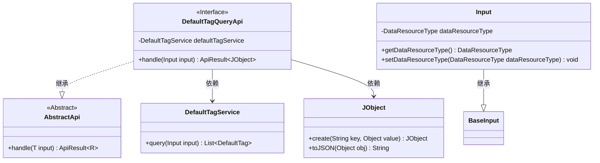
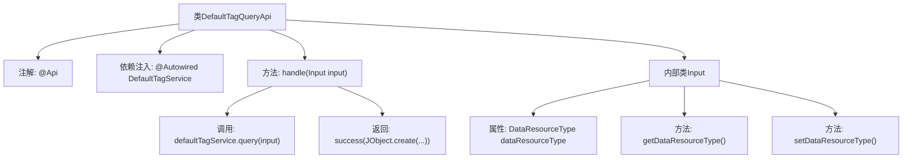

# 基础信息

|      |      |
|------|------|
| 名称 | DefaultTagQueryApi |
| 编码语言 | .java |
| 代码路径 | WeFe/union/union-service/src/main/java/com/welab/wefe/union/service/api/dataresource/DefaultTagQueryApi.java |
| 包名 | com.welab.wefe.union.service.api.dataresource |
| 依赖项 | ['com.welab.wefe.common.exception.StatusCodeWithException', 'com.welab.wefe.common.fieldvalidate.annotation.Check', 'com.welab.wefe.common.util.JObject', 'com.welab.wefe.common.web.api.base.AbstractApi', 'com.welab.wefe.common.web.api.base.Api', 'com.welab.wefe.common.web.dto.ApiResult', 'com.welab.wefe.common.wefe.enums.DataResourceType', 'com.welab.wefe.union.service.dto.base.BaseInput', 'com.welab.wefe.union.service.service.DefaultTagService', 'org.springframework.beans.factory.annotation.Autowired', 'java.io.IOException'] |
| 概述说明 | DefaultTagQueryApi接口，路径data_resource/default_tag/query，需签名访问，调用DefaultTagService查询数据，输入需包含dataResourceType参数，返回JSON格式列表。 |

# 说明

该代码定义了一个名为DefaultTagQueryApi的API类，用于查询默认标签数据。API路径为"data_resource/default_tag/query"，允许签名访问。类继承自AbstractApi，输入类型为内部类Input，输出类型为JObject。通过Autowired注入DefaultTagService处理业务逻辑。handle方法调用defaultTagService.query并返回JSON格式结果。Input类继承BaseInput，包含必须的dataResourceType字段及其getter/setter方法，该字段类型为DataResourceType。整体实现了一个简单的标签查询接口。

# 类列表 Class Summary

| 名称   | 类型  | 说明 |
|-------|------|-------------|
| DefaultTagQueryApi | class | 这是一个查询默认标签的API类，路径为data_resource/default_tag/query，允许签名访问。使用DefaultTagService处理查询请求，输入参数为DataResourceType，返回结果为JSON格式的标签列表。 |

## 类 DefaultTagQueryApi

|      |      |
|------|------|
| 访问范围 | @Api(path = "data_resource/default_tag/query", name = "data_resource_default_tag_query", allowAccessWithSign = true);public |
| 类型 | class |
| 名称 | DefaultTagQueryApi |
| 说明 | 这是一个查询默认标签的API类，路径为data_resource/default_tag/query，允许签名访问。使用DefaultTagService处理查询请求，输入参数为DataResourceType，返回结果为JSON格式的标签列表。 |

### UML类图

这段代码展示了一个API处理类`DefaultTagQueryApi`，它继承自泛型抽象类`AbstractApi`，处理特定类型的输入`Input`并返回JSON格式结果。`Input`类继承自`BaseInput`，包含一个必须的`DataResourceType`枚举字段。API通过`DefaultTagService`查询数据，并使用`JObject`工具类构建响应。整个设计体现了清晰的层级结构和依赖关系，其中`DefaultTagQueryApi`作为具体实现类，依赖服务层和工具类完成业务逻辑。

### 内部方法调用关系图

该流程图展示了DefaultTagQueryApi类的结构及其内部关系。类通过@Api注解定义API路径，注入DefaultTagService服务，核心方法handle处理输入参数Input并调用服务层查询数据，最终返回包含查询结果的JObject。Input内部类包含受校验的dataResourceType属性及其getter/setter方法。流程清晰呈现了从请求处理到结果返回的完整链路。

### 字段列表 Field List

| 名称  | 类型  | 说明 |
|-------|-------|------|
| defaultTagService | DefaultTagService | 使用@Autowired自动注入DefaultTagService实例。 |

### 方法列表

| 名称  | 类型  | 说明 |
|-------|-------|------|
| handle | ApiResult<JObject> | Java方法重写，处理输入并返回JSON格式的默认标签查询结果。 |

