# 基础信息

|      |      |
|------|------|
| 名称 | DeleteApi |
| 编码语言 | .java |
| 代码路径 | WeFe/union/union-service/src/main/java/com/welab/wefe/union/service/api/dataresource/DeleteApi.java |
| 包名 | com.welab.wefe.union.service.api.dataresource |
| 依赖项 | ['com.welab.wefe.common.exception.StatusCodeWithException', 'com.welab.wefe.common.fieldvalidate.annotation.Check', 'com.welab.wefe.common.web.api.base.AbstractApi', 'com.welab.wefe.common.web.api.base.Api', 'com.welab.wefe.common.web.dto.AbstractApiOutput', 'com.welab.wefe.common.web.dto.ApiResult', 'com.welab.wefe.union.service.dto.base.BaseInput', 'com.welab.wefe.union.service.service.DataResourceService', 'org.springframework.beans.factory.annotation.Autowired', 'java.io.IOException'] |
| 概述说明 | 删除数据资源的API接口，需传入dataResourceId参数，调用DataResourceService的delete方法处理。 |

# 说明

该代码定义了一个名为DeleteApi的API类，用于删除数据资源。API路径为data_resource/delete，允许签名访问。类继承自AbstractApi，输入类型为DeleteApi.Input，输出类型为AbstractApiOutput。通过Autowired注入DataResourceService服务，在handle方法中调用其delete方法完成删除操作。输入类Input继承BaseInput，包含必须的dataResourceId字段及其getter和setter方法。处理成功时返回success结果。

# 类列表 Class Summary

| 名称   | 类型  | 说明 |
|-------|------|-------------|
| DeleteApi | class | 删除数据资源的API类，路径为data_resource/delete，需签名访问，接收dataResourceId参数并调用服务删除对应资源。 |


## 类 DeleteApi

|      |      |
|------|------|
| 访问范围 | @Api(path = "data_resource/delete", name = "data_resource_delete", allowAccessWithSign = true);public |
| 类型 | class |
| 名称 | DeleteApi |
| 说明 | 删除数据资源的API类，路径为data_resource/delete，需签名访问，接收dataResourceId参数并调用服务删除对应资源。 |


### UML类图

```mermaid
classDiagram
    class AbstractApi~T, R~ {
        <<Abstract>>
        +handle(T input) ApiResult~R~
    }
    class DeleteApi {
        -DataResourceService dataResourceService
        +handle(Input input) ApiResult~AbstractApiOutput~
    }
    class DataResourceService {
        +delete(DeleteApi$Input input)
    }
    class BaseInput {
        <<Abstract>>
    }
    class DeleteApi$Input {
        -String dataResourceId
        +String getDataResourceId()
        +void setDataResourceId(String dataResourceId)
    }
    class AbstractApiOutput {
    }
    class ApiResult~T~ {
    }

    DeleteApi --|> AbstractApi~DeleteApi$Input, AbstractApiOutput~ : 继承
    DeleteApi --> DataResourceService : 依赖
    DeleteApi$Input --|> BaseInput : 继承
    AbstractApi ..> ApiResult : 使用
    DeleteApi ..> AbstractApiOutput : 使用
```

类图描述：
该图展示了DeleteApi及其相关类的结构关系。DeleteApi继承自泛型类AbstractApi<Input, AbstractApiOutput>，并依赖DataResourceService进行数据资源删除操作。Input作为DeleteApi的内部类，继承自BaseInput，包含dataResourceId字段及其访问方法。AbstractApi定义核心抽象方法handle，ApiResult用于包装返回结果。整体结构体现了分层设计和依赖注入的典型模式。


### 内部方法调用关系图

```mermaid
graph TD
    A["类DeleteApi"]
    B["注解: @Api"]
    C["继承: AbstractApi<Input, AbstractApiOutput>"]
    D["依赖注入: @Autowired DataResourceService"]
    E["重写方法: handle(Input input)"]
    F["内部类: Input extends BaseInput"]
    G["属性: @Check String dataResourceId"]
    H["方法: getDataResourceId()"]
    I["方法: setDataResourceId()"]
    J["调用: dataResourceService.delete(input)"]
    K["返回: success()"]

    A --> B
    A --> C
    A --> D
    A --> E
    E --> J
    E --> K
    A --> F
    F --> G
    F --> H
    F --> I
```



这段代码定义了一个带有API注解的DeleteApi类，继承自AbstractApi并重写了handle方法。流程图展示了类结构、注解、依赖注入、内部类定义和核心处理逻辑。主要功能是通过dataResourceService删除指定数据资源，内部类Input用于验证必需参数dataResourceId。整体设计符合API接口的典型分层模式，包含输入验证和业务逻辑处理。

### 字段列表 Field List

| 名称  | 类型  | 说明 |
|-------|-------|------|
| dataResourceService | DataResourceService | 自动注入DataResourceService实例。 |

### 方法列表

| 名称  | 类型  | 说明 |
|-------|-------|------|
| handle | ApiResult<AbstractApiOutput> | Java方法：处理输入并调用删除服务，成功返回结果。 |


