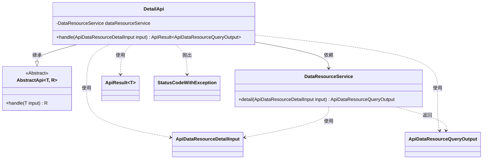
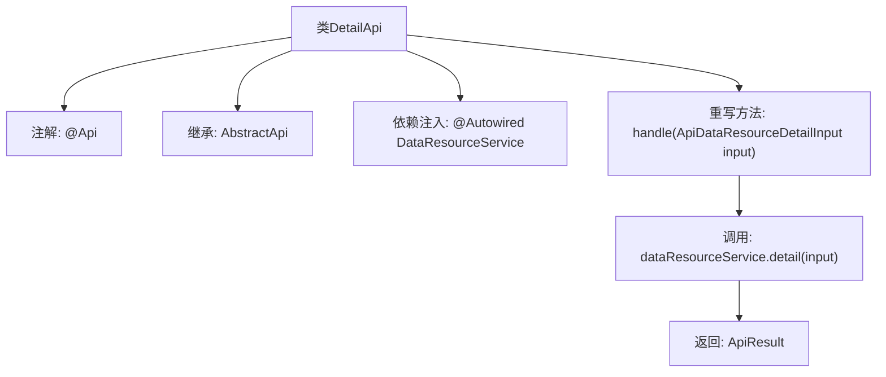

# 基础信息

|      |      |
|------|------|
| 名称 | DetailApi |
| 编码语言 | .java |
| 代码路径 | WeFe/union/union-service/src/main/java/com/welab/wefe/union/service/api/dataresource/DetailApi.java |
| 包名 | com.welab.wefe.union.service.api.dataresource |
| 依赖项 | ['com.welab.wefe.common.exception.StatusCodeWithException', 'com.welab.wefe.common.web.api.base.AbstractApi', 'com.welab.wefe.common.web.api.base.Api', 'com.welab.wefe.common.web.dto.ApiResult', 'com.welab.wefe.union.service.dto.dataresource.ApiDataResourceDetailInput', 'com.welab.wefe.union.service.dto.dataresource.ApiDataResourceQueryOutput', 'com.welab.wefe.union.service.service.DataResourceService', 'org.springframework.beans.factory.annotation.Autowired'] |
| 概述说明 | DetailApi类是一个数据资源详情接口，允许签名访问，调用DataResourceService处理输入并返回详情数据。 |

# 说明

这是一个名为DetailApi的Java类，继承自AbstractApi基类，用于处理数据资源详情查询的API请求。该类标注了Api注解，指定路径为"data_resource/detail"，允许签名访问。它通过注入的DataResourceService服务调用detail方法处理输入参数ApiDataResourceDetailInput，并返回ApiDataResourceQueryOutput类型的结果。核心业务逻辑在handle方法中实现，成功时返回封装好的ApiResult对象。

# 类列表 Class Summary

| 名称   | 类型  | 说明 |
|-------|------|-------------|
| DetailApi | class | Java类DetailApi定义了一个API接口，路径为"data_resource/detail"，允许签名访问，调用DataResourceService的detail方法处理输入并返回结果。 |

## 类 DetailApi

|      |      |
|------|------|
| 访问范围 | @Api(path = "data_resource/detail", name = "data_resource_detail", allowAccessWithSign = true);public |
| 类型 | class |
| 名称 | DetailApi |
| 说明 | Java类DetailApi定义了一个API接口，路径为"data_resource/detail"，允许签名访问，调用DataResourceService的detail方法处理输入并返回结果。 |

### UML类图

这段代码展示了一个名为DetailApi的API类，继承自泛型抽象类AbstractApi，实现了数据资源详情查询功能。DetailApi通过依赖注入使用DataResourceService服务，处理输入参数ApiDataResourceDetailInput并返回封装在ApiResult中的ApiDataResourceQueryOutput结果。类图清晰地展示了继承关系、依赖关系以及各类型之间的交互方式，体现了Spring框架中典型的控制器-服务层交互模式。

### 内部方法调用关系图

这段代码展示了一个基于注解的API类DetailApi，它继承自AbstractApi并实现了数据处理逻辑。流程从类定义开始，通过@Api注解配置接口元信息，使用@Autowired注入DataResourceService服务，重写handle方法调用服务层的detail功能，最终返回封装后的ApiResult结果。整个过程体现了Spring框架下典型的API层实现模式，包含依赖注入、服务调用和结果封装等关键步骤。

### 字段列表 Field List

| 名称  | 类型  | 说明 |
|-------|-------|------|
| dataResourceService | DataResourceService | 自动注入DataResourceService服务实例。 |

### 方法列表

| 名称  | 类型  | 说明 |
|-------|-------|------|
| handle | ApiResult<ApiDataResourceQueryOutput> | Java方法重写，调用dataResourceService.detail处理输入并返回ApiResult封装的结果。 |

