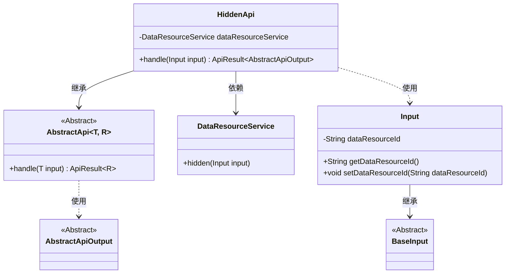
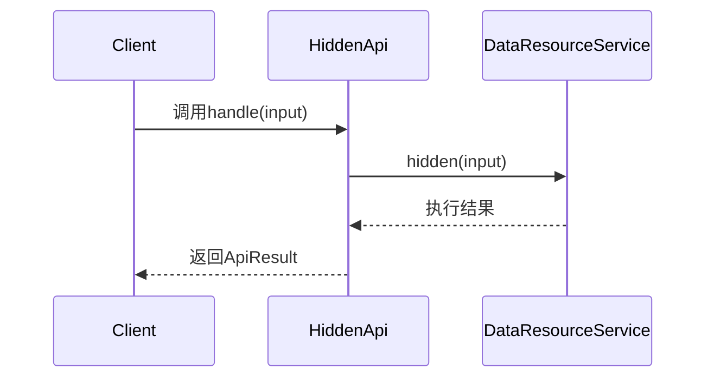

# 基础信息

|      |      |
|------|------|
| 名称 | HiddenApi |
| 编码语言 | .java |
| 代码路径 | WeFe/union/union-service/src/main/java/com/welab/wefe/union/service/api/dataresource/HiddenApi.java |
| 包名 | com.welab.wefe.union.service.api.dataresource |
| 依赖项 | ['com.welab.wefe.common.exception.StatusCodeWithException', 'com.welab.wefe.common.fieldvalidate.annotation.Check', 'com.welab.wefe.common.web.api.base.AbstractApi', 'com.welab.wefe.common.web.api.base.Api', 'com.welab.wefe.common.web.dto.AbstractApiOutput', 'com.welab.wefe.common.web.dto.ApiResult', 'com.welab.wefe.union.service.dto.base.BaseInput', 'com.welab.wefe.union.service.service.DataResourceService', 'org.springframework.beans.factory.annotation.Autowired', 'java.io.IOException'] |
| 概述说明 | HiddenApi类是一个数据资源隐藏接口，路径为data_resource/hidden，需签名访问。处理输入参数dataResourceId，调用dataResourceService.hidden方法实现隐藏功能。 |

# 说明

HiddenApi是一个处理数据资源隐藏操作的API类，路径为"data_resource/hidden"，允许签名访问。它继承自AbstractApi，使用泛型指定输入类型为HiddenApi.Input，输出类型为AbstractApiOutput。类中注入了DataResourceService用于业务处理，核心方法handle调用dataResourceService.hidden执行隐藏操作。输入类Input继承BaseInput，包含必须的dataResourceId字段及其getter/setter方法。整个API设计简洁，专注于单一职责的数据资源隐藏功能。

# 类列表 Class Summary

| 名称   | 类型  | 说明 |
|-------|------|-------------|
| HiddenApi | class | HiddenApi类是一个允许签名的数据资源隐藏接口，通过dataResourceService处理输入参数dataResourceId，执行隐藏操作后返回成功结果。 |

## 类 HiddenApi

|      |      |
|------|------|
| 访问范围 | @Api(path = "data_resource/hidden", name = "data_resource_hidden", allowAccessWithSign = true);public |
| 类型 | class |
| 名称 | HiddenApi |
| 说明 | HiddenApi类是一个允许签名的数据资源隐藏接口，通过dataResourceService处理输入参数dataResourceId，执行隐藏操作后返回成功结果。 |

### UML类图

这段代码展示了一个隐藏数据资源的API实现类结构。HiddenApi继承自泛型抽象类AbstractApi，处理Input输入并返回AbstractApiOutput。通过DataResourceService执行实际隐藏操作，Input类继承BaseInput并包含必须的数据资源ID字段。类图清晰地展示了继承关系、依赖关系和使用关系，体现了Spring框架中典型的API服务层设计模式。

### 内部方法调用关系图

```mermaid
graph TD
    A["类HiddenApi"]
    B["注解: @Api"]
    C["继承: AbstractApi<Input, AbstractApiOutput>"]
    D["依赖注入: @Autowired DataResourceService"]
    E["重写方法: handle(Input input)"]
    F["内部类: Input"]
    G["属性: String dataResourceId"]
    H["校验注解: @Check(require=true)"]
    I["Getter/Setter方法"]

    A --> B
    A --> C
    A --> D
    A --> E
    E --> D["调用dataResourceService.hidden()"]
    A --> F
    F --> G
    F --> H
    F --> I
```

这段代码定义了一个带有API注解的HiddenApi类，继承自AbstractApi并实现了数据处理逻辑。流程图展示了类结构关系，包括注解、继承关系、依赖服务和内部输入类。时序图描述了客户端调用handle方法时，通过DataResourceService执行隐藏操作并返回结果的完整流程。核心功能是通过服务层对指定数据资源进行隐藏操作，输入参数通过嵌套类Input进行校验和封装。

### 字段列表 Field List

| 名称  | 类型  | 说明 |
|-------|-------|------|
| dataResourceService | DataResourceService | 自动注入DataResourceService服务实例。 |

### 方法列表

| 名称  | 类型  | 说明 |
|-------|-------|------|
| handle | ApiResult<AbstractApiOutput> | 重写handle方法，调用dataResourceService隐藏输入数据，成功时返回空结果。可能抛出状态码异常或IO异常。 |

