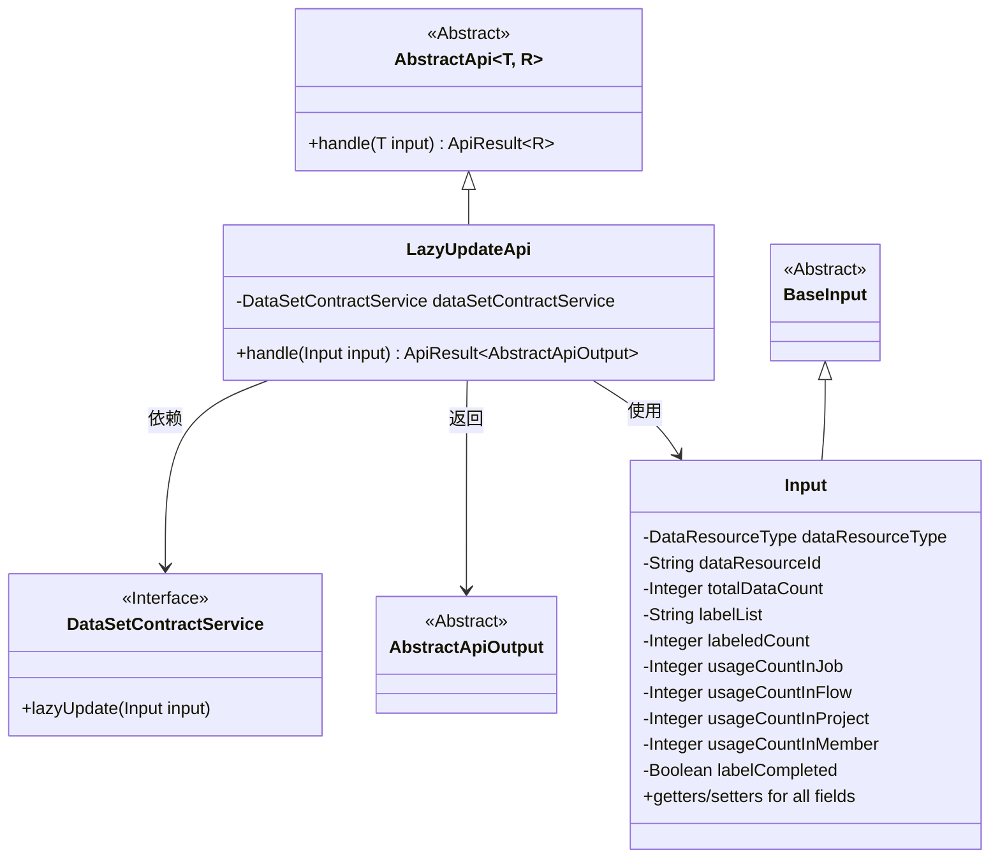

# 基础信息

|      |      |
|------|------|
| 名称 | LazyUpdateApi |
| 编码语言 | .java |
| 代码路径 | WeFe/union/union-service/src/main/java/com/welab/wefe/union/service/api/dataresource/LazyUpdateApi.java |
| 包名 | com.welab.wefe.union.service.api.dataresource |
| 依赖项 | ['com.welab.wefe.common.exception.StatusCodeWithException', 'com.welab.wefe.common.fieldvalidate.annotation.Check', 'com.welab.wefe.common.web.api.base.AbstractApi', 'com.welab.wefe.common.web.api.base.Api', 'com.welab.wefe.common.web.dto.AbstractApiOutput', 'com.welab.wefe.common.web.dto.ApiResult', 'com.welab.wefe.common.wefe.enums.DataResourceType', 'com.welab.wefe.union.service.dto.base.BaseInput', 'com.welab.wefe.union.service.service.contract.DataSetContractService', 'org.springframework.beans.factory.annotation.Autowired'] |
| 概述说明 | LazyUpdateApi类用于懒更新数据资源标签统计，接收资源类型、ID、总数等必填参数，调用dataSetContractService处理并返回成功结果。 |

# 说明

LazyUpdateApi是一个用于懒更新数据资源标签统计的API，路径为data_resource/lazy_update，允许签名访问。它继承自AbstractApi，接受Input参数并返回AbstractApiOutput。Input类包含必填字段dataResourceType、dataResourceId、totalDataCount，以及可选字段labelList、labeledCount、usageCountInJob、usageCountInFlow、usageCountInProject、usageCountInMember和labelCompleted。处理逻辑通过dataSetContractService.lazyUpdate方法实现。

# 类列表 Class Summary

| 名称   | 类型  | 说明 |
|-------|------|-------------|
| LazyUpdateApi | class | LazyUpdateApi用于懒更新数据集标签统计信息，需传入资源类型、ID、总数等参数，调用dataSetContractService处理。 |

## 类 LazyUpdateApi

|      |      |
|------|------|
| 访问范围 | @Api(path = "data_resource/lazy_update", name = "image_data_set_update_labeled_count", allowAccessWithSign = true);public |
| 类型 | class |
| 名称 | LazyUpdateApi |
| 说明 | LazyUpdateApi用于懒更新数据集标签统计信息，需传入资源类型、ID、总数等参数，调用dataSetContractService处理。 |

### UML类图

该类图展示了LazyUpdateApi继承自AbstractApi，并依赖DataSetContractService接口处理输入数据。Input类继承自BaseInput，包含多个字段及其getter/setter方法。LazyUpdateApi通过handle方法处理Input参数并返回AbstractApiOutput结果，实现了数据资源的懒更新功能。

### 内部方法调用关系图

```mermaid
graph TD
    A["类LazyUpdateApi"]
    B["注解: @Api"]
    C["继承: AbstractApi<Input, AbstractApiOutput>"]
    D["依赖注入: DataSetContractService"]
    E["重写方法: handle(Input input)"]
    F["内部类: Input"]
    G["Input属性: DataResourceType dataResourceType"]
    H["Input属性: String dataResourceId"]
    I["Input属性: Integer totalDataCount"]
    J["Input属性: String labelList"]
    K["Input属性: Integer labeledCount"]
    L["Input属性: Integer usageCountInJob"]
    M["Input属性: Integer usageCountInFlow"]
    N["Input属性: Integer usageCountInProject"]
    O["Input属性: Integer usageCountInMember"]
    P["Input属性: Boolean labelCompleted"]
    Q["Input方法: 各属性的getter/setter"]

    A --> B
    A --> C
    A --> D
    A --> E
    A --> F
    F --> G
    F --> H
    F --> I
    F --> J
    F --> K
    F --> L
    F --> M
    F --> N
    F --> O
    F --> P
    F --> Q
    E --> D
    E --> F
```

这段代码展示了一个名为LazyUpdateApi的API类，它继承自AbstractApi并处理数据资源的延迟更新。类通过@Api注解定义API路径和权限，使用DataSetContractService进行业务逻辑处理。内部类Input包含多个数据资源属性及其getter/setter方法，handle方法调用服务层进行数据更新并返回结果。流程图清晰展现了类结构、依赖关系和主要方法调用链。

### 字段列表 Field List

| 名称  | 类型  | 说明 |
|-------|-------|------|
| dataSetContractService | DataSetContractService | 代码片段使用@Autowired注解自动注入DataSetContractService实例。 |

### 方法列表

| 名称  | 类型  | 说明 |
|-------|-------|------|
| handle | ApiResult<AbstractApiOutput> | 该方法重写父类逻辑，调用服务层更新数据集，成功后返回空结果。异常时抛出状态码封装异常。 |

