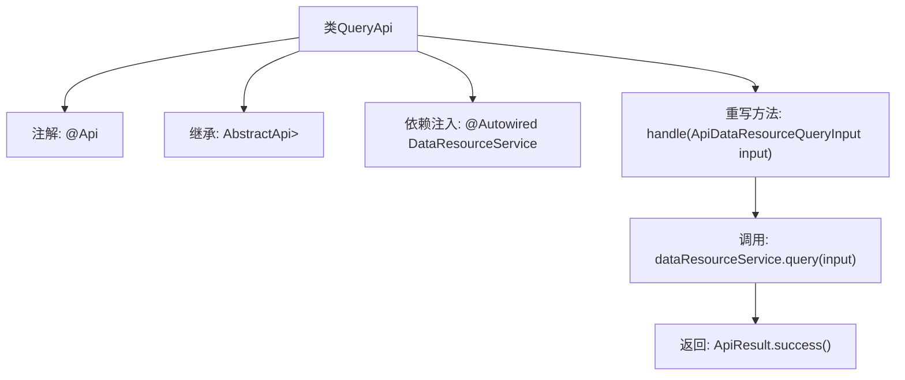

# 基础信息

|      |      |
|------|------|
| 名称 | QueryApi |
| 编码语言 | .java |
| 代码路径 | WeFe/union/union-service/src/main/java/com/welab/wefe/union/service/api/dataresource/QueryApi.java |
| 包名 | com.welab.wefe.union.service.api.dataresource |
| 依赖项 | ['com.welab.wefe.common.data.mongodb.dto.PageOutput', 'com.welab.wefe.common.web.api.base.AbstractApi', 'com.welab.wefe.common.web.api.base.Api', 'com.welab.wefe.common.web.dto.ApiResult', 'com.welab.wefe.union.service.dto.dataresource.ApiDataResourceQueryInput', 'com.welab.wefe.union.service.dto.dataresource.ApiDataResourceQueryOutput', 'com.welab.wefe.union.service.service.DataResourceService', 'org.springframework.beans.factory.annotation.Autowired'] |
| 概述说明 | Java类QueryApi定义了数据资源查询接口，路径为"data_resource/query"，需签名访问，调用DataResourceService的query方法处理输入并返回分页结果。 |

# 说明

该代码定义了一个名为QueryApi的API类，用于查询数据资源。类注解指定了API路径为"data_resource/query"，名称为"data_resource_query"，并允许签名访问。该类继承自AbstractApi，泛型参数指定了输入类型为ApiDataResourceQueryInput，输出类型为分页的ApiDataResourceQueryOutput。通过自动注入的DataResourceService调用query方法处理输入参数，并返回封装成功的ApiResult结果。整个类实现了对数据资源查询请求的处理和响应。

# 类列表 Class Summary

| 名称   | 类型  | 说明 |
|-------|------|-------------|
| QueryApi | class | 这是一个数据资源查询API类，路径为"data_resource/query"，允许签名访问。它继承自AbstractApi，处理ApiDataResourceQueryInput输入并返回分页的ApiDataResourceQueryOutput结果。通过注入的DataResourceService执行查询操作。 |


## 类 QueryApi

|      |      |
|------|------|
| 访问范围 | @Api(path = "data_resource/query", name = "data_resource_query", allowAccessWithSign = true);public |
| 类型 | class |
| 名称 | QueryApi |
| 说明 | 这是一个数据资源查询API类，路径为"data_resource/query"，允许签名访问。它继承自AbstractApi，处理ApiDataResourceQueryInput输入并返回分页的ApiDataResourceQueryOutput结果。通过注入的DataResourceService执行查询操作。 |


### UML类图

```mermaid
classDiagram
    class AbstractApi~T, R~ {
        <<Abstract>>
        #ApiResult~R~ handle(T input)
    }

    class QueryApi {
        -DataResourceService dataResourceService
        +ApiResult~PageOutput~ApiDataResourceQueryOutput~~ handle(ApiDataResourceQueryInput input)
    }

    class DataResourceService {
        +PageOutput~ApiDataResourceQueryOutput~ query(ApiDataResourceQueryInput input)
    }

    class ApiDataResourceQueryInput {
        // 查询输入参数类
    }

    class ApiDataResourceQueryOutput {
        // 查询输出结果类
    }

    class PageOutput~T~ {
        // 分页输出包装类
    }

    class ApiResult~T~ {
        // API结果包装类
    }

    QueryApi --|> AbstractApi~ApiDataResourceQueryInput, PageOutput~ApiDataResourceQueryOutput~~ : 继承
    QueryApi --> DataResourceService : 依赖
    DataResourceService ..> ApiDataResourceQueryInput : 使用
    DataResourceService ..> ApiDataResourceQueryOutput : 使用
    DataResourceService ..> PageOutput~ApiDataResourceQueryOutput~ : 使用
    AbstractApi ..> ApiResult~R~ : 使用
```

这段代码展示了一个查询API的实现结构，QueryApi继承自泛型抽象类AbstractApi，通过依赖注入使用DataResourceService进行数据查询。AbstractApi定义了核心处理逻辑的模板方法，QueryApi实现具体业务处理，返回分页查询结果。整个设计体现了模板方法模式，通过泛型实现了输入输出类型的灵活性，同时依赖服务层完成核心业务逻辑。类图中清晰地展示了继承、依赖和使用关系，以及各泛型类的参数传递关系。


### 内部方法调用关系图



该流程图展示了QueryApi类的结构和主要执行流程。这是一个基于Spring框架的API类，通过@Api注解定义接口路径，继承AbstractApi抽象类并注入DataResourceService服务。核心处理逻辑在handle方法中，调用dataResourceService.query进行数据查询后，返回封装成功的ApiResult结果。整个流程体现了从请求输入到服务调用再到结果封装的完整处理链条。

### 字段列表 Field List

| 名称  | 类型  | 说明 |
|-------|-------|------|
| dataResourceService | DataResourceService | 自动注入DataResourceService服务实例。 |

### 方法列表

| 名称  | 类型  | 说明 |
|-------|-------|------|
| handle | ApiResult<PageOutput<ApiDataResourceQueryOutput>> | 代码重写父类方法，调用服务查询数据并返回分页结果。 |


