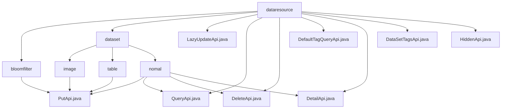

# 基础信息

|      |      |
|------|------|
| 名称 | dataresource |
| 编码语言 | .java |
| 代码路径 | WeFe/union/union-service/src/main/java/com/welab/wefe/union/service/api/dataresource |
| 包名 | docs.union.union-service.src.main.java.com.welab.wefe.union.service.api.dataresource |
| 概述说明 | PutApi用于向布隆过滤器添加数据。LazyUpdateApi懒更新标签统计。QueryApi查询数据资源。DeleteApi删除数据资源。DefaultTagQueryApi查询默认标签。DetailApi查询数据详情。DataSetTagsApi查询标签。HiddenApi隐藏数据资源。 |

# 说明

## 概述  
该模块是统一的数据资源管理服务，核心职责为提供数据资源的CRUD操作、标签管理和状态控制。接口规范采用继承AbstractApi的统一设计，支持签名访问和标准化的Input/Output模式（例如PutApi要求必填字段，QueryApi支持分页输出）。关键数据结构包括基础输入类DataResourcePutInput、带统计字段的ImageInput、带特征描述的TableInput以及分页查询结构ApiDataResourceQueryOutput。外部依赖包括BloomFilterService、DataResourceService和DefaultTagService等，通过Autowired注入。例如布隆过滤器通过hashFunction属性定义哈希策略。

## 主要业务场景  
模块支持多类型数据资源管理：基础CRUD（如DeleteApi）、标签统计（如LazyUpdateApi）、元数据查询（如DetailApi）和状态控制（如HiddenApi）。交互采用RESTful风格，路径如"data_resource/delete"和"data_resource/tags/query"。典型应用包括：联合建模时查询特征数据集（调用QueryApi）、标注平台更新统计信息（使用LazyUpdateApi）。扩展功能类似配置中心，如DefaultTagQueryApi提供预置标签查询。写操作均通过服务层实现，例如HiddenApi会持久化资源隐藏状态。

### 包内部结构视图

该流程图展示了数据资源服务的API结构，顶层为dataresource目录，包含bloomfilter、dataset两个子目录及多个直接API文件。dataset目录下又分为image、table、nomal三个子类型，每个子类型包含各自的API实现文件。nomal类型包含最丰富的API集合，涵盖增删改查等操作。

# 文件列表

| 名称   | 类型  | 说明 |
|-------|------|-------------|
| [bloomfilter](bloomfilter/_module.md) | package | 布隆过滤器添加API，允许签名访问，接收输入参数并调用服务添加数据。 |
| [LazyUpdateApi.java](LazyUpdateApi.md) | file | LazyUpdateApi类用于懒更新数据资源标签统计，接收资源类型、ID、总数等必填参数，调用dataSetContractService处理并返回成功结果。 |
| [QueryApi.java](QueryApi.md) | file | Java类QueryApi定义了数据资源查询接口，路径为"data_resource/query"，需签名访问，调用DataResourceService的query方法处理输入并返回分页结果。 |
| [DeleteApi.java](DeleteApi.md) | file | 删除数据资源的API接口，需传入dataResourceId参数，调用DataResourceService的delete方法处理。 |
| [DefaultTagQueryApi.java](DefaultTagQueryApi.md) | file | DefaultTagQueryApi接口，路径data_resource/default_tag/query，需签名访问，调用DefaultTagService查询数据，输入需包含dataResourceType参数，返回JSON格式列表。 |
| [DetailApi.java](DetailApi.md) | file | DetailApi类是一个数据资源详情接口，允许签名访问，调用DataResourceService处理输入并返回详情数据。 |
| [DataSetTagsApi.java](DataSetTagsApi.md) | file | 这是一个查询数据资源标签的API类，路径为"data_resource/tags/query"，需要签名访问。它接收数据类型参数，调用DataResourceService查询并返回标签列表。 |
| [HiddenApi.java](HiddenApi.md) | file | HiddenApi类是一个数据资源隐藏接口，路径为data_resource/hidden，需签名访问。处理输入参数dataResourceId，调用dataResourceService.hidden方法实现隐藏功能。 |
| [dataset](dataset/_module.md) | package | PutApi类处理图像和表格数据集添加，继承AbstractApi，使用Input类包含必填字段，调用Service的add方法。模块提供数据集CRUD操作，遵循统一设计，依赖DataSetService，支持RESTful风格API。 |

