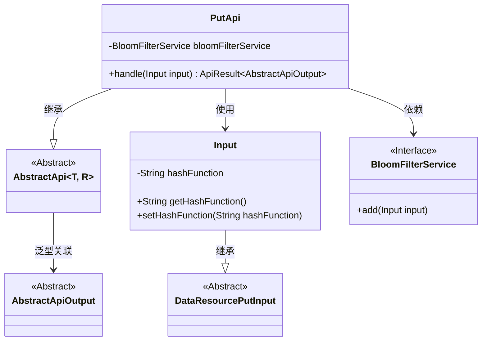

# 基础信息

|      |      |
|------|------|
| 名称 | PutApi |
| 编码语言 | .java |
| 代码路径 | WeFe/union/union-service/src/main/java/com/welab/wefe/union/service/api/dataresource/bloomfilter/PutApi.java |
| 包名 | com.welab.wefe.union.service.api.dataresource.bloomfilter |
| 依赖项 | ['com.welab.wefe.common.exception.StatusCodeWithException', 'com.welab.wefe.common.web.api.base.AbstractApi', 'com.welab.wefe.common.web.api.base.Api', 'com.welab.wefe.common.web.dto.AbstractApiOutput', 'com.welab.wefe.common.web.dto.ApiResult', 'com.welab.wefe.union.service.dto.dataresource.DataResourcePutInput', 'com.welab.wefe.union.service.service.BloomFilterService', 'org.springframework.beans.factory.annotation.Autowired'] |
| 概述说明 | 布隆过滤器添加API，允许签名访问，接收输入参数并调用服务添加数据。 |

# 说明

该代码定义了一个名为PutApi的API类，用于向布隆过滤器添加数据。API路径为"bloom_filter/put"，允许签名访问。类继承自AbstractApi，使用泛型指定输入类型为内部类Input，输出类型为AbstractApiOutput。通过@Autowired注入BloomFilterService服务，在handle方法中调用add方法处理输入。Input类继承自DataResourcePutInput，包含一个hashFunction字符串属性及其getter/setter方法。处理成功时返回success()。

# 类列表 Class Summary

| 名称   | 类型  | 说明 |
|-------|------|-------------|
| PutApi | class | 布隆过滤器添加API，允许签名访问，接收包含哈希函数参数的输入，调用服务添加数据后返回成功结果。 |

## 类 PutApi

|      |      |
|------|------|
| 访问范围 | @Api(path = "bloom_filter/put", name = "bloom_filter_put", allowAccessWithSign = true);public |
| 类型 | class |
| 名称 | PutApi |
| 说明 | 布隆过滤器添加API，允许签名访问，接收包含哈希函数参数的输入，调用服务添加数据后返回成功结果。 |

### UML类图

类图描述：该图展示了PutApi类继承自泛型类AbstractApi，并依赖BloomFilterService接口实现布隆过滤器功能。Input作为内部类继承DataResourcePutInput，包含hashFunction属性和访问方法。PutApi通过handle方法处理输入参数，调用服务层完成数据添加操作，整体结构体现了清晰的层级关系和职责划分。

### 内部方法调用关系图

```mermaid
graph TD
    A["类PutApi"]
    B["注解: @Api"]
    C["继承: AbstractApi<Input, AbstractApiOutput>"]
    D["依赖注入: @Autowired BloomFilterService"]
    E["重写方法: handle(Input input)"]
    F["内部类: Input"]
    G["属性: String hashFunction"]
    H["方法: getHashFunction()"]
    I["方法: setHashFunction()"]
    J["调用: bloomFilterService.add(input)"]
    K["返回: success()"]

    A --> B
    A --> C
    A --> D
    A --> E
    E --> J
    E --> K
    A --> F
    F --> G
    F --> H
    F --> I
```

这段代码描述了一个基于Spring框架的API类PutApi，主要用于向布隆过滤器添加数据。类通过@Api注解定义REST端点，继承AbstractApi并指定输入/输出类型。核心逻辑在handle方法中，调用BloomFilterService的add操作并返回成功结果。Input作为嵌套类扩展了DataResourcePutInput，包含可配置的hashFunction属性及其getter/setter。流程图清晰展示了类结构、方法调用关系和内部类层级。

### 字段列表 Field List

| 名称  | 类型  | 说明 |
|-------|-------|------|
| bloomFilterService | BloomFilterService | 自动注入布隆过滤器服务实例。 |

### 方法列表

| 名称  | 类型  | 说明 |
|-------|-------|------|
| handle | ApiResult<AbstractApiOutput> | 该方法处理输入数据，先将其加入布隆过滤器，然后返回成功结果。 |

