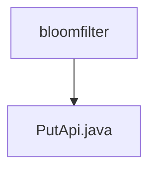

# 基础信息

|      |      |
|------|------|
| 名称 | bloomfilter |
| 编码语言 | .java |
| 代码路径 | WeFe/union/union-service/src/main/java/com/welab/wefe/union/service/api/dataresource/bloomfilter |
| 包名 | docs.union.union-service.src.main.java.com.welab.wefe.union.service.api.dataresource.bloomfilter |
| 概述说明 | 布隆过滤器添加API，允许签名访问，接收输入参数并调用服务添加数据。 |

# 说明

该代码定义了一个名为PutApi的API类，用于向布隆过滤器添加数据。API路径为"bloom_filter/put"，允许签名访问。类继承自AbstractApi，使用泛型指定输入类型为内部类Input，输出类型为AbstractApiOutput。通过@Autowired注入BloomFilterService服务，在handle方法中调用add方法处理输入。Input类继承自DataResourcePutInput，包含一个hashFunction字符串属性及其getter/setter方法。处理成功时返回success()。

### 包内部结构视图

该流程图展示了Java项目中bloomfilter包与PutApi.java文件之间的层级关系。bloomfilter作为父级目录，包含一个子文件PutApi.java，这是典型的Java项目结构，其中API实现类存放在对应的功能包下。这种结构清晰地体现了代码的组织方式，便于开发者快速定位相关功能模块。

# 文件列表

| 名称   | 类型  | 说明 |
|-------|------|-------------|
| [PutApi.java](PutApi.md) | file | 布隆过滤器添加API，允许签名访问，接收输入参数并调用服务添加数据。 |

