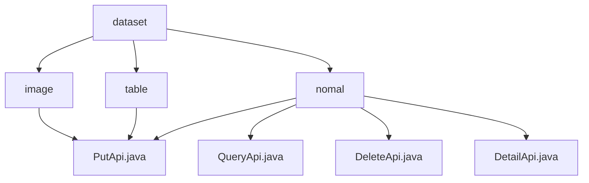

# 基础信息

|      |      |
|------|------|
| 名称 | dataset |
| 编码语言 | .java |
| 代码路径 | WeFe/union/union-service/src/main/java/com/welab/wefe/union/service/api/dataresource/dataset |
| 包名 | docs.union.union-service.src.main.java.com.welab.wefe.union.service.api.dataresource.dataset |
| 概述说明 | PutApi类处理图像和表格数据集添加，继承AbstractApi，使用Input类包含必填字段，调用Service的add方法。模块提供数据集CRUD操作，遵循统一设计，依赖DataSetService，支持RESTful风格API。 |

# 说明

## 概述  
该模块是统一的数据集管理服务，核心职责为提供图像和表格数据集的标准化CRUD操作。接口规范采用继承AbstractApi的统一设计，使用签名访问和Input/Output模式（例如ImageDataSet的PutApi要求必填labelCompleted，TableDataSet的PutApi要求containsY）。关键数据结构包括DataResourcePutInput（基础输入）、带统计字段的ImageInput和带特征描述的TableInput。外部依赖为ImageDataSetService和TableDataSetService，通过Autowired注入。例如表格数据集通过columnNameList定义结构。

## 主要业务场景  
模块支持异构数据集的差异化处理：图像数据集侧重标注管理（如labeledCount统计），表格数据集关注特征描述（如featureNameList）。交互采用RESTful风格，路径如"image_data_set/put"和"table_data_set/put"。典型应用包括：联合建模时发布特征工程数据集（使用表格API）、标注平台回传标注结果（调用图像API）。写操作均通过PutApi实现，例如包含usageCountInJob的运维统计字段会在图像数据集创建时持久化。

### 包内部结构视图

该流程图展示了数据集(dataset)目录下的层级结构，包含三个子目录：image、table和nomal。每个子目录下都有对应的API文件，其中image和table目录各有一个PutApi.java文件，而nomal目录下则包含PutApi.java、QueryApi.java、DeleteApi.java和DetailApi.java四个API文件。整个结构清晰地反映了数据资源服务中不同数据集类型的API组织方式。

# 文件列表

| 名称   | 类型  | 说明 |
|-------|------|-------------|
| [table](table/_module.md) | package | 这是一个用于添加表格数据集的API类，包含输入参数如列数、特征数及名称列表，通过服务层将数据存入数据库。 |
| [nomal](nomal/_module.md) | package | PutApi处理数据集添加，继承AbstractApi，使用Input和DataSetOutput。QueryApi处理查询，返回分页结果，含多种查询条件。DeleteApi处理删除，输入含id，输出DataSetOutput。DetailApi获取详情，输入需id，返回DataSetDetailOutput。均通过DataSetService处理。 |
| [image](image/_module.md) | package | PutApi类处理图像数据集添加，输入包含任务类型、标签、文件大小等字段，调用ImageDataSetService完成操作。 |

