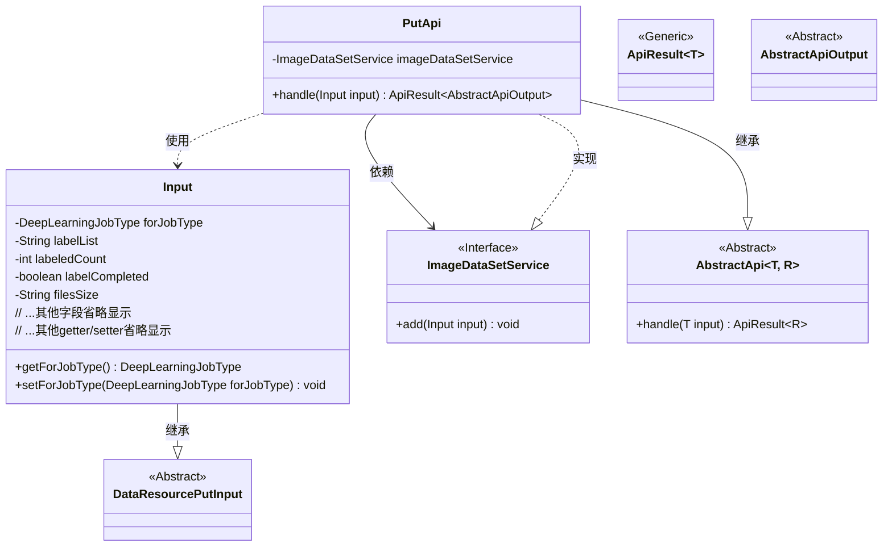
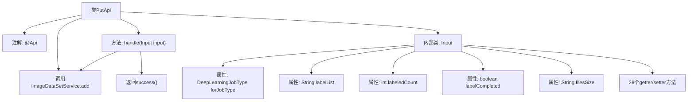

# 基础信息

|      |      |
|------|------|
| 名称 | PutApi |
| 编码语言 | .java |
| 代码路径 | WeFe/union/union-service/src/main/java/com/welab/wefe/union/service/api/dataresource/dataset/image/PutApi.java |
| 包名 | com.welab.wefe.union.service.api.dataresource.dataset.image |
| 依赖项 | ['com.welab.wefe.common.exception.StatusCodeWithException', 'com.welab.wefe.common.fieldvalidate.annotation.Check', 'com.welab.wefe.common.web.api.base.AbstractApi', 'com.welab.wefe.common.web.api.base.Api', 'com.welab.wefe.common.web.dto.AbstractApiOutput', 'com.welab.wefe.common.web.dto.ApiResult', 'com.welab.wefe.common.wefe.enums.DeepLearningJobType', 'com.welab.wefe.union.service.dto.dataresource.DataResourcePutInput', 'com.welab.wefe.union.service.service.ImageDataSetService', 'org.springframework.beans.factory.annotation.Autowired'] |
| 概述说明 | PutApi类处理图像数据集添加，输入包含任务类型、标签、文件大小等字段，调用ImageDataSetService完成操作。 |

# 说明

这是一个名为PutApi的Java类，用于处理图像数据集的添加操作。该类继承自AbstractApi，使用Api注解定义了路径和名称，并允许签名访问。类中注入了ImageDataSetService服务，通过handle方法调用add方法处理输入数据。输入类Input继承自DataResourcePutInput，包含多个字段如forJobType、labelList、labeledCount等，用于描述图像数据集的属性。每个字段都有对应的getter和setter方法，其中labelCompleted字段被标记为必填。此外，Input类还包含一些与数据集使用统计相关的字段，如usageCountInJob等。

# 类列表 Class Summary

| 名称   | 类型  | 说明 |
|-------|------|-------------|
| PutApi | class | 这是一个图像数据集上传API类，路径为image_data_set/put，允许签名访问。处理输入参数包括任务类型、标签列表、文件大小等，调用服务层添加数据后返回成功结果。 |

## 类 PutApi

|      |      |
|------|------|
| 访问范围 | @Api(path = "image_data_set/put", name = "image_data_set_put", allowAccessWithSign = true);public |
| 类型 | class |
| 名称 | PutApi |
| 说明 | 这是一个图像数据集上传API类，路径为image_data_set/put，允许签名访问。处理输入参数包括任务类型、标签列表、文件大小等，调用服务层添加数据后返回成功结果。 |

### UML类图

这段类图展示了图像数据集上传API的结构体系。PutApi继承自泛型抽象类AbstractApi，处理Input类型参数并返回AbstractApiOutput结果。核心依赖ImageDataSetService接口实现数据添加功能，Input类继承自DataResourcePutInput并包含深度学习任务类型、标签列表等扩展字段。整个设计采用分层架构，通过抽象类和接口实现扩展性，符合面向对象设计原则。

### 内部方法调用关系图

该流程图展示了PutApi类的完整结构，包含API注解、服务注入和核心处理方法。内部类Input包含多个属性和对应的getter/setter方法，其中labelCompleted属性带有@Check验证注解。handle方法通过调用imageDataSetService.add处理输入数据后返回成功结果，体现了典型的API请求处理流程。类结构清晰展示了数据验证、业务处理和服务调用的完整链路。

### 字段列表 Field List

| 名称  | 类型  | 说明 |
|-------|-------|------|
| imageDataSetService | ImageDataSetService | 代码片段使用Spring的@Autowired注解自动注入ImageDataSetService实例。 |

### 方法列表

| 名称  | 类型  | 说明 |
|-------|-------|------|
| handle | ApiResult<AbstractApiOutput> | 该方法处理输入数据，调用服务添加图像数据集，成功后返回结果。 |

