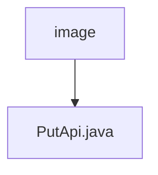

# 基础信息

|      |      |
|------|------|
| 名称 | image |
| 编码语言 | .java |
| 代码路径 | WeFe/union/union-service/src/main/java/com/welab/wefe/union/service/api/dataresource/dataset/image |
| 包名 | docs.union.union-service.src.main.java.com.welab.wefe.union.service.api.dataresource.dataset.image |
| 概述说明 | PutApi类处理图像数据集添加，输入包含任务类型、标签、文件大小等字段，调用ImageDataSetService完成操作。 |

# 说明

这是一个名为PutApi的Java类，用于处理图像数据集的添加操作。该类继承自AbstractApi，使用Api注解定义了路径和名称，并允许签名访问。类中注入了ImageDataSetService服务，通过handle方法调用add方法处理输入数据。输入类Input继承自DataResourcePutInput，包含多个字段如forJobType、labelList、labeledCount等，用于描述图像数据集的属性。每个字段都有对应的getter和setter方法，其中labelCompleted字段被标记为必填。此外，Input类还包含一些与数据集使用统计相关的字段，如usageCountInJob等。

### 包内部结构视图

该流程图展示了WeFe项目中数据集图片资源的API路径结构。根节点"image"表示图片资源目录，其下包含一个具体的API实现文件"PutApi.java"。这个结构清晰地反映了图片资源API的单一实现路径，符合给定的两条路径信息。

# 文件列表

| 名称   | 类型  | 说明 |
|-------|------|-------------|
| [PutApi.java](PutApi.md) | file | PutApi类处理图像数据集添加，输入包含任务类型、标签、文件大小等字段，调用ImageDataSetService完成操作。 |

