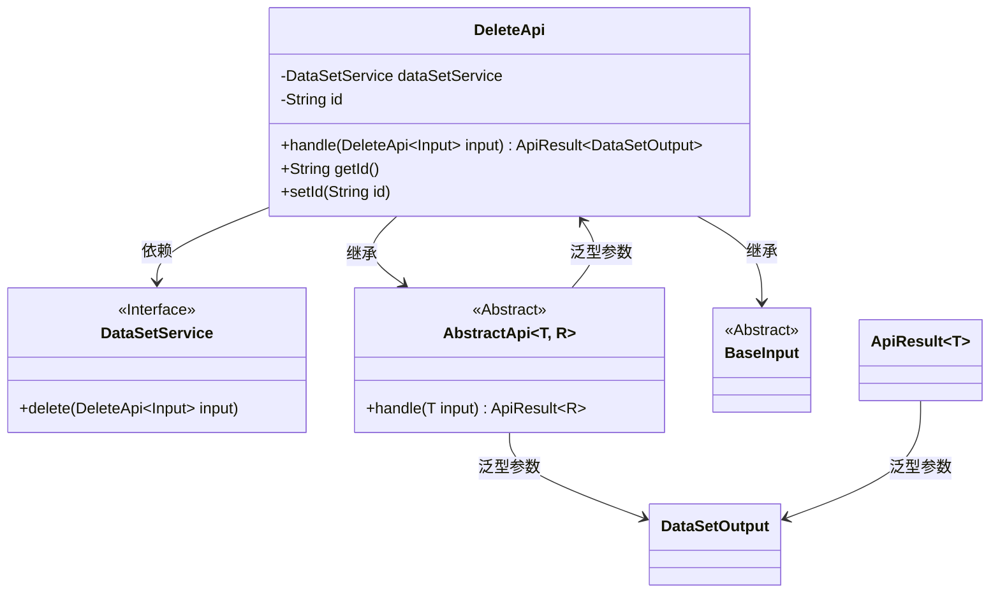

# 基础信息

|      |      |
|------|------|
| 名称 | DeleteApi |
| 编码语言 | .java |
| 代码路径 | WeFe/union/union-service/src/main/java/com/welab/wefe/union/service/api/dataresource/dataset/nomal/DeleteApi.java |
| 包名 | com.welab.wefe.union.service.api.dataresource.dataset.nomal |
| 依赖项 | ['com.welab.wefe.common.exception.StatusCodeWithException', 'com.welab.wefe.common.web.api.base.AbstractApi', 'com.welab.wefe.common.web.api.base.Api', 'com.welab.wefe.common.web.dto.ApiResult', 'com.welab.wefe.union.service.dto.base.BaseInput', 'com.welab.wefe.union.service.dto.dataresource.dataset.table.DataSetOutput', 'com.welab.wefe.union.service.service.DataSetService', 'org.springframework.beans.factory.annotation.Autowired'] |
| 概述说明 | 删除数据集的API类，路径为"data_set/delete"，允许签名访问，通过DataSetService删除指定ID的数据集，返回成功结果。输入参数包含ID字段。 |

# 说明

这是一个名为DeleteApi的Java类，用于处理数据集删除的API请求。该类继承自AbstractApi，使用泛型指定输入类型为DeleteApi.Input，输出类型为DataSetOutput。类上标注了@Api注解，定义了API路径为"data_set/delete"，名称为"data_set_delete"，并允许带签名的访问。类中注入了DataSetService用于业务处理。handle方法接收输入参数，调用dataSetService的delete方法执行删除操作，并返回成功结果。输入参数Input继承自BaseInput，包含一个字符串类型的id属性及其getter和setter方法。

# 类列表 Class Summary

| 名称   | 类型  | 说明 |
|-------|------|-------------|
| DeleteApi | class | 删除数据集的API类，路径为data_set/delete，需签名访问，调用dataSetService的delete方法处理输入ID并返回成功结果。 |

## 类 DeleteApi

|      |      |
|------|------|
| 访问范围 | @Api(path = "data_set/delete", name = "data_set_delete", allowAccessWithSign = true);public |
| 类型 | class |
| 名称 | DeleteApi |
| 说明 | 删除数据集的API类，路径为data_set/delete，需签名访问，调用dataSetService的delete方法处理输入ID并返回成功结果。 |

### UML类图

这段代码展示了一个删除数据集的API类结构。DeleteApi继承自泛型抽象类AbstractApi，指定输入类型为内部类Input（继承自BaseInput）和输出类型DataSetOutput。通过Autowired注入DataSetService接口实现删除功能，handle方法处理输入并返回ApiResult封装的结果。类图清晰地反映了继承、依赖和泛型关系，体现了Spring风格的API层设计模式。

### 内部方法调用关系图

```mermaid
graph TD
    A["类DeleteApi"]
    B["注解: @Api"]
    C["继承: AbstractApi<Input, DataSetOutput>"]
    D["依赖注入: @Autowired DataSetService"]
    E["重写方法: handle(Input input)"]
    F["内部类: Input"]
    G["属性: String id"]
    H["方法: String getId()"]
    I["方法: void setId(String id)"]
    J["调用: dataSetService.delete(input)"]
    K["返回: success()"]

    A --> B
    A --> C
    A --> D
    A --> E
    E --> J
    E --> K
    A -.-> F
    F --> G
    F --> H
    F --> I
```

这段代码展示了一个基于Spring框架的API类DeleteApi，用于处理数据集删除请求。通过@Api注解定义接口路径和权限，继承AbstractApi模板类并实现handle方法，内部调用DataSetService执行删除操作。Input内部类封装了请求参数id及其getter/setter方法，体现了分层设计和依赖注入的典型Spring Boot应用结构。

### 字段列表 Field List

| 名称  | 类型  | 说明 |
|-------|-------|------|
| dataSetService | DataSetService | 自动注入数据集服务实例。 |

### 方法列表

| 名称  | 类型  | 说明 |
|-------|-------|------|
| handle | ApiResult<DataSetOutput> | 这是一个Java方法，重写父类方法，处理删除请求，调用dataSetService删除输入数据，成功后返回空结果。 |

