# 基础信息

|      |      |
|------|------|
| 名称 | DetailApi |
| 编码语言 | .java |
| 代码路径 | WeFe/union/union-service/src/main/java/com/welab/wefe/union/service/api/dataresource/dataset/nomal/DetailApi.java |
| 包名 | com.welab.wefe.union.service.api.dataresource.dataset.nomal |
| 依赖项 | ['com.welab.wefe.common.fieldvalidate.annotation.Check', 'com.welab.wefe.common.web.api.base.AbstractApi', 'com.welab.wefe.common.web.api.base.Api', 'com.welab.wefe.common.web.dto.ApiResult', 'com.welab.wefe.union.service.dto.base.BaseInput', 'com.welab.wefe.union.service.dto.dataresource.dataset.table.DataSetDetailOutput', 'com.welab.wefe.union.service.service.DataSetService', 'org.springframework.beans.factory.annotation.Autowired'] |
| 概述说明 | 这是一个名为DetailApi的API类，路径为"data_set/detail"，允许签名访问。它处理输入参数id并返回数据集详情，使用dataSetService的detail方法实现功能。 |

# 说明

这是一个名为DetailApi的API类，用于获取数据集详情。它继承自AbstractApi，接受DetailApi.Input作为输入参数，返回DataSetDetailOutput类型结果。API路径为"data_set/detail"，允许签名访问。内部通过注入的DataSetService处理业务逻辑，调用其detail方法获取详情。输入类Input继承BaseInput，包含一个必填字段id及其getter和setter方法。处理逻辑在handle方法中实现，成功时返回封装好的结果。

# 类列表 Class Summary

| 名称   | 类型  | 说明 |
|-------|------|-------------|
| DetailApi | class | 这是一个名为DetailApi的API类，路径为data_set/detail，允许签名访问。它处理输入参数id并返回DataSetDetailOutput，通过dataSetService.detail方法实现。输入类Input继承BaseInput，id字段必填。 |


## 类 DetailApi

|      |      |
|------|------|
| 访问范围 | @Api(path = "data_set/detail", name = "data_set_detail", allowAccessWithSign = true);public |
| 类型 | class |
| 名称 | DetailApi |
| 说明 | 这是一个名为DetailApi的API类，路径为data_set/detail，允许签名访问。它处理输入参数id并返回DataSetDetailOutput，通过dataSetService.detail方法实现。输入类Input继承BaseInput，id字段必填。 |


### UML类图

```mermaid
classDiagram
    class DetailApi {
        -DataSetService dataSetService
        +handle(DetailApi~Input~ input) ApiResult~DataSetDetailOutput~
    }
    class DataSetService {
        <<Interface>>
        +detail(DetailApi~Input~ input) DataSetDetailOutput
    }
    class DetailApi~Input~ {
        -String id
        +String getId()
        +void setId(String id)
    }
    class BaseInput {
        <<Abstract>>
    }
    class ApiResult~T~ {
        <<Generic>>
    }
    class DataSetDetailOutput {
    }

    DetailApi --> DataSetService : 依赖
    DetailApi~Input~ --|> BaseInput : 继承
    DetailApi ..|> AbstractApi~DetailApi~Input~, DataSetDetailOutput~ : 实现
    DetailApi ..> DetailApi~Input~ : 使用
    DetailApi ..> DataSetDetailOutput : 使用
    DetailApi ..> ApiResult~DataSetDetailOutput~ : 使用
```

类图描述：该图展示了DetailApi类及其相关结构。DetailApi继承自泛型类AbstractApi，实现了处理输入输出数据的逻辑。它依赖于DataSetService接口获取数据详情，使用内部类Input（继承自BaseInput）作为输入参数，并返回包装在ApiResult中的DataSetDetailOutput结果。图中清晰体现了类之间的继承、实现和依赖关系。


### 内部方法调用关系图

```mermaid
graph TD
    A["类DetailApi"]
    B["注解: @Api"]
    C["继承: AbstractApi<Input, DataSetDetailOutput>"]
    D["依赖注入: @Autowired DataSetService"]
    E["重写方法: handle(Input input)"]
    F["内部类: Input"]
    G["属性: @Check String id"]
    H["方法: getId()"]
    I["方法: setId(String id)"]
    J["调用: dataSetService.detail(input)"]
    K["返回: success(result)"]

    A --> B
    A --> C
    A --> D
    A --> E
    A --> F
    F --> G
    F --> H
    F --> I
    E --> J
    J --> K
```



这段代码定义了一个名为DetailApi的API类，继承自AbstractApi并指定了输入输出类型。类通过@Api注解配置路径和权限，使用@Autowired注入DataSetService服务。核心方法是handle()，它调用dataSetService.detail()处理输入参数并返回封装结果。内部类Input继承BaseInput，包含带校验注解的id属性和对应的getter/setter方法。流程图清晰展示了类结构、依赖关系和方法调用链。

### 字段列表 Field List

| 名称  | 类型  | 说明 |
|-------|-------|------|
| dataSetService | DataSetService | 代码片段使用@Autowired注解自动注入DataSetService实例。 |

### 方法列表

| 名称  | 类型  | 说明 |
|-------|-------|------|
| handle | ApiResult<DataSetDetailOutput> | 处理输入并返回数据集详情，调用服务层detail方法，封装结果后返回。 |


