# 基础信息

|      |      |
|------|------|
| 名称 | PutApi |
| 编码语言 | .java |
| 代码路径 | WeFe/union/union-service/src/main/java/com/welab/wefe/union/service/api/dataresource/dataset/nomal/PutApi.java |
| 包名 | com.welab.wefe.union.service.api.dataresource.dataset.nomal |
| 依赖项 | ['com.welab.wefe.common.exception.StatusCodeWithException', 'com.welab.wefe.common.fieldvalidate.annotation.Check', 'com.welab.wefe.common.web.api.base.AbstractApi', 'com.welab.wefe.common.web.api.base.Api', 'com.welab.wefe.common.web.dto.ApiResult', 'com.welab.wefe.union.service.dto.base.BaseInput', 'com.welab.wefe.union.service.dto.dataresource.dataset.table.DataSetOutput', 'com.welab.wefe.union.service.service.DataSetService', 'org.springframework.beans.factory.annotation.Autowired'] |
| 概述说明 | 这是一个名为PutApi的API类，用于处理数据集添加请求。它接收包含ID、名称、成员ID等必填字段的输入，调用DataSetService进行添加操作，并返回成功结果。输入类包含多个可选和必填属性，如行数、列数、特征列表等。 |

# 说明

这是一个名为PutApi的Java类，用于处理数据集添加操作。它继承自AbstractApi，接受Input类型输入并返回DataSetOutput。类通过Autowired注入DataSetService，并在handle方法中调用其add方法处理输入。Input内部类包含多个字段，其中id、name、memberId、publicLevel和tags为必填项，其余如containsY、rowCount、columnCount等为可选字段。所有字段都有对应的getter和setter方法。

# 类列表 Class Summary

| 名称   | 类型  | 说明 |
|-------|------|-------------|
| PutApi | class | PutApi类用于添加数据集，包含必填字段id、name、memberId、publicLevel和tags，以及其他可选字段如描述、使用统计等。通过dataSetService.add方法处理输入并返回成功结果。 |


## 类 PutApi

|      |      |
|------|------|
| 访问范围 | @Api(path = "data_set/put", name = "data_set_put", allowAccessWithSign = true);public |
| 类型 | class |
| 名称 | PutApi |
| 说明 | PutApi类用于添加数据集，包含必填字段id、name、memberId、publicLevel和tags，以及其他可选字段如描述、使用统计等。通过dataSetService.add方法处理输入并返回成功结果。 |


### UML类图

```mermaid
classDiagram
    class PutApi {
        -DataSetService dataSetService
        +handle(Input input) ApiResult~DataSetOutput~
    }
    <<Interface>> {
        interface AbstractApi~Input, DataSetOutput~ {
            <<Abstract>>
        }
    }
    class Input {
        -String id
        -String name
        -String memberId
        -Boolean containsY
        -Long rowCount
        -Integer columnCount
        -String columnNameList
        -Integer featureCount
        -String featureNameList
        -String publicLevel
        -String publicMemberList
        -int usageCountInJob
        -int usageCountInFlow
        -int usageCountInProject
        -String description
        -String tags
        // 所有字段的getter/setter方法省略
    }
    class DataSetService {
        +add(Input input) void
    }
    class BaseInput {
        <<Abstract>>
    }
    class DataSetOutput {
        // 输出数据结构
    }
    class ApiResult~T~ {
        // 泛型结果封装
    }

    PutApi --|> AbstractApi~Input, DataSetOutput~ : 继承
    Input --|> BaseInput : 继承
    PutApi --> DataSetService : 依赖
    PutApi ..> Input : 使用
    AbstractApi~Input, DataSetOutput~ ..> ApiResult~DataSetOutput~ : 返回
    AbstractApi~Input, DataSetOutput~ ..> DataSetOutput : 返回
```

该代码实现了一个数据集的PUT接口，核心类PutApi继承自泛型抽象类AbstractApi，处理Input输入参数并返回DataSetOutput结果。Input类继承BaseInput包含数据集的各种属性，通过DataSetService完成数据添加操作。类图展示了继承关系、依赖关系和泛型参数传递，整体结构清晰体现了API层、服务层和数据模型层的分层架构。


### 内部方法调用关系图

```mermaid
graph TD
    A["类PutApi"]
    B["注解: @Api"]
    C["继承: AbstractApi<Input, DataSetOutput>"]
    D["依赖注入: @Autowired DataSetService"]
    E["重写方法: handle(Input input)"]
    F["内部类: Input"]
    G["属性: 15个字段+校验注解"]
    H["方法: 15对getter/setter"]

    A --> B
    A --> C
    A --> D
    A --> E
    A --> F
    F --> G
    F --> H
    E --> D
    E -->|调用| D["dataSetService.add(input)"]
    E -->|返回| I["ApiResult.success()"]
```



这段代码描述了一个带有数据处理功能的API类PutApi，它继承自抽象类AbstractApi并实现了handle方法。主要流程是通过依赖注入的DataSetService执行数据添加操作，内部类Input定义了丰富的数据字段及校验规则。流程图清晰展示了类结构、依赖关系和核心处理逻辑，包括注解声明、服务调用和结果返回路径。

### 字段列表 Field List

| 名称  | 类型  | 说明 |
|-------|-------|------|
| dataSetService | DataSetService | 自动注入DataSetService实例。 |

### 方法列表

| 名称  | 类型  | 说明 |
|-------|-------|------|
| handle | ApiResult<DataSetOutput> | 这段代码重写了handle方法，调用dataSetService.add处理输入，成功后返回ApiResult。 |


